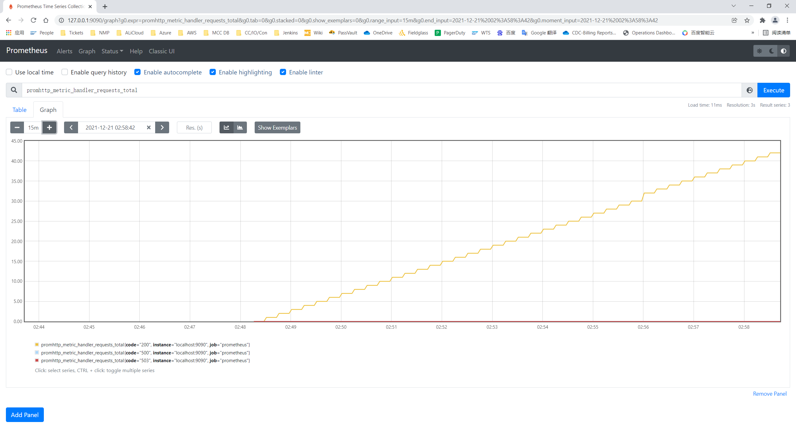
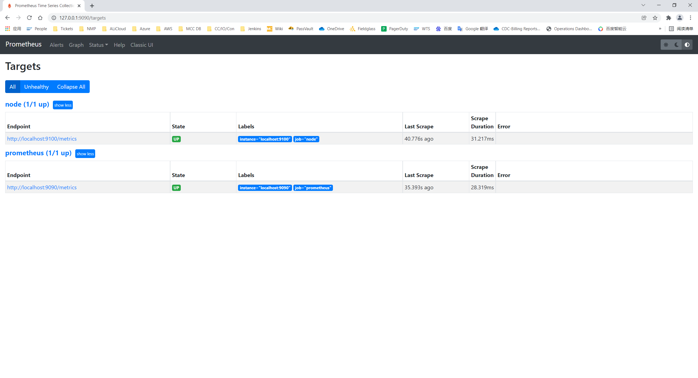
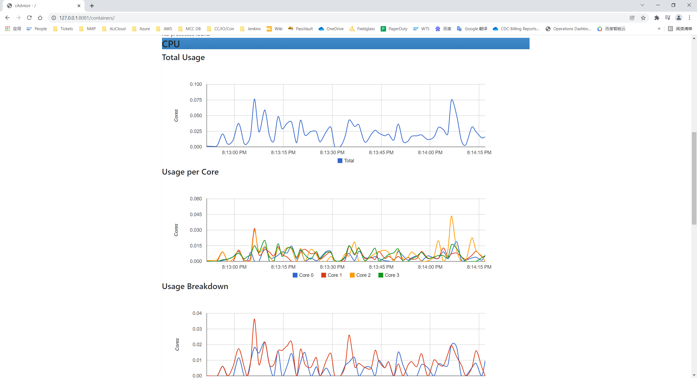
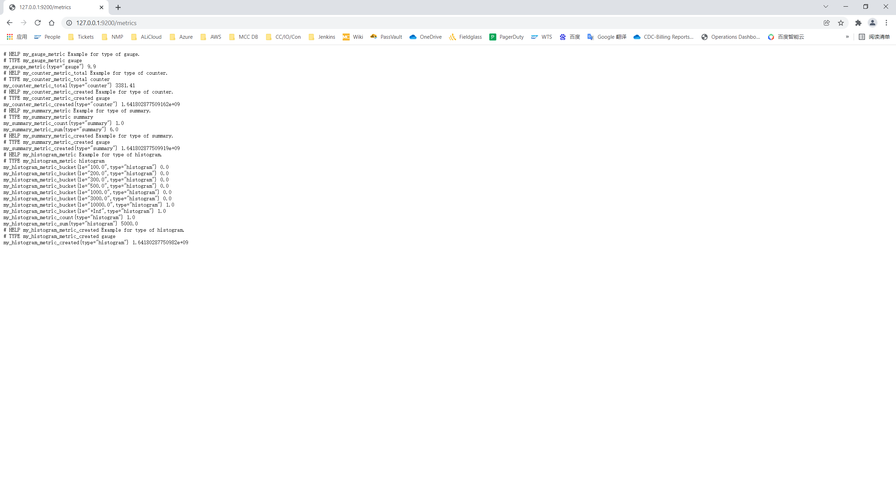
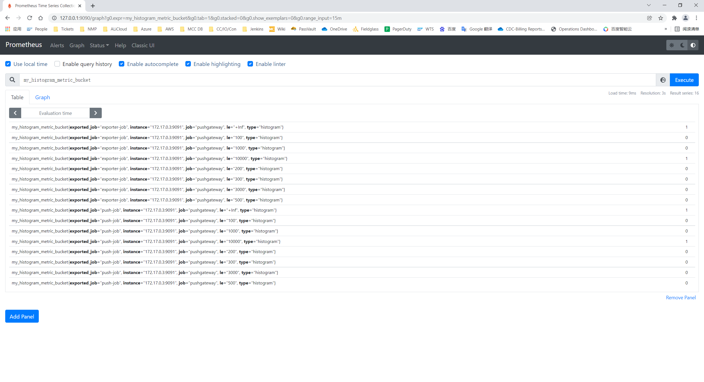
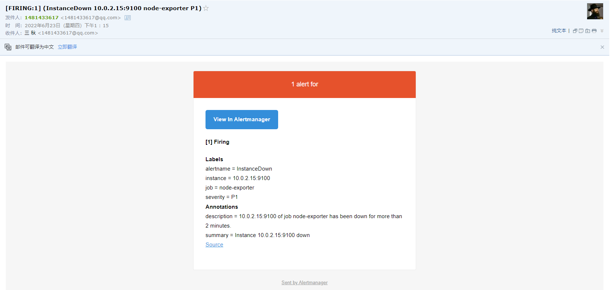

<h1 align = "center">Prometheus学习笔记</h1>

​                                                                                   																																——by 王浩

[TOC]

# 一、Prometheus的概述

## 1、Prometheus简介

Prometheus是一套开源的系统监控报警框架。它启发于Google的borgmon监控系统，由工作在SoundCloud的google前员工在2012年创建，作为社区开源项目进行开发，并于2015年正式发布。2016年，Prometheus正式加入Cloud Native Computing Foundation，成为受欢迎度仅次于Kubernetes的项目。

Prometheus由Go语言编写而成，采用Pull方式获取监控信息，并提供了多维度的数据模型和灵活的查询接口。Prometheus不仅可以通过静态文件配置监控对象，还支持自动发现机制，能通过Kubernetes、Consl、DNS等多种方式动态获取监控对象。在数据采集方面，借助Go语音的高并发特性，单机Prometheus可以采取数百个节点的监控数据；在数据存储方面，随着本地时序数据库的不断优化，单机Prometheus每秒可以采集一千万个指标，如果需要存储大量的历史监控数据，则还支持远程存储。

## 2、Prometheus的优缺点

### （1）Prometheus的优点

* 强大的多维度数据模型：时间序列数据通过metric名和键值对来区分；所有的metrics都可以设置任意的多维标签；数据模型更随意，不需要刻意设置为以点分隔的字符串；可以对数据模型进行聚合，切割和切片操作；支持双精度浮点类型，标签可以设为全unicode。

* 灵活而强大的查询语句（PromQL）：在同一个查询语句，可以对多个metrics进行乘法、加法、连接、取分数位等操作。
* 易于管理： Prometheus server是一个单独的二进制文件，可直接在本地工作，不依赖于分布式存储。
* 高效：平均每个采样点仅占3.5bytes，且一个Prometheus server可以处理数百万的metrics。
* 使用pull模式采集时间序列数据，这样不仅有利于本机测试而且可以避免有问题的服务器推送坏的metrics。
* 可以采用push gateway的方式把时间序列数据推送至Prometheus server端。
* 可视化图形界面：prometheus server自带一个UI, 通过这个ui可以方便对数据进行查询和图形化展示，可以对接grafana可视化工具展示精美监控指标。
* 易于伸缩：prometheus配置比较简单， 可以在每个数据中心运行独立的prometheus server, 也可以使用联邦集群，让多个prometheus实例产生一个逻辑集群，还可以在单个prometheus server处理的任务量过大的时候，通过使用功能分区和联邦集群对其扩展。

### （2）Prometheus的缺点

* 指标众多，需进行适当裁剪。
* 自定义数据类型，有误差（最大误差0.0001%）。
* 自定义采集脚本需要脚本开发能力（go、python），相比zabbix（shell）学习成本高。
* 是指标监控系统，不适合存储事件和日志，更多的是展示趋势性指标，而非精确数据。
* 默认保存周期是一个月，如果需要长期保存建议使用influxDB或者openTSDB。
* 集群机制成熟度不高。

## 3、Prometheus的适用场景

### （1）适用场景

Prometheus适用于记录任何纯数字时间序列。 它适用于以机器为中心的监控以及高度动态的面向服务架构的监控。 在微服务的世界中，Prometheus的多维度数据收集和查询非常强大。

Prometheus是为服务的可靠性而设计的，当服务出现故障时，它可以使你快速定位和诊断问题。 每个Prometheus服务器都是独立的，不依赖于网络存储或其他远程服务。 当基础架构的其他部分损坏时，您可以依赖它，并且您不需要设置大量的基础架构来使用它。

### （2）不适用场景

Prometheus重视可靠性。 即使在故障情况下，也可以随时查看有关系统的可用统计信息。 如果需要100％的准确度，例如按请求计费，Prometheus不是一个好的选择，因为收集的数据可能不够详细和完整。 在这种情况下，最好使用其他系统来收集和分析数据以进行计费，并使用Prometheus进行其余监控。

## 4、Prometheus的学习文档

Prometheus官方文档：https://prometheus.io/docs/prometheus/latest/getting_started/


# 二、Prometheus的架构

## 1、Prometheus的基本组成

Prometheus架构由客户端在被监控系统上利用导出器采集指标数据，在服务端配置静态目标或者动态的服务发现，此时Prometheus根据抓取频率进行数据的拉取（exporter）和推送（pushgateway），然后将抓取的数据存储到时序数据库（TSDB）之中，再利用Grafana的仪表盘展示Prometheus服务中的数据，同时设定记录规则（PromQL表达式）和告警规则（频率）并发送给alertmanager进行发送报警事件到运维人员手中，最终可能还需要进行数据的持久化默认的是本地存储但可以通过远程读写的API让其他系统也可接入采集存储数据。


## 2、Prometheus Server

Prometheus Server是Prometheus组件中的核心部分，负责实现对监控数据的获取，存储以及查询。 Prometheus Server可以通过静态配置管理监控目标，也可以配合使用Service Discovery的方式动态管理监控目标，并从这些监控目标中获取数据。其次Prometheus Server需要对采集到的监控数据进行存储，Prometheus Server本身就是一个时序数据库，将采集到的监控数据按照时间序列的方式存储在本地磁盘当中。最后Prometheus Server对外提供了自定义的PromQL语言，实现对数据的查询以及分析。

Prometheus Server内置的Express Browser UI，通过这个UI可以直接通过PromQL实现数据的查询以及可视化。

Prometheus Server的联邦集群能力可以使其从其他的Prometheus Server实例中获取数据，因此在大规模监控的情况下，可以通过联邦集群以及功能分区的方式对Prometheus Server进行扩展。

## 3、Exporter

Exporter将监控数据采集的端点通过HTTP服务的形式暴露给Prometheus Server，Prometheus Server通过访问该Exporter提供的Endpoint端点，即可获取到需要采集的监控数据。

一般来说可以将Exporter分为2类：

* 直接采集：这一类Exporter直接内置了对Prometheus监控的支持，比如cAdvisor，Kubernetes，Etcd，Gokit等，都直接内置了用于向Prometheus暴露监控数据的端点。
* 间接采集：原有监控目标并不直接支持Prometheus，因此我们需要通过Prometheus提供的Client Library编写该监控目标的监控采集程序。例如： Mysql Exporter，JMX Exporter，Consul Exporter等。

## 4、AlertManager

AlertManager即Prometheus体系中的告警处理中心。在Prometheus Server中支持基于PromQL创建告警规则，如果满足PromQL定义的规则，则会产生一条告警，而告警的后续处理流程则由AlertManager进行管理。在AlertManager中我们可以与邮件，Slack等等内置的通知方式进行集成，也可以通过Webhook自定义告警处理方式。

## 5、Pushgateway

由于Prometheus数据采集基于Pull模型进行设计，因此在网络环境的配置上必须要让Prometheus Server能够直接与Exporter进行通信。当这种网络需求无法直接满足时，就可以利用PushGateway来进行中转。可以通过PushGateway将内部网络的监控数据主动Push到Gateway当中。而Prometheus Server则可以采用同样Pull的方式从PushGateway中获取到监控数据。

## 6、Prometheus web UI

自带的可以展示数据的UI界面，但是不怎么好用，一般采用Grafana来进行可视化展示。

## 7、TSDB

Time Series DataBase（TSDB），时序数据库(TSDB)用于保存时间序列（按时间顺序变化）的数据,每条记录都有完整的时间戳，基于时间的操作都比较方便。

Prometheus按2小时一个block进行存储，每个block由一个目录组成，该目录里包含：一个或者多个chunk文件（保存timeseries数据）、一个metadata文件、一个index文件（通过metric name和labels查找timeseries数据在chunk文件的位置）。

最新写入的数据保存在内存block中，达到2小时后写入磁盘。为了防止程序崩溃导致数据丢失，实现了WAL（write-ahead-log）机制，启动时会以写入日志（WAL）的方式来实现重播，从而恢复数据。

删除数据时，删除条目会记录在独立的tombstone文件中，而不是立即从chunk文件删除。

通过时间窗口的形式保存所有的样本数据，可以明显提高Prometheus的查询效率，当查询一段时间范围内的所有样本数据时，只需要简单的从落在该范围内的块中查询数据即可。

这些2小时的block会在后台压缩成更大的block，数据压缩合并成更高level的block文件后删除低level的block文件。这个和leveldb、rocksdb等LSM树的思路一致。

## 8、Prometheus的基本工作流程

* Step1：Prometheus Server读取配置解析静态监控端点（static_configs），以及服务发现规则（xxx_sd_configs）自动收集需要监控的端点。

* Step2：Prometheus Server周期抓取（scrape_interval）监控端点，通过HTTP的Pull方式采集监控数据。
* Step3：Prometheus Server HTTP请求到达Node Exporter，Exporter返回一个文本响应，每个非注释行包含一条完整的时序数据：Name + Labels + Samples（一个浮点数和一个时间戳构成），数据来源是一些官方的exporter或自定义sdk或接口。
* Step4：Prometheus Server收到响应，Relabel处理之后（relabel_configs）将其存储在TSDB中并建立倒排索引。
* Step5：Prometheus Server另一个周期计算任务（evaluation_interval）开始执行，根据配置的Rules逐个计算与设置的阈值进行匹配，若结果超过阈值并持续时长超过临界点将进行报警，此时发送Alert到AlertManager独立组件中。

* Step6：AlertManager收到告警请求，根据配置的策略决定是否需要触发告警，如需告警则根据配置的路由链路依次发送告警，比如邮件、微信、Slack、PagerDuty、WebHook等等。
* Step7：当通过界面或HTTP调用查询时序数据利用PromQL表达式查询，Prometheus Server处理过滤完之后返回瞬时向量（Instant vector，N条只有一个Sample的时序数据），区间向量(Range vector，N条包含M个Sample的时序数据），或标量数据 （Scalar, 一个浮点数）。
* Step8：采用Grafana开源的分析和可视化工具进行数据的图形化展示。


# 三、Prometheus的相关概念

## 1、样本（Sample）

Prometheus会将所有采集到的样本数据以时间序列（time-series）的方式保存在内存数据库中，并且定时保存到硬盘上。time-series是按照时间戳和值的序列顺序存放的，我们称之为向量（vector)）。每条time-series通过指标名称（metrics name）和一组标签集（labelset）命名。

在time-series中的每一个点称为一个样本（sample），样本由以下三部分组成：

* 指标（metric）：metric name和描述当前样本特征的labelsets；
* 时间戳（timestamp）：一个精确到毫秒的时间戳；
* 样本值（value）： 一个float64的浮点型数据表示当前样本的值。

## 2、指标（Metric）

在形式上，所有的指标（Metric）都通过如下格式标示：

```
<metric name>{<label name>=<label value>, ...}
```

指标的名称（metric name）可以反映被监控样本的含义（比如，http_request_total - 表示当前系统接收到的HTTP请求总量）。指标名称只能由ASCII字符、数字、下划线以及冒号组成并必须符合正则表达式：

```
[a-zA-Z_:][a-zA-Z0-9_:]*
```

标签（label）反映了当前样本的特征维度，通过这些维度Prometheus可以对样本数据进行过滤，聚合等。标签的名称只能由ASCII字符、数字以及下划线组成并满足正则表达式：

```
[a-zA-Z_][a-zA-Z0-9_]*
```

其中以 __ 作为前缀的标签，是系统保留的关键字，只能在系统内部使用。标签的值则可以包含任何Unicode编码的字符。在Prometheus的底层实现中指标名称实际上是以 __ name __=< metric name>的形式保存在数据库中的，因此以下两种方式均表示的同一条time-series：

```
api_http_requests_total{method="POST", handler="/messages"}
#等同于：
{__name__="api_http_requests_total"，method="POST", handler="/messages"}
```

## 3、指标类型

Prometheus客户端库提供了四种核心的metrics类型，这四种类型目前仅在客户端库和wire协议中区分。Prometheus服务还没有充分利用这些类型，将来可能会发生改变。在指标页面中，会注释说明指标的类型。

### （1）Counter（计数器）

counter （只增不减的计数器）是表示单个单调递增计数器的累积度量，其值只能在重启时增加或重置为零（某些特殊情况下除外，比如说定时清零）。 例如，可以使用计数器来表示所服务的请求数，已完成的任务或错误。不要使用计数器来暴露可能减少的值。例如，不要使用计数器来处理当前正在运行的进程数，而是使用gauge。

如prometheus_http_requests_total ，node_cpu_seconds_total都是Counter类型的监控指标。 一般在定义Counter类型指标的名称时推荐使用_total作为后缀。

Counter是一个简单但有强大的工具，例如我们可以在应用程序中记录某些事件发生的次数，通过以时序的形式存储这些数据，我们可以轻松的了解该事件产生速率的变化。 PromQL内置的聚合操作和函数可以让用户对这些数据进行进一步的分析。

例如，通过rate()函数获取HTTP请求量的增长率：

```txt
#通过rate()函数获取HTTP请求量的增长率
rate(prometheus_http_requests_total[5m])

#查询当前系统中，访问量前10的HTTP地址
topk(10, prometheus_http_requests_total)
```

### （2）Gauge（测量器）

gauge（可增可减的仪表盘）是一个度量指标，它表示一个既可以递增，又可以递减的值，Gauge类型的指标侧重于反应系统的当前状态。因此这类指标的样本数据可增可减。通过Gauge指标，用户可以直接查看系统的当前状态，对于Gauge类型的监控指标，通过PromQL内置函数delta()可以获取样本在一段时间返回内的变化情况，还可以使用deriv()计算样本的线性回归模型，甚至是直接使用predict_linear()对数据的变化趋势进行预测。

```txt
#主机当前空闲的内容大小
node_memory_MemFree_bytes

#可用内存大小
node_memory_MemAvailable_bytes

#预测系统磁盘空间在4个小时之后的剩余情况
predict_linear(node_filesystem_files_free{job="node"}[1h], 4 * 3600)
```

### （3）Histogram（柱状图）

假设我们想监控某个应用在一段时间内的响应时间，最后监控到的样本的响应时间范围为0s~10s。现在我们将样本的值域划分为不同的区间，即不同的bucket，每个bucket的宽度0.2s。那么第一个bucket表示响应时间小于等于0.2s的请求数量，第二个bucket表示响应时间大于0.2s小于等于0.4s的请求数量，以此类推。

Prometheus的histogram是一种累积直方图，与上面的区间划分方式是有差别的，它的划分方式如下：还假设每个bucket的宽度是0.2s，那么第一个bucket表示响应时间小于等于0.2s的请求数量，第二个bucket 表示响应时间小于等于 0.4s 的请求数量，以此类推。也就是说，每一个bucket的样本包含了之前所有bucket的样本，所以叫累积直方图。

如果histogram类型的指标中加入了额外的标签，或者划分了更多的bucket，那么样本数据的分析就会变得越来越复杂。如果histogram 是累积的，在抓取指标时就可以根据需要丢弃某些bucket，这样可以在降低Prometheus维护成本的同时，还可以粗略计算样本值的分位数。通过这种方法，用户不需要修改应用代码，便可以动态减少抓取到的样本数量。

直方图对观察结果进行采样（通常是请求持续时间或响应大小等），并将其计入可配置存储桶中。它还提供所有观察值的总和。比如对一天的http请求进行统计，获取不同响应时间的访问数。

基本度量标准名称为< basename >的直方图在scrape期间显示多个时间序列：

- 暴露的观察桶的累积计数器：< basename>_bucket{le="< upper inclusive bound >"}
- 所有观测值的总和：< basename >_sum
- 已观察到的事件数：< basename >_ count，和< basename>_bucket{le="+Inf"}相同

### （4）Summary（综合）

如果需要聚合（aggregate），选择histograms，如果比较清楚要观测的指标的范围和分布情况，选择histograms。如果需要精确的分为数选择summary。

类似histogram柱状图，summary是采样点分位图统计（通常是请求持续时间和响应大小等）。虽然它还提供观察的总数和所有观测值的总和，但它在滑动时间窗口上计算可配置的分位数。

基本度量标准名称< basename>的summary在scrape期间公开了多个时间序列：

* 流φ-quantiles (0 ≤ φ ≤ 1)：显示为< basename>{quantiles="[φ]"}
* < basename >_sum：是指所有观察值的总和
* < basename>_ count：是指已观察到的事件计数值

## 4、实例（Instance）

当我们需要采集不同的监控指标（例如：主机、MySQL、Nginx）时，我们只需要运行相应的监控采集程序，并且让Prometheus Server知道这些Exporter实例的访问地址。在Prometheus中，每一个暴露监控样本数据的HTTP服务称为一个实例。

## 5、任务（Job）

一组用于相同采集目的的实例，或者同一个采集进程的多个副本则通过一个一个任务（Job）进行管理。当前在每一个Job中主要使用了静态配置(static_configs)的方式定义监控目标。除了静态配置每一个Job的采集Instance地址以外，Prometheus还支持与DNS、Consul、E2C、Kubernetes等进行集成实现自动发现Instance实例，并从这些Instance上获取监控数据。

可以访问http://ip:9090/targets直接从Prometheus的UI中查看当前所有的任务以及每个任务对应的实例信息。


# 四、安装部署Prometheus

## 1、安装Prometheus server

### （1）下载Prometheus server

```shell
[root@master /]# mkdir prometheus

[root@master /]# cd prometheus/

[root@master prometheus]# wget https://github.com/prometheus/prometheus/releases/download/v2.32.1/prometheus-2.32.1.linux-amd64.tar.gz

2021-12-14 23:08:24 (11.8 MB/s) - ‘prometheus-2.32.1.linux-amd64.tar.gz’ saved [75073989/75073989]

[root@master prometheus]# ls
prometheus-2.32.1.linux-amd64.tar.gz
```

### （2）安装Prometheus server

```shell
#同步系统时间，不然可能会报错，对系统时间的要求非常高，需要经常去同步时间。
[root@master prometheus]# ntpdate  ntp.aliyun.com
21 Dec 10:01:51 ntpdate[18246]: step time server 203.107.6.88 offset 557418.387109 sec

[root@master prometheus]# tar xvfz prometheus-2.32.1.linux-amd64.tar.gz
prometheus-2.32.1.linux-amd64/
prometheus-2.32.1.linux-amd64/consoles/
prometheus-2.32.1.linux-amd64/consoles/index.html.example
prometheus-2.32.1.linux-amd64/consoles/node-cpu.html
prometheus-2.32.1.linux-amd64/consoles/node-disk.html
prometheus-2.32.1.linux-amd64/consoles/node-overview.html
prometheus-2.32.1.linux-amd64/consoles/node.html
prometheus-2.32.1.linux-amd64/consoles/prometheus-overview.html
prometheus-2.32.1.linux-amd64/consoles/prometheus.html
prometheus-2.32.1.linux-amd64/console_libraries/
prometheus-2.32.1.linux-amd64/console_libraries/menu.lib
prometheus-2.32.1.linux-amd64/console_libraries/prom.lib
prometheus-2.32.1.linux-amd64/prometheus.yml
prometheus-2.32.1.linux-amd64/LICENSE
prometheus-2.32.1.linux-amd64/NOTICE
prometheus-2.32.1.linux-amd64/prometheus
prometheus-2.32.1.linux-amd64/promtool

[root@master prometheus]# ls
prometheus-2.32.1.linux-amd64  prometheus-2.32.1.linux-amd64.tar.gz

[root@master prometheus]# cd prometheus-2.32.1.linux-amd64

[root@master prometheus-2.32.1.linux-amd64]# ls
console_libraries  consoles  LICENSE  NOTICE  prometheus  prometheus.yml  promtool

#执行帮助命令
[root@master prometheus-2.32.1.linux-amd64]# ./prometheus --help
usage: prometheus [<flags>]

The Prometheus monitoring server
...
```

### （3）Prometheus的初始配置

prometheus的配置文件是YAML文件，Prometheus下载包里附带一个名为prometheus.yml的文件中的示例配置。起作用的有三个配置块：global，rule_files和scrape_configs。由于Prometheus还将自己的数据公开为HTTP端点，因此它可以抓取并监控自身的健康状况。 在默认配置中，有一个名为prometheus的job，它会抓取Prometheus服务器公开的时间序列数据。 包含一个静态配置的目标，即端口9090上的localhost。Prometheus希望指标在/metrics路径上的目标上可用。 所以这个默认的工作是通过URL抓取：[http//localhost:9090/metrics](https://links.jianshu.com/go?to=http%2F%2Flocalhost%3A9090%2Fmetrics)。返回的时间序列数据将详细说明Prometheus服务器的状态和性能。

```yaml
# my global config
global:
  scrape_interval: 15s # Set the scrape interval to every 15 seconds. Default is every 1 minute.
  evaluation_interval: 15s # Evaluate rules every 15 seconds. The default is every 1 minute.
  # scrape_timeout is set to the global default (10s).

# Alertmanager configuration
#alerting:
#  alertmanagers:
#    - static_configs:
#        - targets:
          # - alertmanager:9093

# Load rules once and periodically evaluate them according to the global 'evaluation_interval'.
rule_files:
  # - "first_rules.yml"
  # - "second_rules.yml"

# A scrape configuration containing exactly one endpoint to scrape:
# Here it's Prometheus itself.
scrape_configs:
  # The job name is added as a label `job=<job_name>` to any timeseries scraped from this config.
  - job_name: "prometheus"

    # metrics_path defaults to '/metrics'
    # scheme defaults to 'http'.

    static_configs:
      - targets: ["localhost:9090"]
```

### （4）启动Prometheus server

使用初始配置文件启动，到prometheus.yml的相同路径下。Prometheus启动后应该能够在[http//localhost:9090](https://links.jianshu.com/go?to=http%2F%2Flocalhost%3A9090)浏览到状态页面，给它大约30秒的时间从自己的HTTP指标端点收集有关自己的数据。还可以通过导航到其自己的指标端点来验证是否正在提供有关自身的指标：[http//localhost:9090/metrics](https://links.jianshu.com/go?to=http%2F%2Flocalhost%3A9090%2Fmetrics)。

```shell
[root@master prometheus-2.32.1.linux-amd64]# ./prometheus --config.file=prometheus.yml
ts=2021-12-21T02:48:08.915Z caller=main.go:478 level=info msg="No time or size retention was set so using the default time retention" duration=15d
ts=2021-12-21T02:48:08.915Z caller=main.go:515 level=info msg="Starting Prometheus" version="(version=2.32.1, branch=HEAD, revision=41f1a8125e664985dd30674e5bdf6b683eff5d32)"
ts=2021-12-21T02:48:08.915Z caller=main.go:520 level=info build_context="(go=go1.17.5, user=root@54b6dbd48b97, date=20211217-22:08:06)"
ts=2021-12-21T02:48:08.915Z caller=main.go:521 level=info host_details="(Linux 3.10.0-1160.49.1.el7.x86_64 #1 SMP Tue Nov 30 15:51:32 UTC 2021 x86_64 master (none))"
ts=2021-12-21T02:48:08.915Z caller=main.go:522 level=info fd_limits="(soft=1024, hard=4096)"
ts=2021-12-21T02:48:08.915Z caller=main.go:523 level=info vm_limits="(soft=unlimited, hard=unlimited)"
ts=2021-12-21T02:48:08.918Z caller=web.go:570 level=info component=web msg="Start listening for connections" address=0.0.0.0:9090
ts=2021-12-21T02:48:08.918Z caller=main.go:924 level=info msg="Starting TSDB ..."
ts=2021-12-21T02:48:08.924Z caller=tls_config.go:195 level=info component=web msg="TLS is disabled." http2=false
ts=2021-12-21T02:48:08.929Z caller=head.go:488 level=info component=tsdb msg="Replaying on-disk memory mappable chunks if any"
ts=2021-12-21T02:48:08.929Z caller=head.go:522 level=info component=tsdb msg="On-disk memory mappable chunks replay completed" duration=7.67µs
ts=2021-12-21T02:48:08.929Z caller=head.go:528 level=info component=tsdb msg="Replaying WAL, this may take a while"
ts=2021-12-21T02:48:08.937Z caller=head.go:599 level=info component=tsdb msg="WAL segment loaded" segment=0 maxSegment=0
ts=2021-12-21T02:48:08.937Z caller=head.go:605 level=info component=tsdb msg="WAL replay completed" checkpoint_replay_duration=25.322µs wal_replay_duration=8.650107ms total_replay_duration=8.70241ms
ts=2021-12-21T02:48:08.939Z caller=main.go:945 level=info fs_type=XFS_SUPER_MAGIC
ts=2021-12-21T02:48:08.939Z caller=main.go:948 level=info msg="TSDB started"
ts=2021-12-21T02:48:08.939Z caller=main.go:1129 level=info msg="Loading configuration file" filename=prometheus.yml
ts=2021-12-21T02:48:08.941Z caller=main.go:1166 level=info msg="Completed loading of configuration file" filename=prometheus.yml totalDuration=1.593742ms db_storage=1.551µs remote_storage=6.05µs web_handler=655ns query_engine=1.54µs scrape=887.048µs scrape_sd=50.918µs notify=2.293µs notify_sd=2.175µs rules=5.647µs
ts=2021-12-21T02:48:08.941Z caller=main.go:897 level=info msg="Server is ready to receive web requests."
```

### （5）查看状态页面

访问9090端口，要使用Prometheus的内置表达式浏览器，导航到http://127.0.0.1:9090/graph，输入一个度量标准promhttp_metric_handler_requests_total（Prometheus服务器已服务的/metrics请求的总数）到表达式控制台，点击Graph。

这应该返回许多不同的时间序列（以及为每个记录的最新值），所有时间序列都使用度量标准名称promhttp_metric_handler_requests_total，但具有不同的标签。 这些标签指定不同的请求状态。如果我们只对导致HTTP代码200的请求感兴趣，我们可以使用此查询来检索该信息：

```
promhttp_metric_handler_requests_total{code="200", instance="localhost:9090", job="prometheus"}
```

就可以看到：



要计算返回的时间序列总数，可以写：

```
count(promhttp_metric_handler_requests_total)
```

### （6）查看指标页面

访问http://127.0.0.1:9090/metrics


## 2、使用Node Exporter采集主机数据 1860

在Prometheus的架构设计中，Prometheus Server并不直接服务监控特定的目标，其主要任务负责数据的收集，存储并且对外提供数据查询支持。因此为了能够能够监控到某些东西，如主机的CPU使用率，我们需要使用到Exporter。Prometheus周期性的从Exporter暴露的HTTP服务地址（通常是/metrics）拉取监控样本数据。

Exporter可以是一个相对开放的概念，其可以是一个独立运行的程序独立于监控目标以外，也可以是直接内置在监控目标中。只要能够向Prometheus提供标准格式的监控样本数据即可。

为了能够采集到主机的运行指标如CPU, 内存，磁盘等信息。我们可以使用Node Exporter。

### （1）下载Node Exporter

```shell
[root@master prometheus]# wget https://github.com/prometheus/node_exporter/releases/download/v1.3.1/node_exporter-1.3.1.linux-amd64.tar.gz

2021-12-22 10:47:13 (17.8 MB/s) - ‘node_exporter-1.3.1.linux-amd64.tar.gz’ saved [9033415/9033415]

[root@master prometheus]# ls
node_exporter-1.3.1.linux-amd64.tar.gz  prometheus-2.32.1.linux-amd64  prometheus-2.32.1.linux-amd64.tar.gz
```

### （2）安装Node Exporter

```shell
[root@master prometheus]# tar xvfz node_exporter-1.3.1.linux-amd64.tar.gz
node_exporter-1.3.1.linux-amd64/
node_exporter-1.3.1.linux-amd64/LICENSE
node_exporter-1.3.1.linux-amd64/NOTICE
node_exporter-1.3.1.linux-amd64/node_exporter

[root@master prometheus]# ls
node_exporter-1.3.1.linux-amd64  node_exporter-1.3.1.linux-amd64.tar.gz  prometheus-2.32.1.linux-amd64  prometheus-2.32.1.linux-amd64.tar.gz

[root@master prometheus]# cd node_exporter-1.3.1.linux-amd64

[root@master node_exporter-1.3.1.linux-amd64]# ls
LICENSE  node_exporter  NOTICE
```

### （3）启动Node Exporter

```shell
[root@master node_exporter-1.3.1.linux-amd64]# ./node_exporter
ts=2021-12-22T02:51:19.503Z caller=node_exporter.go:182 level=info msg="Starting node_exporter" version="(version=1.3.1, branch=HEAD, revision=a2321e7b940ddcff26873612bccdf7cd4c42b6b6)"
ts=2021-12-22T02:51:19.503Z caller=node_exporter.go:183 level=info msg="Build context" build_context="(go=go1.17.3, user=root@243aafa5525c, date=20211205-11:09:49)"
ts=2021-12-22T02:51:19.503Z caller=node_exporter.go:185 level=warn msg="Node Exporter is running as root user. This exporter is designed to run as unpriviledged user, root is not required."
ts=2021-12-22T02:51:19.505Z caller=filesystem_common.go:111 level=info collector=filesystem msg="Parsed flag --collector.filesystem.mount-points-exclude" flag=^/(dev|proc|run/credentials/.+|sys|var/lib/docker/.+)($|/)
ts=2021-12-22T02:51:19.505Z caller=filesystem_common.go:113 level=info collector=filesystem msg="Parsed flag --collector.filesystem.fs-types-exclude" flag=^(autofs|binfmt_misc|bpf|cgroup2?|configfs|debugfs|devpts|devtmpfs|fusectl|hugetlbfs|iso9660|mqueue|nsfs|overlay|proc|procfs|pstore|rpc_pipefs|securityfs|selinuxfs|squashfs|sysfs|tracefs)$
ts=2021-12-22T02:51:19.506Z caller=node_exporter.go:108 level=info msg="Enabled collectors"
ts=2021-12-22T02:51:19.506Z caller=node_exporter.go:115 level=info collector=arp
ts=2021-12-22T02:51:19.506Z caller=node_exporter.go:115 level=info collector=bcache
ts=2021-12-22T02:51:19.506Z caller=node_exporter.go:115 level=info collector=bonding
ts=2021-12-22T02:51:19.506Z caller=node_exporter.go:115 level=info collector=btrfs
ts=2021-12-22T02:51:19.506Z caller=node_exporter.go:115 level=info collector=conntrack
ts=2021-12-22T02:51:19.506Z caller=node_exporter.go:115 level=info collector=cpu
ts=2021-12-22T02:51:19.506Z caller=node_exporter.go:115 level=info collector=cpufreq
ts=2021-12-22T02:51:19.506Z caller=node_exporter.go:115 level=info collector=diskstats
ts=2021-12-22T02:51:19.506Z caller=node_exporter.go:115 level=info collector=dmi
ts=2021-12-22T02:51:19.506Z caller=node_exporter.go:115 level=info collector=edac
ts=2021-12-22T02:51:19.506Z caller=node_exporter.go:115 level=info collector=entropy
ts=2021-12-22T02:51:19.506Z caller=node_exporter.go:115 level=info collector=fibrechannel
ts=2021-12-22T02:51:19.506Z caller=node_exporter.go:115 level=info collector=filefd
ts=2021-12-22T02:51:19.506Z caller=node_exporter.go:115 level=info collector=filesystem
ts=2021-12-22T02:51:19.506Z caller=node_exporter.go:115 level=info collector=hwmon
ts=2021-12-22T02:51:19.506Z caller=node_exporter.go:115 level=info collector=infiniband
ts=2021-12-22T02:51:19.506Z caller=node_exporter.go:115 level=info collector=ipvs
ts=2021-12-22T02:51:19.506Z caller=node_exporter.go:115 level=info collector=loadavg
ts=2021-12-22T02:51:19.506Z caller=node_exporter.go:115 level=info collector=mdadm
ts=2021-12-22T02:51:19.506Z caller=node_exporter.go:115 level=info collector=meminfo
ts=2021-12-22T02:51:19.506Z caller=node_exporter.go:115 level=info collector=netclass
ts=2021-12-22T02:51:19.506Z caller=node_exporter.go:115 level=info collector=netdev
ts=2021-12-22T02:51:19.506Z caller=node_exporter.go:115 level=info collector=netstat
ts=2021-12-22T02:51:19.506Z caller=node_exporter.go:115 level=info collector=nfs
ts=2021-12-22T02:51:19.506Z caller=node_exporter.go:115 level=info collector=nfsd
ts=2021-12-22T02:51:19.506Z caller=node_exporter.go:115 level=info collector=nvme
ts=2021-12-22T02:51:19.506Z caller=node_exporter.go:115 level=info collector=os
ts=2021-12-22T02:51:19.506Z caller=node_exporter.go:115 level=info collector=powersupplyclass
ts=2021-12-22T02:51:19.506Z caller=node_exporter.go:115 level=info collector=pressure
ts=2021-12-22T02:51:19.506Z caller=node_exporter.go:115 level=info collector=rapl
ts=2021-12-22T02:51:19.506Z caller=node_exporter.go:115 level=info collector=schedstat
ts=2021-12-22T02:51:19.506Z caller=node_exporter.go:115 level=info collector=sockstat
ts=2021-12-22T02:51:19.506Z caller=node_exporter.go:115 level=info collector=softnet
ts=2021-12-22T02:51:19.506Z caller=node_exporter.go:115 level=info collector=stat
ts=2021-12-22T02:51:19.506Z caller=node_exporter.go:115 level=info collector=tapestats
ts=2021-12-22T02:51:19.506Z caller=node_exporter.go:115 level=info collector=textfile
ts=2021-12-22T02:51:19.506Z caller=node_exporter.go:115 level=info collector=thermal_zone
ts=2021-12-22T02:51:19.506Z caller=node_exporter.go:115 level=info collector=time
ts=2021-12-22T02:51:19.506Z caller=node_exporter.go:115 level=info collector=timex
ts=2021-12-22T02:51:19.506Z caller=node_exporter.go:115 level=info collector=udp_queues
ts=2021-12-22T02:51:19.506Z caller=node_exporter.go:115 level=info collector=uname
ts=2021-12-22T02:51:19.506Z caller=node_exporter.go:115 level=info collector=vmstat
ts=2021-12-22T02:51:19.506Z caller=node_exporter.go:115 level=info collector=xfs
ts=2021-12-22T02:51:19.506Z caller=node_exporter.go:115 level=info collector=zfs
ts=2021-12-22T02:51:19.506Z caller=node_exporter.go:199 level=info msg="Listening on" address=:9100
ts=2021-12-22T02:51:19.507Z caller=tls_config.go:195 level=info msg="TLS is disabled." http2=false
```

### （4）查看状态页面

访问访问http://localhost:9100/


### （5）访问目标页面

访问http://127.0.0.1:9090/targets，已经多了一个node target，且状态为up。



### （6）访问指标页面

访问http://localhost:9100/metrics


每一个监控指标之前都会有一段类似于如下形式的信息：

```
# HELP node_arp_entries ARP entries by device
# TYPE node_arp_entries gauge
node_arp_entries{device="enp0s3"} 5
# HELP node_boot_time_seconds Node boot time, in unixtime.
# TYPE node_boot_time_seconds gauge
node_boot_time_seconds 1.640090875e+09
```

HELP用于解释当前指标的含义，TYPE则说明当前指标的数据类型。

根据不同的系统，还有其他的监控指标：

| 监控指标          | 说明                              |
| ----------------- | --------------------------------- |
| node_boot_time_*  | 系统启动时间                      |
| node_cpu_*        | 系统CPU使用量                     |
| node_disk_*       | 磁盘IO                            |
| node_filesystem_* | 文件系统用量                      |
| node_load1_*      | 系统负载                          |
| node_memeory_*    | 内存使用量                        |
| node_network_*    | 网络带宽                          |
| node_time_*       | 当前系统时间                      |
| go_*              | node exporter中go相关指标         |
| process_*         | node exporter自身进程相关运行指标 |

### （7）从Node Exporter收集监控数据

为了能够让Prometheus Server能够从当前node exporter获取到监控数据，这里需要修改Prometheus配置文件。

* 编辑prometheus.yml

```yaml
# my global config
global:
  scrape_interval: 15s # Set the scrape interval to every 15 seconds. Default is every 1 minute.
  evaluation_interval: 15s # Evaluate rules every 15 seconds. The default is every 1 minute.
  # scrape_timeout is set to the global default (10s).

# Alertmanager configuration
#alerting:
#  alertmanagers:
#    - static_configs:
#        - targets:
          # - alertmanager:9093

# Load rules once and periodically evaluate them according to the global 'evaluation_interval'.
rule_files:
  # - "first_rules.yml"
  # - "second_rules.yml"

# A scrape configuration containing exactly one endpoint to scrape:
# Here it's Prometheus itself.

scrape_configs:
  - job_name: 'prometheus'
    static_configs:
      - targets: ['localhost:9090']
  # 添加采集node exporter监控数据的配置
  - job_name: 'node'
    static_configs:
      - targets: ['localhost:9100']


    # metrics_path defaults to '/metrics'
    # scheme defaults to 'http'.

#    static_configs:
#      - targets: ["localhost:9090"]
```

* 重启Prometheus Server

重新启动后，再次查看http://localhost:9090，。如果输入“up”并且点击执行按钮：


可以看到值都为1，表示能够正常从node exporter获取数据（0则表示异常）：

```txt
up{instance="localhost:9090", job="prometheus"} 1

up{instance="localhost:9100", job="node"}       1
```

## 3、使用PromQL查询监控数据

Prometheus UI是Prometheus内置的一个可视化管理界面，通过Prometheus UI用户能够轻松的了解Prometheus当前的配置，监控任务运行状态等。 通过Graph面板，用户还能直接使用PromQL实时查询监控数据。

### （1）查询关键字

切换到Graph面板，用户可以使用PromQL表达式查询特定监控指标的监控数据。查询主机负载变化情况，可以使用关键字node_load1可以查询出Prometheus采集到的主机负载的样本数据，这些样本数据按照时间先后顺序展示，形成了主机负载随时间变化的趋势图表。


### （2）查询函数

PromQL是Prometheus自定义的一套强大的数据查询语言，除了使用监控指标作为查询关键字以外，还内置了大量的函数，帮助用户进一步对时序数据进行处理。例如使用rate()函数，可以计算在单位时间内样本数据的变化情况（即增长率），因此通过该函数我们可以近似的通过CPU使用时间计算CPU的利用率。


## 4、Grafana可视化监控数据

Prometheus UI提供了快速验证PromQL以及临时可视化支持的能力，而在大多数场景下引入监控系统通常还需要构建可以长期使用的监控数据可视化面板（Dashboard）。这时用户可以考虑使用第三方的可视化工具如Grafana，Grafana是一个开源的可视化平台，并且提供了对Prometheus的完整支持。

### （1）运行grafana容器

```shell
[root@master prometheus-2.32.1.linux-amd64]# docker run -dit --name grafana -p 3000:3000 grafana/grafana:8.3.0
Unable to find image 'grafana/grafana:8.3.0' locally
8.3.0: Pulling from grafana/grafana
97518928ae5f: Pull complete
33f610417605: Pull complete
982c8babeb69: Pull complete
35db451b2276: Pull complete
32f95bcac453: Pull complete
ff155ce441ae: Pull complete
8d11671a7759: Pull complete
b7760718149d: Pull complete
9edc204c0f2c: Pull complete
dcd3ae8cb697: Pull complete
Digest: sha256:64853d72058a08490a9edbba3e7884ae1a2aa0767c6f4d43d1f06f9c477dd7d4
Status: Downloaded newer image for grafana/grafana:8.3.0
ab3c5db888ea8d1af7c378f1b0421c23f8f00991731c48154e9d02e0cf4c481d
```

### （2）浏览器查看

访问http://127.0.0.1:3000/，就可以进入到Grafana的界面中。默认情况下使用账户admin/admin进行登录。


### （3）配置Grafana

在Configuration中添加Prometheus作为默认的数据源，指定数据源类型为Prometheus并且设置Prometheus的访问方式和访问地址即可，在配置正确的情况下点击“save&test”按钮，如果没有提示错误的情况下，点击“Explore”。

添加PromQL查询表达式之后，点击“Run query”，就可以查看。


### （4）导入监控dashboard

当然作为开源软件，Grafana社区鼓励用户分享Dashboard通过https://grafana.com/dashboards网站，可以找到大量可直接使用的Dashboard，Grafana中所有的Dashboard通过JSON进行共享，下载并且导入这些JSON文件，就可以直接使用这些已经定义好的Dashboard。

在Grafana页面，点击import，输入1860，选择Peometheus数据源，然后导入。


# 五、Prometheus的配置

Prometheus通过命令行和配置文件进行配置，命令行配置不能修改的系统参数（例如存储位置，要保留在磁盘和内存中的数据量等），但配置文件定义了与抓取作业及其实例相关的所有内容，以及哪些规则文件的加载。

Prometheus可以在运行时重新加载其配置。 如果新配置格式不正确，则更改将不会应用。 通过向Prometheus进程发送SIGHUP或向/-/reload端点发送HTTP POST请求（启用--web.enable-lifecycle）来触发配置重载，这还将重新加载所有已配置的规则文件。

## 1、配置文件的组成

### （1）配置文件的组成

使用--config.file参数指定要加载的配置文件。该文件以YAML格式编写，括号表示参数是可选的，对于为设置的参数，该值设置为指定的默认值。

默认的配置文件有六个组成部分，分别是global、rule_files、scrape_configs、alerting、remote_write、remote_read。

```yaml
global:
  # 默认情况下抓取目标的频率.
  [ scrape_interval: <duration> | default = 1m ]

  # 抓取超时时间.
  [ scrape_timeout: <duration> | default = 10s ]

  # 评估规则的频率.
  [ evaluation_interval: <duration> | default = 1m ]

  # 与外部系统通信时添加到任何时间序列或警报的标签（联合，远程存储，Alertma# nager）.即添加到拉取的数据并存到数据库中
  external_labels:
    [ <labelname>: <labelvalue> ... ]

# 规则文件指定了一个globs列表. 
# 从所有匹配的文件中读取规则和警报.
rule_files:
  [ - <filepath_glob> ... ]

# 抓取配置列表.
scrape_configs:
  [ - <scrape_config> ... ]

# 警报指定与Alertmanager相关的设置.
alerting:
  alert_relabel_configs:
    [ - <relabel_config> ... ]
  alertmanagers:
    [ - <alertmanager_config> ... ]

# 与远程写入功能相关的设置.
remote_write:
  [ - <remote_write> ... ]

# 与远程读取功能相关的设置.
remote_read:
  [ - <remote_read> ... ]
```

### （2）通用占位符

通用占位符定义如下：

| 通用占位符    | 说明                                                 |
| ------------- | ---------------------------------------------------- |
| < boolean>    | 一个可以取值为true或false的布尔值                    |
| < duration>   | 与正则表达式匹配的持续时间[0-9] +（ms  \| [smhdwy]） |
| < labelname>  | 与正则表达式匹配的字符串[a-zA-Z _] [a-zA-Z0-9 _] *   |
| < labelvalue> | 一串unicode字符                                      |
| < filename>   | 当前工作目录中的有效路径                             |
| < host>       | 由主机名或IP后跟可选端口号组成的有效字符串           |
| < path>       | 有效的URL路径                                        |
| < scheme>     | 一个可以取值http或https的字符串                      |
| < string>     | 常规字符串                                           |
| < secret>     | 一个秘密的常规字符串，例如密码                       |
| <tmpl_string> | 在使用前进行模板扩展的字符串                         |

其他占位符是单独指定的。

## 2、global

控制Prometheus服务器的全局配置。全局配置指定在所有其他配置上下文中有效的参数，比如采集间隔，抓取超时时间等。 它们还可用作其他配置节的默认值。主要包含4个属性scrape_interval、scrape_timeout、evaluation_interval、external_labels。

```yaml
global:
  # 默认情况下抓取目标的频率。
  [ scrape_interval: <duration> | default = 1m ]

  # 抓取超时时间。
  [ scrape_timeout: <duration> | default = 10s ]

  # 评估规则的频率。
  [ evaluation_interval: <duration> | default = 1m ]

  # 与外部系统通信时添加到任何时间序列或警报的标签（联合，远程存储，Alertma# nager）。即添加到拉取的数据并存到数据库中
  external_labels:
    [ <labelname>: <labelvalue> ... ]
```

### （1）scrape_interval

指定Prometheus抓取应用程序数据的间隔时间，默认情况下抓取目标的频率为1m，也可以为单个目标重写此值

```yaml
#设置默认的频率为15s
scrape_interval: 15s
```

### （2）scrape_timeout

指定抓取超时时间，默认的超时时间为10s。

```yaml
#设置抓取超时时间为10s
scrape_timeout: 10s
```

### （3）evaluation_interval

指定评估规则的频率，默认为1m。

```yaml
evaluation_interval: 1m
```

## 3、rule_files

```yaml
# 规则文件指定了一个globs列表。
# 从所有匹配的文件中读取规则和警报。
rule_files:
  [ - <filepath_glob> ... ]

#设置报警规则文件为prometheus.rules.yml
rule_files:
  - "prometheus.rules.yml"
```

## 4、scrape_configs

<scrape_config>指定一组描述如何抓取的目标和参数。 一般一个scrape指定单个job。目标可以通过<static_configs>参数静态配置，也可以使用其中一种支持的服务发现机制动态发现。此外，<relabel_configs>允许在抓取之前对任何目标及其标签进行高级修改。

其中<job_name>在所有scrape配置中必须是唯一的。

```yaml
# 默认分配给已抓取指标的job名称。
job_name: <job_name>

# 从job中抓取目标的频率。
[ scrape_interval: <duration> | default = <global_config.scrape_interval> ]

# 抓取此job时，每次抓取超时时间。
[ scrape_timeout: <duration> | default = <global_config.scrape_timeout> ]

# 从目标获取指标的HTTP资源路径。
[ metrics_path: <path> | default = /metrics ]

# honor_labels控制Prometheus如何处理已经存在于已抓取数据中的标签与Prometheus将附加服务器端的标签之间的冲突（"job"和"instance"标签，手动配置的目标标签以及服务发现实现生成的标签）。
# 如果honor_labels设置为"true"，则通过保留已抓取数据的标签值并忽略冲突的服务器端标签来解决标签冲突。
# 如果honor_labels设置为"false"，则通过将已抓取数据中的冲突标签重命名为"exported_ <original-label>"（例如"exported_instance"，"exported_job"）然后附加服务器端标签来解决标签冲突。 这对于联合等用例很有用，其中应保留目标中指定的所有标签。
# 请注意，任何全局配置的"external_labels"都不受此设置的影响。在与外部系统通信时，它们始终仅在时间序列尚未具有给定标签时应用，否则将被忽略。
[ honor_labels: <boolean> | default = false ]

# 配置用于请求的协议方案。
[ scheme: <scheme> | default = http ]

# 可选的HTTP URL参数。
params:
  [ <string>: [<string>, ...] ]

# 使用配置的用户名和密码在每个scrape请求上设置`Authorization`标头。 password和password_file是互斥的。
basic_auth:
  [ username: <string> ]
  [ password: <secret> ]
  [ password_file: <string> ]

# 使用配置的承载令牌在每个scrape请求上设置`Authorization`标头。 它`bearer_token_file`和是互斥的。
[ bearer_token: <secret> ]

# 使用配置的承载令牌在每个scrape请求上设置`Authorization`标头。 它`bearer_token`和是互斥的。
[ bearer_token_file: /path/to/bearer/token/file ]

# 配置scrape请求的TLS设置。
tls_config:
  [ <tls_config> ]

# 可选的代理URL。
[ proxy_url: <string> ]

# Azure服务发现配置列表。
azure_sd_configs:
  [ - <azure_sd_config> ... ]

# Consul服务发现配置列表。
consul_sd_configs:
  [ - <consul_sd_config> ... ]

# DNS服务发现配置列表。
dns_sd_configs:
  [ - <dns_sd_config> ... ]

# EC2服务发现配置列表。
ec2_sd_configs:
  [ - <ec2_sd_config> ... ]

# OpenStack服务发现配置列表。
openstack_sd_configs:
  [ - <openstack_sd_config> ... ]

# 文件服务发现配置列表。
file_sd_configs:
  [ - <file_sd_config> ... ]

# GCE服务发现配置列表。
gce_sd_configs:
  [ - <gce_sd_config> ... ]

# Kubernetes服务发现配置列表。
kubernetes_sd_configs:
  [ - <kubernetes_sd_config> ... ]

# Marathon服务发现配置列表。
marathon_sd_configs:
  [ - <marathon_sd_config> ... ]

# AirBnB的神经服务发现配置列表。
nerve_sd_configs:
  [ - <nerve_sd_config> ... ]

# Zookeeper Serverset服务发现配置列表。
serverset_sd_configs:
  [ - <serverset_sd_config> ... ]

# Triton服务发现配置列表。
triton_sd_configs:
  [ - <triton_sd_config> ... ]

# 此job的标记静态配置目标列表。
static_configs:
  [ - <static_config> ... ]

# 目标重新标记配置列表。
relabel_configs:
  [ - <relabel_config> ... ]

# 度量标准重新配置列表。
metric_relabel_configs:
  [ - <relabel_config> ... ]

# 对每个将被接受的样本数量的每次抓取限制。
# 如果在度量重新标记后存在超过此数量的样本，则整个抓取将被视为失败。 0表示没有限制。
[ sample_limit: <int> | default = 0 ]
```

### （1）job_name

指定job的名字。

```yaml
#指定job的名字是prometheus
job_name: "prometheus"
```

### （2）static_config

指定静态目标的规范方法，定目标列表和它们的公共标签集。

```yaml
# 静态配置指定的目标。
targets:
  [ - '<host>' ]

# 分配给从目标中已抓取的所有指标的标签。
labels:
  [ <labelname>: <labelvalue> ... ]

#设置目标为localhost:9090，并指定标签为target:01
static_configs:
  - targets: ['localhost:9090']
    labels: [target:01]
```

### （3）relabel_config

重新标记是一种强大的工具，可以在抓取目标之前动态重写目标的标签集。 每个抓取配置可以配置多个重新标记步骤。 它们按照它们在配置文件中的出现顺序应用于每个目标的标签集。

```yaml
# 源标签从现有标签中选择值。 它们的内容使用已配置的分隔符进行连接，并与已配置的正则表达式进行匹配，以进行替换，保留和删除操作。
[ source_labels: '[' <labelname> [, ...] ']' ]

# 分隔符放置在连接的源标签值之间。
[ separator: <string> | default = ; ]

# 在替换操作中将结果值写入的标签。
# 替换操作是强制性的。 正则表达式捕获组可用。
[ target_label: <labelname> ]

# 与提取的值匹配的正则表达式。
[ regex: <regex> | default = (.*) ]

# 采用源标签值的散列的模数。
[ modulus: <uint64> ]

# 如果正则表达式匹配，则执行正则表达式替换的替换值。 正则表达式捕获组可用。
[ replacement: <string> | default = $1 ]

# 基于正则表达式匹配执行的操作。
[ action: <relabel_action> | default = replace ]
```

## 5、alerting

altering配置Prometheus的警报服务器。Prometheus的警报由一个名为AlertManager的独立工具提供。

```yaml
# 警报指定与Alertmanager相关的设置.
alerting:
  alert_relabel_configs:
    [ - <relabel_config> ... ]
  alertmanagers:
    [ - <alertmanager_config> ... ]
```

### （1）alert_relabel_configs

警报重新标记在发送到Alertmanager之前应用于警报。 它具有与目标重新标记相同的配置格式和操作。 外部标签后应用警报重新标记。这样做的一个用途是确保具有不同外部标签的HA对Prometheus服务器发送相同的警报。

### （2）alertmanagers

alertmanager_config部分指定Prometheus服务器向其发送警报的Alertmanager实例。 它还提供参数以配置如何与这些Alertmanagers进行通信。

```yaml
# 推送警报时按目标Alertmanager超时。
[ timeout: <duration> | default = 10s ]

# 将推送HTTP路径警报的前缀。
[ path_prefix: <path> | default = / ]

# 配置用于请求的协议方案。
[ scheme: <scheme> | default = http ]

# 使用配置的用户名和密码在每个请求上设置“Authorization”标头。 password和password_file是互斥的。
basic_auth:
  [ username: <string> ]
  [ password: <string> ]
  [ password_file: <string> ]

# 使用配置的承载令牌在每个请求上设置“Authorization”标头。 它与“bearer_token_file”互斥。
[ bearer_token: <string> ]

# 使用配置的承载令牌在每个请求上设置“Authorization”标头。 它与“bearer_token”互斥。
[ bearer_token_file: /path/to/bearer/token/file ]

# 配置scrape请求的TLS设置。
tls_config:
  [ <tls_config> ]

# 可选的代理URL。
[ proxy_url: <string> ]

# Azure服务发现配置列表。
azure_sd_configs:
  [ - <azure_sd_config> ... ]

# Consul服务发现配置列表。
consul_sd_configs:
  [ - <consul_sd_config> ... ]

# DNS服务发现配置列表。
dns_sd_configs:
  [ - <dns_sd_config> ... ]

# ECS服务发现配置列表。
ec2_sd_configs:
  [ - <ec2_sd_config> ... ]

# 文件服务发现配置列表。
file_sd_configs:
  [ - <file_sd_config> ... ]

# GCE服务发现配置列表。
gce_sd_configs:
  [ - <gce_sd_config> ... ]

# K8S服务发现配置列表。
kubernetes_sd_configs:
  [ - <kubernetes_sd_config> ... ]

# Marathon服务发现配置列表。
marathon_sd_configs:
  [ - <marathon_sd_config> ... ]

# AirBnB's Nerve 服务发现配置列表。
nerve_sd_configs:
  [ - <nerve_sd_config> ... ]

# Zookepper服务发现配置列表。
serverset_sd_configs:
  [ - <serverset_sd_config> ... ]

# Triton服务发现配置列表。
triton_sd_configs:
  [ - <triton_sd_config> ... ]

# 标记为静态配置的Alertmanagers列表。
static_configs:
  [ - <static_config> ... ]

# Alertmanager重新配置列表。
relabel_configs:
  [ - <relabel_config> ... ]
```

## 6、remote_write

指定与远程写入相关的设置。

```yaml
# 要发送样本的端点的URL.
url: <string>

# 对远程写端点的请求超时。
[ remote_timeout: <duration> | default = 30s ]

# 远程写入重新标记配置列表。
write_relabel_configs:
  [ - <relabel_config> ... ]

# 使用配置的用户名和密码在每个远程写请求上设置`Authorization`标头.password和password_file是互斥的。
basic_auth:
  [ username: <string> ]
  [ password: <string> ]
  [ password_file: <string> ]

# 使用配置的承载令牌在每个远程写请求上设置`Authorization`头。 它与`bearer_token_file`互斥。
[ bearer_token: <string> ]

# 使用配置的承载令牌在每个远程写请求上设置`Authorization`头。 它与`bearer_token`互斥。
[ bearer_token_file: /path/to/bearer/token/file ]

# 配置远程写入请求的TLS设置。
tls_config:
  [ <tls_config> ]

# 可选的代理URL。
[ proxy_url: <string> ]

# 配置用于写入远程存储的队列。
queue_config:
  # 在我们开始删除之前每个分片缓冲的样本数。
  [ capacity: <int> | default = 10000 ]
  # 最大分片数，即并发数。
  [ max_shards: <int> | default = 1000 ]
  # 最小分片数，即并发数。
  [ min_shards: <int> | default = 1 ]
  # 每次发送的最大样本数。
  [ max_samples_per_send: <int> | default = 100]
  # 样本在缓冲区中等待的最长时间。
  [ batch_send_deadline: <duration> | default = 5s ]
  # 在可恢复错误上重试批处理的最大次数。
  [ max_retries: <int> | default = 3 ]
  # 初始重试延迟。 每次重试都会加倍。
  [ min_backoff: <duration> | default = 30ms ]
  # 最大重试延迟。
  [ max_backoff: <duration> | default = 100ms ]
```

## 7、remote_read

指定与远程读取功能相关的设置。

```yaml
# 要发送样本的端点的URL.
url: <string>

# 可选的匹配器列表，必须存在于选择器中以查询远程读取端点。
required_matchers:
  [ <labelname>: <labelvalue> ... ]

# 对远程读取端点的请求超时。
[ remote_timeout: <duration> | default = 1m ]

# 本地存储应该有完整的数据。
[ read_recent: <boolean> | default = false ]

# 使用配置的用户名和密码在每个远程写请求上设置`Authorization`标头.password和password_file是互斥的。
basic_auth:
  [ username: <string> ]
  [ password: <string> ]
  [ password_file: <string> ]

# 使用配置的承载令牌在每个远程写请求上设置`Authorization`头。 它与`bearer_toke_filen`互斥。
[ bearer_token: <string> ]

# 使用配置的承载令牌在每个远程写请求上设置`Authorization`头。 它与`bearer_token`互斥。
[ bearer_token_file: /path/to/bearer/token/file ]

# 配置远程写入请求的TLS设置。
tls_config:
  [ <tls_config> ]

# 可选的代理URL。
[ proxy_url: <string> ]
```


# 六、Prometheus的查询

## 1、PromQL简介

Prometheus通过指标名称（metrics name）以及对应的一组标签（labelset）唯一定义一条时间序列。指标名称反映了监控样本的基本标识，而label则在这个基本特征上为采集到的数据提供了多种特征维度。用户可以基于这些特征维度过滤，聚合，统计从而产生新的计算后的一条时间序列。

PromQL是Prometheus内置的数据查询语言，其提供对时间序列数据丰富的查询，聚合以及逻辑运算能力的支持。并且被广泛应用在Prometheus的日常应用当中，包括对数据查询、可视化、告警处理当中。可以这么说，PromQL是Prometheus所有应用场景的基础。

## 2、PromQL的查询方法

### （1）查询时间序列

* 根据指标名称查询时间序列

当Prometheus通过Exporter采集到相应的监控指标样本数据后，我们就可以通过PromQL对监控样本数据进行查询。当我们直接使用监控指标名称查询时，可以查询该指标下的所有时间序列。

```txt
#查询样本数据,http请求总量
prometheus_http_requests_total{}
#等同于
prometheus_http_requests_total{}
#结果
prometheus_http_requests_total{code="200", handler="/-/ready", instance="localhost:9090", job="prometheus"}
12
prometheus_http_requests_total{code="200", handler="/api/v1/label/:name/values", instance="localhost:9090", job="prometheus"}
12
prometheus_http_requests_total{code="200", handler="/api/v1/metadata", instance="localhost:9090", job="prometheus"}
13
prometheus_http_requests_total{code="200", handler="/api/v1/query", instance="localhost:9090", job="prometheus"}
40
prometheus_http_requests_total{code="200", handler="/api/v1/query_range", instance="localhost:9090", job="prometheus"}
66
prometheus_http_requests_total{code="200", handler="/api/v1/series", instance="localhost:9090", job="prometheus"}
10
prometheus_http_requests_total{code="200", handler="/graph", instance="localhost:9090", job="prometheus"}
12
prometheus_http_requests_total{code="200", handler="/metrics", instance="localhost:9090", job="prometheus"}
541
prometheus_http_requests_total{code="200", handler="/static/*filepath", instance="localhost:9090", job="prometheus"}
2
prometheus_http_requests_total{code="302", handler="/", instance="localhost:9090", job="prometheus"}
1
prometheus_http_requests_total{code="400", handler="/api/v1/query", instance="localhost:9090", job="prometheus"}
4
prometheus_http_requests_total{code="400", handler="/api/v1/query_range", instance="localhost:9090", job="prometheus"}
14
```

* 根据标签的完全匹配来查询时间序列

PromQL还支持用户根据时间序列的标签匹配模式来对时间序列进行过滤，目前主要支持两种匹配模式：完全匹配=和正则匹配!=。

通过使用label=value可以选择那些标签满足表达式定义的时间序列：

```txt
#handler为/metrics的样本数据
prometheus_http_requests_total{handler="/metrics"}
#结果
prometheus_http_requests_total{code="200", handler="/metrics", instance="localhost:9090", job="prometheus"}
548
```

反之使用label!=value则可以根据标签匹配排除时间序列：

```txt
#查询标签中instance不为localhost:9090的样本数据
prometheus_http_requests_total{handler!="/metrics"}
#结果
prometheus_http_requests_total{code="200", handler="/-/ready", instance="localhost:9090", job="prometheus"}
12
prometheus_http_requests_total{code="200", handler="/api/v1/label/:name/values", instance="localhost:9090", job="prometheus"}
12
prometheus_http_requests_total{code="200", handler="/api/v1/metadata", instance="localhost:9090", job="prometheus"}
13
prometheus_http_requests_total{code="200", handler="/api/v1/query", instance="localhost:9090", job="prometheus"}
42
prometheus_http_requests_total{code="200", handler="/api/v1/query_range", instance="localhost:9090", job="prometheus"}
66
prometheus_http_requests_total{code="200", handler="/api/v1/series", instance="localhost:9090", job="prometheus"}
10
prometheus_http_requests_total{code="200", handler="/graph", instance="localhost:9090", job="prometheus"}
12
prometheus_http_requests_total{code="200", handler="/static/*filepath", instance="localhost:9090", job="prometheus"}
2
prometheus_http_requests_total{code="302", handler="/", instance="localhost:9090", job="prometheus"}
1
prometheus_http_requests_total{code="400", handler="/api/v1/query", instance="localhost:9090", job="prometheus"}
4
prometheus_http_requests_total{code="400", handler="/api/v1/query_range", instance="localhost:9090", job="prometheus"}
14
```

* 根据标签的正则表达式匹配查询

除使用完全匹配的方式对时间序列进行过滤以外，PromQL还可以支持使用正则表达式作为匹配条件，多个表达式之间使用|进行分离。

使用label=~regx表示选择那些标签符合正则表达式定义的时间序列，反之使用label!~regx进行排除时间序列。

### （2）范围查询

直接通过类似于PromQL表达式prometheus_http_requests_total查询时间序列时，返回值中只会包含该时间序列中的最新的一个样本值，这样的返回结果我们称之为瞬时向量。而相应的这样的表达式称之为瞬时向量表达式。

而如果想查询过去一段时间范围内的样本数据时，则需要使用区间向量表达式。区间向量表达式和瞬时向量表达式之间的差异在于在区间向量表达式中需要定义时间选择的范围，时间范围通过时间范围选择器[]进行定义。

```txt
#handler="/metrics"最近1分钟内的的http请求数量
prometheus_http_requests_total{handler="/metrics"}[1m]
#结果（每分钟检测四次）
prometheus_http_requests_total{code="200", handler="/metrics", instance="localhost:9090", job="prometheus"}
555 @1640708097.372
556 @1640708112.379
557 @1640708127.373
558 @1640708142.372
```

通过区间向量表达式查询到的结果称为区间向量。

PromQL的时间范围选择器支持时间单位：

| 时间单位 | 说明 |
| -------- | ---- |
| ms       | 毫秒 |
| s        | 秒   |
| m        | 分钟 |
| h        | 小时 |
| d        | 天   |
| w        | 周   |
| y        | 年   |

### （3）时间位移操作查询

在瞬时向量表达式或者区间向量表达式中，都是以当前时间为基准，而如果想查询5分钟前的瞬时样本数据，或昨天一天的区间内的样本数据呢? 这个时候我们就可以使用位移操作，位移操作的关键字为offset。

```txt
#瞬时向量表达式，选择当前最新的数据
prometheus_http_requests_total{handler="/metrics"}
#结果
prometheus_http_requests_total{code="200", handler="/metrics", instance="localhost:9090", job="prometheus"}
568

#区间向量表达式，选择以当前时间为基准，1分钟内的数据
prometheus_http_requests_total{handler="/metrics"}[1m] 
#结果
prometheus_http_requests_total{code="200", handler="/metrics", instance="localhost:9090", job="prometheus"}
572 @1640708352.372
573 @1640708367.372
574 @1640708382.372
575 @1640708397.372

#时间位移操作，选择1分钟前的瞬时样本数据
prometheus_http_requests_total{} offset 1m
#结果
prometheus_http_requests_total{code="200", handler="/metrics", instance="localhost:9090", job="prometheus"}
574
```

### （4）使用聚合操作查询

一般来说，如果描述样本特征的标签（label）在并非唯一的情况下，通过PromQL查询数据，会返回多条满足这些特征维度的时间序列。而PromQL提供的聚合操作可以用来对这些时间序列进行处理，形成一条新的时间序列。

```txt
#查询系统所有http请求的总量
sum(prometheus_http_requests_total)
#结果
{}
785
```

常用的聚合函数及说明如下：

| 聚合函数     | 说明            |
| ------------ | --------------- |
| sum          | 求和            |
| min          | 最小值          |
| max          | 最大值          |
| avg          | 平均数          |
| stddev       | 标准差          |
| stdvar       | 标准方差        |
| count        | 计数            |
| count_values | 对value进行计数 |
| bottomk      | 后n条时序       |
| topk         | 前n条时序       |
| quantile     | 分位数          |

### （5）标量和字符串查询

除了使用瞬时向量表达式和区间向量表达式以外，PromQL还直接支持用户使用标量（Scalar）和字符串（String）。

* 查询标量

标量（Scalar）一个浮点型的数字值，标量只有一个数字，没有时序。

```txt
10
#结果
scalar	10
```

* 查询字符串

字符串（String）一个简单的字符串值，直接使用字符串，作为PromQL表达式，则会直接返回字符串。

```txt
"this is a string"
#结果
string	this is a string
```

## 3、PromQL的查询操作符

### （1）数学运算符

PromQL支持的数学运算符如下：

| 数学运算符 | 说明   |
| ---------- | ------ |
| +          | 加法   |
| -          | 减法   |
| *          | 乘法   |
| /          | 除法   |
| %          | 取余   |
| ^          | 幂运算 |

* 瞬时向量与标量的数学运算

当瞬时向量与标量之间进行数学运算时，数学运算符会依次作用域瞬时向量中的每一个样本值，从而得到一组新的时间序列。

例如，用node_memory_MemFree_bytes来获取内存的剩余字节数。

```txt
#直接查询node_memory_MemFree_bytes，获得的结果单位为字节Bytes
node_memory_MemFree_bytes{instance="localhost:9100", job="node"}
1773981696
#如果想要得到的结果的单位为MB，则需要查询node_memory_MemFree_bytes/(1024 * 1024)
{instance="localhost:9100", job="node"}
1691.26953125
```

* 瞬时向量与瞬时向量的数学运算

瞬时向量与瞬时向量之间进行数学运算时，过程会相对复杂一点。依次找到与左边向量元素匹配（标签完全一致）的右边向量元素进行运算，如果没找到匹配元素，则直接丢弃。同时新的时间序列将不会包含指标名称。

例如，node_disk_read_bytes_total + node_disk_read_bytes_total可以获取主机磁盘IO总量。

```txt
#查询node_disk_read_bytes_total的结果
node_disk_read_bytes_total{device="dm-0", instance="localhost:9100", job="node"}
1534603776
115896217088
node_disk_read_bytes_total{device="dm-1", instance="localhost:9100", job="node"}
2121728
node_disk_read_bytes_total{device="sda", instance="localhost:9100", job="node"}
1553856512
node_disk_read_bytes_total{device="sr0", instance="localhost:9100", job="node"}
0

#查询node_disk_written_bytes_total的结果
node_disk_written_bytes_total{device="dm-0", instance="localhost:9100", job="node"}
115896217088
node_disk_written_bytes_total{device="dm-1", instance="localhost:9100", job="node"}
0
node_disk_written_bytes_total{device="sda", instance="localhost:9100", job="node"}
90141651456
node_disk_written_bytes_total{device="sr0", instance="localhost:9100", job="node"}
0

#查询node_disk_written_bytes_total+ node_disk_read_bytes_total的结果
{device="dm-0", instance="localhost:9100", job="node"}
117432119296
{device="dm-1", instance="localhost:9100", job="node"}
2121728
{device="sda", instance="localhost:9100", job="node"}
91696735744
{device="sr0", instance="localhost:9100", job="node"}
0
```

### （2）布尔运算符

布尔运算符的作用主要是对查询的时间序列进行过滤。

Prometheus支持的布尔运算符如下：

| 布尔运算符 | 说明     |
| ---------- | -------- |
| ==         | 相等     |
| !=         | 不相等   |
| >          | 大于     |
| <          | 小于     |
| >=         | 大于等于 |
| <=         | 小于等于 |

在PromQL通过标签匹配模式，用户可以根据时间序列的特征维度对其进行过滤查询。而布尔运算则支持用户根据时间序列中样本的值，对时间序列进行过滤。

* 瞬时向量与标量的布尔运算

瞬时向量与标量进行布尔运算时，PromQL依次比较向量中的所有时间序列样本的值，如果比较结果为true则保留，反之丢弃。

例如，(node_memory_MemTotal_bytes - node_memory_MemFree_bytes)/node_memory_MemTotal_bytes 可以获取内存的使用率。

```txt
#查询(node_memory_MemTotal_bytes - node_memory_MemFree_bytes)/node_memory_MemTotal_bytes可以得出结果
{instance="localhost:9100", job="node"}
0.5574200784962211
```

当在排查问题或者设置监控报警时，只想知道当前的使用率是否达到了95%，此时就需要用到布尔运算。

```txt
#查询(node_memory_MemTotal_bytes - node_memory_MemFree_bytes)/node_memory_MemTotal_bytes >= 0.95的结果
Empty query result  

#查询(node_memory_MemTotal_bytes - node_memory_MemFree_bytes)/node_memory_MemTotal_bytes <= 0.95的结果
{instance="localhost:9100", job="node"}
0.5543829118654657
```

* 瞬时向量与瞬时向量的布尔运算

瞬时向量与瞬时向量直接进行布尔运算时，同样遵循默认的匹配模式：依次找到与左边向量元素匹配（标签完全一致）的右边向量元素进行相应的操作，如果为True则保存显示当前的数据，如果没找到匹配元素，则直接丢弃。

例如，如果我们想查看下当前的内存使用是否到了一半，除了计算内存的使用率是否大于50%之外，还可以计算当前剩余的内存是否大于已经使用的内存。

```txt
#查询(node_memory_MemTotal_bytes - node_memory_MemFree_bytes) > node_memory_MemFree_bytes的结果
{instance="localhost:9100", job="node"}
2233921536  

#查询(node_memory_MemTotal_bytes - node_memory_MemFree_bytes) < node_memory_MemFree_bytes的结果
Empty query result
```

### （3）bool修饰符

bool修饰符的作用主要是改变布尔运算符的行为，布尔运算符的默认行为是对时序数据进行过滤。而在其它的情况下我们可能需要的是真正的布尔结果。使用bool修改符后，布尔运算不会对时间序列进行过滤，而是直接依次瞬时向量中的各个样本数据与标量的比较结果0或者1，从而形成一条新的时间序列。

* 瞬时向量与标量的bool修饰

例如，只需要知道当前模块的HTTP请求量是否>=1000，如果大于等于1000则返回1（true）否则返回0（false）。这时可以使用bool修饰符改变布尔运算的默认行为。

```txt
#查询prometheus_http_requests_total的结果，可以很明显的看到大于等于1000的有2个（1821和2404）
prometheus_http_requests_total{code="200", handler="/-/ready", instance="localhost:9090", job="prometheus"}
4
prometheus_http_requests_total{code="200", handler="/api/v1/label/:name/values", instance="localhost:9090", job="prometheus"}
10
prometheus_http_requests_total{code="200", handler="/api/v1/labels", instance="localhost:9090", job="prometheus"}
1
prometheus_http_requests_total{code="200", handler="/api/v1/metadata", instance="localhost:9090", job="prometheus"}
22
prometheus_http_requests_total{code="200", handler="/api/v1/query", instance="localhost:9090", job="prometheus"}
116
prometheus_http_requests_total{code="200", handler="/api/v1/query_range", instance="localhost:9090", job="prometheus"}
1821
prometheus_http_requests_total{code="200", handler="/api/v1/rules", instance="localhost:9090", job="prometheus"}
2
prometheus_http_requests_total{code="200", handler="/api/v1/series", instance="localhost:9090", job="prometheus"}
8
prometheus_http_requests_total{code="200", handler="/api/v1/status/config", instance="localhost:9090", job="prometheus"}
3
prometheus_http_requests_total{code="200", handler="/api/v1/status/tsdb", instance="localhost:9090", job="prometheus"}
2
prometheus_http_requests_total{code="200", handler="/api/v1/targets", instance="localhost:9090", job="prometheus"}
2
prometheus_http_requests_total{code="200", handler="/classic/graph", instance="localhost:9090", job="prometheus"}
2
prometheus_http_requests_total{code="200", handler="/classic/static/*filepath", instance="localhost:9090", job="prometheus"}
25
prometheus_http_requests_total{code="200", handler="/graph", instance="localhost:9090", job="prometheus"}
4
prometheus_http_requests_total{code="200", handler="/metrics", instance="localhost:9090", job="prometheus"}
2404
prometheus_http_requests_total{code="200", handler="/static/*filepath", instance="localhost:9090", job="prometheus"}
2
prometheus_http_requests_total{code="302", handler="/", instance="localhost:9090", job="prometheus"}
1
prometheus_http_requests_total{code="400", handler="/api/v1/query", instance="localhost:9090", job="prometheus"}
6
prometheus_http_requests_total{code="400", handler="/api/v1/query_range", instance="localhost:9090", job="prometheus"}
1

#查询prometheus_http_requests_total > bool 1000的结果，为1的个数为2
{code="200", handler="/-/ready", instance="localhost:9090", job="prometheus"}
0
{code="200", handler="/api/v1/label/:name/values", instance="localhost:9090", job="prometheus"}
0
{code="200", handler="/api/v1/labels", instance="localhost:9090", job="prometheus"}
0
{code="200", handler="/api/v1/metadata", instance="localhost:9090", job="prometheus"}
0
{code="200", handler="/api/v1/query", instance="localhost:9090", job="prometheus"}
0
{code="200", handler="/api/v1/query_range", instance="localhost:9090", job="prometheus"}
1
{code="200", handler="/api/v1/rules", instance="localhost:9090", job="prometheus"}
0
{code="200", handler="/api/v1/series", instance="localhost:9090", job="prometheus"}
0
{code="200", handler="/api/v1/status/config", instance="localhost:9090", job="prometheus"}
0
{code="200", handler="/api/v1/status/tsdb", instance="localhost:9090", job="prometheus"}
0
{code="200", handler="/api/v1/targets", instance="localhost:9090", job="prometheus"}
0
{code="200", handler="/classic/graph", instance="localhost:9090", job="prometheus"}
0
{code="200", handler="/classic/static/*filepath", instance="localhost:9090", job="prometheus"}
0
{code="200", handler="/graph", instance="localhost:9090", job="prometheus"}
0
{code="200", handler="/metrics", instance="localhost:9090", job="prometheus"}
1
{code="200", handler="/static/*filepath", instance="localhost:9090", job="prometheus"}
0
{code="302", handler="/", instance="localhost:9090", job="prometheus"}
0
{code="400", handler="/api/v1/query", instance="localhost:9090", job="prometheus"}
0
{code="400", handler="/api/v1/query_range", instance="localhost:9090", job="prometheus"}
0
```

* 标量与标量的bool修饰

如果是在两个标量之间使用布尔运算，则必须使用bool修饰符。

```txt
# 查询2 == bool 2的结果为
scalar	1
```

### （4）集合运算符

使用瞬时向量表达式能够获取到一个包含多个时间序列的集合，我们称为瞬时向量。 通过集合运算，可以在两个瞬时向量与瞬时向量之间进行相应的集合操作。

Prometheus支持的集合运算符如下：

| 集合运算符 | 说明 |
| ---------- | ---- |
| and        | 并且 |
| or         | 或者 |
| unless     | 排除 |

* and

vector1 and vector2会产生一个由vector1的元素组成的新的向量。该向量包含vector1中完全匹配vector2中的元素组成。

* or

vector1 or vector2会产生一个新的向量，该向量包含vector1中所有的样本数据，以及vector2中没有与vector1匹配到的样本数据。

* unless

vector1 unless vector2会产生一个新的向量，新向量中的元素由vector1中没有与vector2匹配的元素组成。

### （5）操作符优先级

对于复杂类型的表达式，需要了解运算操作的运行优先级，在PromQL操作符中优先级由高到低依次为：

| ^                    |
| -------------------- |
| *, /, %              |
| +, -                 |
| ==, !=, <=, <, >=, > |
| and, unless          |
| or                   |

## 4、PromQL向量的匹配模式

向量与向量之间进行运算操作时会基于默认的匹配规则：依次找到与左边向量元素匹配（标签完全一致）的右边向量元素进行运算，必须所有的标签都匹配，才能进行运算，如果没找到匹配元素，则直接丢弃。

### （1）一对一匹配

一对一匹配模式会从操作符两边表达式获取的瞬时向量依次比较并找到唯一匹配(标签完全一致)的样本值。

* 默认表达式

```txt
vector1 <operator> vector2
```

在操作符两边表达式标签不一致的情况下，可以使用on(label list)或者ignoring(label list）来修改便签的匹配行为。

* ignoring

使用ignoreing可以在匹配时忽略某些标签。

```txt
<vector expr> <bin-op> ignoring(<label list>) <vector expr>
```

例如，计算访问localhost:9090/（根路径）的响应时间<=0.1s的次数占总的次数的比例：

```txt
#查询prometheus_http_request_duration_seconds_bucket{handler="/"}的结果，可以很明显的看到，响应时间小于等于0.1的次数为5，总的访问次数也是5。
prometheus_http_request_duration_seconds_bucket{handler="/", instance="localhost:9090", job="prometheus", le="+Inf"}
5
prometheus_http_request_duration_seconds_bucket{handler="/", instance="localhost:9090", job="prometheus", le="0.1"}
5
prometheus_http_request_duration_seconds_bucket{handler="/", instance="localhost:9090", job="prometheus", le="0.2"}
5
prometheus_http_request_duration_seconds_bucket{handler="/", instance="localhost:9090", job="prometheus", le="0.4"}
5
prometheus_http_request_duration_seconds_bucket{handler="/", instance="localhost:9090", job="prometheus", le="1"}
5
prometheus_http_request_duration_seconds_bucket{handler="/", instance="localhost:9090", job="prometheus", le="120"}
5
prometheus_http_request_duration_seconds_bucket{handler="/", instance="localhost:9090", job="prometheus", le="20"}
5
prometheus_http_request_duration_seconds_bucket{handler="/", instance="localhost:9090", job="prometheus", le="3"}
5
prometheus_http_request_duration_seconds_bucket{handler="/", instance="localhost:9090", job="prometheus", le="60"}
5
prometheus_http_request_duration_seconds_bucket{handler="/", instance="localhost:9090", job="prometheus", le="8"}
5

#如果想知道响应时间<=0.1s的请求占所有请求的比例，如果查询
prometheus_http_request_duration_seconds_bucket{handler="/",le="0.1"} / prometheus_http_request_duration_seconds_bucket{handler="/",le="+Inf"}
#结果
Empty query result
因为有一个标签是不一样的

#如果忽略这个标签
prometheus_http_request_duration_seconds_bucket{handler="/",le="0.1"} / ignoring(le) prometheus_http_request_duration_seconds_bucket{handler="/",le="+Inf"}

#结果和5/5=1的值一样
{handler="/", instance="localhost:9090", job="prometheus"}
1
```

* on

on则用于将匹配行为限定在某些便签之内。

```txt
<vector expr> <bin-op> on(<label list>) <vector expr>
```

例如，计算访问localhost:9090/（根路径）的响应时间<=0.1s的次数占总的次数的比例：

```txt
#查询prometheus_http_request_duration_seconds_bucket{handler="/"}的结果，可以很明显的看到，响应时间小于等于0.1的次数为5，总的访问次数也是5。
prometheus_http_request_duration_seconds_bucket{handler="/", instance="localhost:9090", job="prometheus", le="+Inf"}
5
prometheus_http_request_duration_seconds_bucket{handler="/", instance="localhost:9090", job="prometheus", le="0.1"}
5
prometheus_http_request_duration_seconds_bucket{handler="/", instance="localhost:9090", job="prometheus", le="0.2"}
5
prometheus_http_request_duration_seconds_bucket{handler="/", instance="localhost:9090", job="prometheus", le="0.4"}
5
prometheus_http_request_duration_seconds_bucket{handler="/", instance="localhost:9090", job="prometheus", le="1"}
5
prometheus_http_request_duration_seconds_bucket{handler="/", instance="localhost:9090", job="prometheus", le="120"}
5
prometheus_http_request_duration_seconds_bucket{handler="/", instance="localhost:9090", job="prometheus", le="20"}
5
prometheus_http_request_duration_seconds_bucket{handler="/", instance="localhost:9090", job="prometheus", le="3"}
5
prometheus_http_request_duration_seconds_bucket{handler="/", instance="localhost:9090", job="prometheus", le="60"}
5
prometheus_http_request_duration_seconds_bucket{handler="/", instance="localhost:9090", job="prometheus", le="8"}
5

#prometheus_http_request_duration_seconds_bucket的标签有四个，如果不用ignoring()的方法，而用on()的方法
#如果想知道响应时间<=0.1s的请求占所有请求的比例，需要在已有的条件下，匹配instance,job标签即可
prometheus_http_request_duration_seconds_bucket{handler="/",le="0.1"} / on(instance,job) prometheus_http_request_duration_seconds_bucket{handler="/",le="+Inf"}

#结果和5/5=1的值一样
{instance="localhost:9090", job="prometheus"}
1
```

### （2）多对一和一对多

多对一和一对多两种匹配模式指的是“一”侧的每一个向量元素可以与"多"侧的多个元素匹配的情况。在这种情况下，必须使用group修饰符：group_left或者group_right来确定哪一个向量具有更高的基数（充当“多”的角色）。

多对一和一对多两种模式一定是出现在操作符两侧表达式返回的向量标签不一致的情况。因此需要使用ignoring和on修饰符来排除或者限定匹配的标签列表。

```txt
<vector expr> <bin-op> ignoring(<label list>) group_left(<label list>) <vector expr>
<vector expr> <bin-op> ignoring(<label list>) group_right(<label list>) <vector expr>
<vector expr> <bin-op> on(<label list>) group_left(<label list>) <vector expr>
<vector expr> <bin-op> on(<label list>) group_right(<label list>) <vector expr>
```

例如，如果要计算每一个响应时间阶段的次数占总的次数的比例：

```txt
#查询prometheus_http_request_duration_seconds_bucket{handler="/"}的结果，可以很明显的看到，响应时间小于等于0.1的次数为5，总的访问次数也是5。
prometheus_http_request_duration_seconds_bucket{handler="/", instance="localhost:9090", job="prometheus", le="+Inf"}
5
prometheus_http_request_duration_seconds_bucket{handler="/", instance="localhost:9090", job="prometheus", le="0.1"}
5
prometheus_http_request_duration_seconds_bucket{handler="/", instance="localhost:9090", job="prometheus", le="0.2"}
5
prometheus_http_request_duration_seconds_bucket{handler="/", instance="localhost:9090", job="prometheus", le="0.4"}
5
prometheus_http_request_duration_seconds_bucket{handler="/", instance="localhost:9090", job="prometheus", le="1"}
5
prometheus_http_request_duration_seconds_bucket{handler="/", instance="localhost:9090", job="prometheus", le="120"}
5
prometheus_http_request_duration_seconds_bucket{handler="/", instance="localhost:9090", job="prometheus", le="20"}
5
prometheus_http_request_duration_seconds_bucket{handler="/", instance="localhost:9090", job="prometheus", le="3"}
5
prometheus_http_request_duration_seconds_bucket{handler="/", instance="localhost:9090", job="prometheus", le="60"}
5
prometheus_http_request_duration_seconds_bucket{handler="/", instance="localhost:9090", job="prometheus", le="8"}
5

#计算每个响应时间阶段的次数占总的响应时间的次数，则需要查询
prometheus_http_request_duration_seconds_bucket{handler="/"} / ignoring(le) group_left prometheus_http_request_duration_seconds_bucket{handler="/",le="+Inf"}

#结果如下，因为histogram为累积直方图，所以每个阶段占比都是5/5=1
{handler="/", instance="localhost:9090", job="prometheus", le="+Inf"}
1
{handler="/", instance="localhost:9090", job="prometheus", le="0.1"}
1
{handler="/", instance="localhost:9090", job="prometheus", le="0.2"}
1
{handler="/", instance="localhost:9090", job="prometheus", le="0.4"}
1
{handler="/", instance="localhost:9090", job="prometheus", le="1"}
1
{handler="/", instance="localhost:9090", job="prometheus", le="120"}
1
{handler="/", instance="localhost:9090", job="prometheus", le="20"}
1
{handler="/", instance="localhost:9090", job="prometheus", le="3"}
1
{handler="/", instance="localhost:9090", job="prometheus", le="60"}
1
{handler="/", instance="localhost:9090", job="prometheus", le="8"}
1
```


## 5、常用的内置查询函数

### （1）rate()

rate()函数是专门搭配counter类型数据使用的函数，它的功能是按照设置一个时间段，取counter在这个时间段的平均每秒的增量，取时间范围内的所有的样本，算出一组速率，然后取平均值。用于采集CPU、内存、硬盘、IO、网络流量。

例如，node_network_receive_bytes_total本身是一个counter类型的数据，获取网络接受字节数。rate(node_network_receive_bytes_total[1m])就表示1分钟内网络接受字节数平均每秒的增量，计算方法：1分钟内的网络接受字节数的增量除以60秒，此时是有多少网卡将会显示多少网卡的流量。


### （2）increase()

increase()函数，适合counter类型的数据使用，取区间向量的第一个和最后一样本并返回其增长量。

当rate()采样的时间区间过大，波动曲线就会出现断链的情况，此时就需要使用increase()函数，increase() 函数表示某段时间内数据的增量，increase()函数适合采集频率较低的情况。当我们获取数据比较精细的时候，类似于1m取样推荐使用rate()，我们获取数据比较粗糙的时候，类似于5m，10m甚至更长时间取样推荐使用increase()。如果将increase()的值乘以区间的时间（s为单位），就是rate()函数的值。

increase(node_network_receive_bytes_total[5m])就表示网卡接受字节数5m的增量。计算方法就是


### （3）sum()

sum()函数就是求和函数，使用sum()后是将所有的监控的服务器的值进行取和。

sum(increase(node_network_receive_bytes_total[5m]))表示所有机器的网卡接受字节数的5m的增量。


### （4）by()

在使用sum()函数时，是查看的所有机器的数据总和，当我们需要查看一个机器的数据总和时，就需要by()函数。

拆分的常用方法：

| 拆分方法          | 说明                     |
| ----------------- | ------------------------ |
| by (instance)     | 按照机器进行划分         |
| by (cluster_name) | 按照自定义的标签进行划分 |

sum(increase(node_network_receive_bytes_total[5m])) by(instance)就表示当前机器的网卡接受字节数的5m的增量。由于当前只有一台机器，所以两个函数的结果是一样的。


### （5）topk()

rate()和increase()计算的都是平均的数据，当出现瞬时的增量加强时，可能会出现波动曲线依旧比较平缓的情况，此时就不易察觉存在的风险。此时就需要使用topk()函数，topk()函数的定义是取前面x位的最高值，最简单理解就是数学的top3 ，当有很多服务器时，想要获取某个key的数据排在前3位的服务器。

topk()函数获得数据并不是很适用图形化展示，因为使用topk()函数的数据波动比较大，当前可能是排在前几位，可能在几秒之后就会变成后几位，图型曲线不连续。适合做瞬时报警，当数据在某一瞬间超过某个数值就报警。

* Gauge类型使用方式

```txt
#表示取出最高的前三位
topk(3,key)
```

topk(1,node_memory_MemFree_bytes)表示内存剩余量最大的一台机器。


* Counter类型使用方式

```txt
#1m中平均增量最高的前三位
topk(3,rate(key[1m]))
```

topk(2,rate(node_network_receive_bytes_total[1m]))表示1m网络接收字节数最高的前2位的网卡。


### （6）count()

count()是找出当前或者历史数据中某个key的数值大于或小于（大于等于或小于等于）某个值的统计。

node_netstat_Tcp_CurrEstab当前状态为ESTABLISHED或CLOSE-WAIT的TCP连接数，在http://127.0.0.1:9100/metrics中搜索node_netstat_Tcp_CurrEstab，得到全部的数据如下（只有一条数据value为10）：

```go
# HELP node_netstat_Tcp_CurrEstab Statistic TcpCurrEstab.
# TYPE node_netstat_Tcp_CurrEstab untyped
node_netstat_Tcp_CurrEstab 10
```

count(node_netstat_Tcp_CurrEstab)<=15表示当前状态为ESTABLISHED或CLOSE-WAIT的TCP连接数小于等于15的个数。


### （7）irate()

使用rate或者increase函数去计算样本的平均增长速率，其无法反应在时间窗口内样本数据的突发变化。 例如，对于主机而言在2分钟的时间窗口内，可能在某一个由于访问量或者其它问题导致CPU占用100%的情况，但是通过计算在时间窗口内的平均增长率却无法反应出该问题。

为了解决该问题，PromQL提供了另外一个灵敏度更高的函数irate()。irate()同样用于计算区间向量的计算率，但是其反应出的是瞬时增长率。irate()适用于counter类型的数据，是通过区间向量中最后两个样本数据来计算区间向量的增长速率。这种方式可以避免在时间窗口范围内的“长尾问题”，并且体现出更好的灵敏度，通过irate()绘制的图表能够更好的反应样本数据的瞬时变化状态。

irate函数相比于rate函数提供了更高的灵敏度，不过当需要分析长期趋势或者在告警规则中，irate的这种灵敏度反而容易造成干扰。因此在长期趋势分析或者告警中更推荐使用rate函数。

irate(prometheus_http_requests_total[5m])表示两个最近数据点的HTTP请求的每秒速率，该速率最多可向后5分钟查询。


### （8）predict_linear()

在一般情况下，系统管理员为了确保业务的持续可用运行，会针对服务器的资源设置相应的告警阈值。例如，当磁盘空间只剩512MB时向相关人员发送告警通知。 这种基于阈值的告警模式对于当资源用量是平滑增长的情况下是能够有效的工作的。 但是如果资源不是平滑变化的呢？ 比如有些某些业务增长，存储空间的增长速率提升了高几倍。这时，如果基于原有阈值去触发告警，当系统管理员接收到告警以后可能还没来得及去处理问题，系统就已经不可用了。 因此阈值通常来说不是固定的，需要定期进行调整才能保证该告警阈值能够发挥去作用。

PromQL中内置的predict_linear(v range-vector, t scalar) 函数可以帮助系统管理员更好的处理此类情况，predict_linear函数可以预测时间序列v在t秒后的值。它基于简单线性回归的方式，对时间窗口内的样本数据进行统计，从而可以对时间序列的变化趋势做出预测。

predict_linear(node_filesystem_files_free{job="node"}[1h], 4 * 3600)表示基于1小时的样本数据，来预测主机可用磁盘空间在4个小时后的值。


### （9）histogram_quantile()

Prometheus的四种监控指标类型，其中Histogram和Summary都可以用于统计和分析数据的分布情况。区别在于Summary是直接在客户端计算了数据分布的分位数情况。而Histogram的分位数计算需要通过histogram_quantile(φ float, b instant-vector)函数进行计算。其中φ（0<φ<1）表示需要计算的分位数，如果需要计算中位数，则φ取值为0.5。如果b包含少于两个桶，则返回NaN。 对于φ<0，返回-Inf。 对于φ> 1，返回+Inf。

Prometheus通过histogram_quantile函数来计算的分位数（quantile）是一个预估值，并不完全准确，因为这个函数是假定每个区间内的样本分布是线性分布来计算结果值的。预估的准确度取决于bucket区间划分的粒度，粒度越大，准确度越低。

histogram_quantile()函数通过假设桶内的线性分布来插值分位数值。 最高桶必须具有+Inf的上限。 （否则，返回NaN。）如果分位数位于最高桶中，则返回第二个最高桶的上限。 如果该桶的上限大于0，则假设最低桶的下限为0。在这种情况下，在该桶内应用通常的线性插值。 否则，对于位于最低桶中的分位数，返回最低桶的上限。

例如，计算过去10m内请求持续时间的第90个百分位数：

```txt
#查询histogram_quantile(0.9, rate(prometheus_http_request_duration_seconds_bucket[10m]))
#结果
{handler="/", instance="localhost:9090", job="prometheus"}
NaN
{handler="/api/v1/label/:name/values", instance="localhost:9090", job="prometheus"}
NaN
{handler="/api/v1/query", instance="localhost:9090", job="prometheus"}
0.09000000000000001
{handler="/api/v1/query_range", instance="localhost:9090", job="prometheus"}
0.09000000000000001
{handler="/api/v1/rules", instance="localhost:9090", job="prometheus"}
NaN
{handler="/api/v1/series", instance="localhost:9090", job="prometheus"}
NaN
{handler="/graph", instance="localhost:9090", job="prometheus"}
NaN
{handler="/-/ready", instance="localhost:9090", job="prometheus"}
NaN
{handler="/api/v1/labels", instance="localhost:9090", job="prometheus"}
NaN
{handler="/api/v1/metadata", instance="localhost:9090", job="prometheus"}
0.09
{handler="/api/v1/query_exemplars", instance="localhost:9090", job="prometheus"}
NaN
{handler="/metrics", instance="localhost:9090", job="prometheus"}
0.09000000000000001
```

在http_request_duration_seconds中为每个标签组合计算分位数。 要聚合，在rate()外面使用sum()聚合器。 由于histogram_quantile()需要le标签，因此必须将其包含在by子句中。 以下表达式按job第90个百分点：

```txt
#查询histogram_quantile(0.9, sum(rate(prometheus_http_request_duration_seconds_bucket[10m])) by (job, le))
#结果
{job="prometheus"}
0.09000000000000001
```

要聚合所有内容，仅指定le标签即可：

```txt
#查询histogram_quantile(0.9, sum(rate(prometheus_http_request_duration_seconds_bucket[10m])) by (le))
#结果
{}
0.09000000000000001
```

## 6、查询计算示例-CPU的使用率

### （1）CPU使用率的定义

CPU的使用率 = (所有非空闲状态CPU使用时间总和 )/(所有状态CPU时间总和)

cpu的使用率，最准确的定义其实就是cpu各种状态中除了idle（空闲）这个状态外，其他的所有的cpu状态的加和/总cpu时间。

又因为CPU使用时间总和 = 所有非空闲状态CPU使用时间总和 + 所有空闲状态CPU使用时间总和，

所以CPU的使用率 = 1 - (所有空闲状态CPU使用时间总和 )/(所有状态CPU时间总和)

### （2）单个CPU的所有模式使用时间总和

prometheus的查询关键字node_cpu_seconds_total可以获取单个cpu的总的使用时间。


### （3）单个CPU的所有模式使用时间1m增量值

prometheus的查询函数increase()可以获取计算给定的时间范围内的增量。increase(node_cpu_seconds_total[1m])就可以计算出1分钟内单个cpu使用时间的增量值。


### （4）全部CPU的所有模式使用时间1m增量值

一般来说cpu的个并不止一个，所以要通过聚合函数sum()计算，sum(increase(node_cpu_seconds_total[1m]))所有的cpu的使用1m的增量值。


### （5）单个CPU空闲时间的总和

node_cpu_seconds_total的采样数据，是基于实现序列的key/value格式，而key是"mode"记录了采样的是CPU的哪种状态的时间(user、sys、idle等)。使用{}过滤，用{}对所有模式的使用时间进行过滤，node_cpu_seconds_total{mode="idle"}


### （6）单个CPU空闲时间1m增量值

单个cpu空闲时间1m增量值为increase(node_cpu_seconds_total{mode="idle"}[1m])


### （7）全部CPU空闲时间1m增量值

sum(increase(node_cpu_seconds_total{mode="idle"}[1m]))表示全部cpu的空闲时间的1m的增量值。


### （8）单个机器的全部CPU空闲时间1m增量值

当服务器有有多个的时候，sum()计算的是集群的总和，by(instance)可以按照机器名进行拆分，获取单个机器的1m的增量值

单个机器的全部cpu空闲时间的1m的增量值 sum(increase(node_cpu_seconds_total{mode="idle"}[1m])) by(instance)


### （9）单个机器的全部cpu的使用时间总和的1m的增量值

单个机器的全部cpu的使用时间总和的1m的增量值 sum(increase(node_cpu_seconds_total[1m])) by(instance)


### （10）单个机器CPU的使用率

单个机器的CPU使用率=（1-单个机器所有CPU空闲时间的占比）*100

单个机器所有CPU空闲时间的占比=单个机器所有CPU空闲时间的1m的增量/单个机器所有CPU使用时间的总和的1m的增量

=sum(increase(node_cpu_seconds_total{mode="idle"}[1m])) by(instance)/
sum(increase(node_cpu_seconds_total[1m])) by(instance)

单个机器的CPU使用率=(1-sum(increase(node_cpu_seconds_total{mode="idle"}[1m])) by(instance)/
sum(increase(node_cpu_seconds_total[1m])) by(instance))*100


## 7、常用的主机监控指标

### （1）CPU监控

* CPU负载

CPU负载是指某段时间内占用CPU时间的进程和等待CPU时间的进程数之和。一般来说，cpu负载数/cpu核数如果超过0.7，应该开始关注机器性能情况 ，如果超过1的话，运维人员应该介入处理。

```txt
#三个指标为主机的CPU平均负载，分别对应一分钟、五分钟和十五分钟的时间间隔
node_load1
node_load1{instance="localhost:9100", job="node"}
0.03

node_load5
node_load5{instance="localhost:9100", job="node"}
0.11

node_load15
node_load15{instance="localhost:9100", job="node"}
0.12
```

* CPU平均使用率

node_cpu_seconds_total指标包括了多个标签，分别标记每种处理模式使用的CPU时间，该指标为counter类型。这个指标不适合直接拿来使用，可通过PromQL将其转化成CPU使用率的指标 。

mode="idle"代表CPU 的空闲时间，所以只需要算出空闲的时间占比，再以总数减去该值 ，便可知道CPU的使用率，此处使用irate方法。由于现有的服务器一般为多核，所以加上avg求出所有cpu的平均值，便是CPU的使用率情况 。

```txt
100 -avg(irate(node_cpu_seconds_total{mode="idle"}[5m])) by (instance)* 100

{instance="localhost:9100"}
2.8009336445433206
```

### （2）内存监控

* 物理内存使用率

对于内存，一般会关注内存的使用率，但node-exporter并不直接进行计算，需要根据node-exporet返回的内存指标自己写计算公式 。

需要用到的内存指标有下列几个：

```txt
node_memory_MemTotal_bytes    #总内存大小
node_memory_MemFree_bytes     #空闲内存大小
node_memory_Buffers_bytes     #缓冲缓存大小
node_memory_Cached_bytes      #页面缓存大小
```

物理内存使用率=（总内存 -（空闲内存 + 缓冲缓存 + 页面缓存））/ 总内存 * 100

```txt
(node_memory_MemTotal_bytes - (node_memory_MemFree_bytes + node_memory_Buffers_bytes+node_memory_Cached_bytes ))/node_memory_MemTotal_bytes * 100

{instance="localhost:9100", job="node"}
6.9290146965175365
```

* swap内存使用率

Swap为分换内存分区，它使用磁盘上的部分空间来充当服务器内存，当系统物理内存吃紧时，Linux 会将内存中不常访问的数据保存到swap上，这样系统就有更多的物理内存为各个进程服务。而当系统需要访问swap上存储的内容时，再将swap上的数据加载到内存中，这就是常说的换出和换入。交换空间可以在一定程度上缓解内存不足的情况，但是它需要读写磁盘数据，所以性能不是很高。

swap内存用到的指标如下：

```txt
node_memory_SwapTotal_bytes  #swap内存总大小
node_memory_SwapFree_bytes   #swap空闲内存大小
```

swap内存使用率=（swap总内存 - swap空闲内存）/ swap总内存 * 100

```txt
(node_memory_SwapTotal_bytes - node_memory_SwapFree_bytes)/node_memory_SwapTotal_bytes * 100

#因为关闭了swap分区，所以查询结果为0
{instance="localhost:9100", job="node"}
0
```

### （3）磁盘监控

* 分区使用率

分区空间用到的指标如下：

```txt
node_filesystem_size_bytes  #分区空间总容量
node_filesystem_free_bytes  # 分区空闲容量
```

分区使用率的指标可以通过分区空间总容器和分区空闲容量计算出来。由于主机一般会有多个分区 ，需要通过指标的标签mountpoint 进行区分。

/ 分区磁盘使用率= （/ 分区空间总量 - /分区的空闲容量）/ / 分区的空间总容量 * 100

```txt
(node_filesystem_size_bytes{mountpoint="/"} - node_filesystem_free_bytes{mountpoint="/"})/node_filesystem_size_bytes{mountpoint="/"} * 100

{device="/dev/mapper/centos-root", fstype="xfs", instance="localhost:9100", job="node", mountpoint="/"}
83.82372168061256
```

* 磁盘吞吐量

分区读写用到的指标如下：

```txt
node_disk_read_bytes_total     #分区读总字节数
node_disk_written_bytes_total  #分区写总字节数
```

磁盘的平均每秒读速率 ，device代表对应的磁盘分区。

```txt
irate(node_disk_read_bytes_total{device="dm-0"}[5m])

{device="dm-0", instance="localhost:9100", job="node"}
0
```

磁盘的平均每秒写速率 ，device代表对应的磁盘分区。

```txt
irate(node_disk_written_bytes_total{device="dm-0"}[5m]) 

{device="dm-0", instance="localhost:9100", job="node"}
6144.819309241232
```

* 磁盘IOPS

IOPS表示每秒对磁盘的读写次数，它与吞吐量都是衡量磁盘的重要指标。

IOPS的监控用到的指标：

```txt
node_disk_reads_completed_total    #分区读总次数
node_disk_writes_completed_total   #分区写总次数
```

IOPS监控指标

```txt
irate(node_disk_reads_completed_total{device="dm-0"}[5m])
irate(node_disk_writes_completed_total{device="dm-0"}[5m]) 
```

### （4）网络监控

* 网卡流量

网卡流量一般分为上传和下载流量。网卡每秒流量需要用到的指标：

```txt
node_network_receive_bytes_total   #下载流量总字节数
node_network_transmit_bytes_total  #上传流量总字节数
```

每个网卡的下载流量的每秒增长率：

```txt
irate(node_network_receive_bytes_total[1m])

{device="docker0", instance="localhost:9100", job="node"}
0
{device="enp0s3", instance="localhost:9100", job="node"}
4.00026668444563
{device="lo", instance="localhost:9100", job="node"}
1524.7016467764518
{device="vethbd24e49", instance="localhost:9100", job="node"}
0
```

每个网卡的上传流量的每秒增长率：

```txt
irate(node_network_transmit_bytes_total[1m])

{device="docker0", instance="localhost:9100", job="node"}
0
{device="enp0s3", instance="localhost:9100", job="node"}
7.999466702219852
{device="lo", instance="localhost:9100", job="node"}
1523.1651223251783
{device="vethbd24e49", instance="localhost:9100", job="node"}
0
```


### （5）可用性监控

除了监控主机的性能参数外，我们还需要关注实例的可用性情况，比如是否关机、exporter是否正常运行等。在exporter返回的指标，有一个up指标，可用来实现这类监控需求。

```txt
up

up{instance="localhost:9090", job="prometheus"}
1
up{instance="localhost:9100", job="node"}
1
```


# 七、Prometheus的存储

## 1、Prometheus的存储方式

prometheus的数据存储分为本地存储和远程存储，prometheus将采集到的样本以时间序列的方式保存在内存（TSDB 时序数据库）中，并定时保存到硬盘中，本地时间序列数据库以自定义格式在磁盘上存储时间序列数据。prometheus本地存储会保存15天，超过15天以上的数据将会被删除，若要永久存储数据，有两种方式，方式一：修改prometheus的配置参数“storage.tsdb.retention.time=10000d”；方式二：将数据引入存储到Influxdb、opentsdb等数据库服务中。

## 2、Prometheus的本地存储

### （1）磁盘布局

prometheus的本地存储成为prometheus tsdb，tsdb的设计有两个核心：block和WAL。block包括chunk，index，meta.json，tombstones。

Prometheus服务器的数据目录data的目录结构如下所示：

```shell
[root@master prometheus-2.32.1.linux-amd64]# ls
console_libraries  consoles  data  LICENSE  NOTICE  prometheus  prometheus.yml  promtool

[root@master prometheus-2.32.1.linux-amd64]# cd data/
[root@master data]# tree
.
├── 01FRAMR5BE5QHEEGKTJR9H1NSH
│   ├── chunks       
│   │   └── 000001
│   ├── index
│   ├── meta.json
│   └── tombstones
├── 01FRAVKQ4BFWWNTM4J8278WFTP
│   ├── chunks
│   │   └── 000001
│   ├── index
│   ├── meta.json
│   └── tombstones
├── chunks_head
│   ├── 000047
│   └── 000048
├── lock
├── queries.active
└── wal
    ├── 00000044
    ├── 00000045
    ├── 00000046
    ├── 00000047
    └── checkpoint.00000043
        └── 00000000

33 directories, 69 files
```

### （2）block

如01FRAMR5BE5QHEEGKTJR9H1NSH、01FRAVKQ4BFWWNTM4J8278WFTP等等。

* block的原理

prometheus按照block块的方式来存储数据，每2小时为一个时间单位，首先会存储到内存中，当到达2小时后，会自动写入磁盘中。随着数据量的增长，tsdb会将小的block合并成大的block，其中包含的数据最多可达保留时间的10%或 31 天（以较小者为准），这样不仅可以减少数据存储，还可以减少内存中的block个数，便于对数据进行检索。

* block的优点

prometheus采用的存储方式称为“时间分片”，每个block都是一个独立的数据库。优势是可以提高查询效率，查哪个时间段的数据，只需要打开对应的block即可，无需打开多余数据。

* block的命名规则

每个block都有一个全局唯一的名称。block的命名规则为：名称总长度16字节。前6个字节为时间戳，后10个字节为随机数。prometheus将16字节的名称通过算法转化为26字节的可排序字符串。可以通过block的文件名确定这个block的创建时间，从而很方便地按照时间对block进行排序。对时序数据的查询通常都会涉及连续的很多块，这种通过命名便可以排序的设计十分简便。

* block的目录结构

block文件夹由chunk，index，meta.json，tombstones组成。

```shell
[root@master data]# cd 01FRAMR5BE5QHEEGKTJR9H1NSH

[root@master 01FRAMR5BE5QHEEGKTJR9H1NSH]# tree
.
├── chunks            
│   └── 000001  
├── index             
├── meta.json
└── tombstones

1 directory, 4 files
```

chunks：是个目录，保存timeseries数据。

index：通过metric名和labels查找时序数据在chunk文件中的位置。

meta.json：配置文件，包含起止时间、包含哪些block。

tombstonessha：删除操作会首先记录到这个文件，而不是立刻删除。

### （3）wal

为防止程序异常而导致数据丢失，采用了WAL机制，即2小时内记录的数据存储在内存中的同时，还会记录一份日志，存储在block下的wal目录中。当程序再次启动时，会将wal目录中的数据写入对应的block中，从而达到恢复数据的效果，也可以说是通过预写日志（wal）防止崩溃，可以在崩溃后重新启动Prometheus服务器时重放。这些文件包含尚未压缩的原始数据，因此它们明显大于常规块文件。

wal的目录结构如下：

```shell
[root@master data]# cd wal/

[root@master wal]# tree
.
├── 00000044
├── 00000045
├── 00000046
├── 00000047
└── checkpoint.00000043
    └── 00000000

1 directory, 5 files
```

### （4）本地存储的配置

可以通过命令行启动参数的方式修改本地存储的配置。

| 启动参数                       | 默认值     | 说明                                                         |
| ------------------------------ | ---------- | ------------------------------------------------------------ |
| --storage.tsdb.path            | data/      | 数据存储的位置                                               |
| --storage.tsdb.retention.time  | 15d        | 数据保存的时间                                               |
| --storage.tsdb.retention.size  | 0/disabled | 要保留的块存储的最大字节数。 支持的单位：B、KB、MB、GB、TB、PB、EB， 例如：“512MB” |
| --storage.tsdb.no-lockfile     | false      | 不在数据目录中创建lock文件                                   |
| --storage.tsdb.wal-compression | enabled    | 启用预写日志 (WAL) 的压缩                                    |

### （5）从失败中恢复

如果本地存储由于某些原因出现了错误，最直接的方式就是停止Prometheus并且删除data目录中的所有记录。当然也可以尝试删除那些发生错误的块目录，不过相应的用户会丢失该块中保存的大概两个小时的监控记录。

## 3、Prometheus的远程存储

Prometheus的本地存储设计可以减少其自身运维和管理的复杂度，同时能够满足大部分用户监控规模的需求。但是本地存储也意味着Prometheus无法持久化数据，无法存储大量历史数据，同时也无法灵活扩展和迁移。

为了保持Prometheus的简单性，Prometheus并没有尝试在自身中解决以上问题，而是通过定义两个标准接口(remote_write/remote_read)，让用户可以基于这两个接口对接将数据保存到任意第三方的存储服务中，这种方式在Promthues中称为Remote Storage。

### （1）Remote Write

用户可以在Prometheus配置文件中指定Remote Write（远程写）的URL地址，一旦设置了该配置项，Prometheus将采集到的样本数据通过HTTP的形式发送给适配器（Adaptor）。而用户则可以在适配器中对接外部任意的服务。外部服务可以是真正的存储系统，公有云的存储服务，也可以是消息队列等任意形式。


### （2）Remote Read

Promthues的Remote Read(远程读)也通过了一个适配器实现。在远程读的流程当中，当用户发起查询请求后，Promthues将向remote_read中配置的URL发起查询请求(matchers,ranges)，Adaptor根据请求条件从第三方存储服务中获取响应的数据。同时将数据转换为Promthues的原始样本数据返回给Prometheus Server。

当获取到样本数据后，Promthues在本地使用PromQL对样本数据进行二次处理。启用远程读设置后，只在数据查询时有效，对于规则文件的处理，以及Metadata API的处理都只基于Prometheus本地存储完成。


### （3）远程存储的配置

Prometheus配置文件中添加remote_write和remote_read配置，其中url用于指定远程读/写的HTTP服务地址。如果该URL启动了认证则可以通过basic_auth进行安全认证配置。对于https的支持需要设定tls_concig。proxy_url主要用于Prometheus无法直接访问适配器服务的情况下。

```yaml
#prometheus.yml
remote_write:
    url: <string>
    [ remote_timeout: <duration> | default = 30s ]
    write_relabel_configs:
    [ - <relabel_config> ... ]
    basic_auth:
    [ username: <string> ]
    [ password: <string> ]
    [ bearer_token: <string> ]
    [ bearer_token_file: /path/to/bearer/token/file ]
    tls_config:
    [ <tls_config> ]
    [ proxy_url: <string> ]

remote_read:
    url: <string>
    required_matchers:
    [ <labelname>: <labelvalue> ... ]
    [ remote_timeout: <duration> | default = 30s ]
    [ read_recent: <boolean> | default = false ]
    basic_auth:
    [ username: <string> ]
    [ password: <string> ]
    [ bearer_token: <string> ]
    [ bearer_token_file: /path/to/bearer/token/file ]
    [ <tls_config> ]
    [ proxy_url: <string> ]
```

### （4）自定义远程存储Adaptor

实现自定义Remote Storage需要用户分别创建用于支持remote_read和remote_write的HTTP服务。prometheus也有可以直接使用的remote_storage_adaptor。

当前Prometheus中Remote Storage相关的协议主要通过以下proto文件进行定义：

```go
syntax = "proto3";
package prometheus;

option go_package = "prompb";

import "types.proto";

message WriteRequest {
  repeated prometheus.TimeSeries timeseries = 1;
}

message ReadRequest {
  repeated Query queries = 1;
}

message ReadResponse {
  // In same order as the request's queries.
  repeated QueryResult results = 1;
}

message Query {
  int64 start_timestamp_ms = 1;
  int64 end_timestamp_ms = 2;
  repeated prometheus.LabelMatcher matchers = 3;
}

message QueryResult {
  // Samples within a time series must be ordered by time.
  repeated prometheus.TimeSeries timeseries = 1;
}
```

以下代码展示了一个简单的remote_write服务，创建用于接收remote_write的HTTP服务，将请求内容转换成WriteRequest后，用户就可以按照自己的需求进行后续的逻辑处理。

```go
package main

import (
    "fmt"
    "io/ioutil"
    "net/http"

    "github.com/gogo/protobuf/proto"
    "github.com/golang/snappy"
    "github.com/prometheus/common/model"

    "github.com/prometheus/prometheus/prompb"
)

func main() {
    http.HandleFunc("/receive", func(w http.ResponseWriter, r *http.Request) {
        compressed, err := ioutil.ReadAll(r.Body)
        if err != nil {
            http.Error(w, err.Error(), http.StatusInternalServerError)
            return
        }

        reqBuf, err := snappy.Decode(nil, compressed)
        if err != nil {
            http.Error(w, err.Error(), http.StatusBadRequest)
            return
        }

        var req prompb.WriteRequest
        if err := proto.Unmarshal(reqBuf, &req); err != nil {
            http.Error(w, err.Error(), http.StatusBadRequest)
            return
        }

        for _, ts := range req.Timeseries {
            m := make(model.Metric, len(ts.Labels))
            for _, l := range ts.Labels {
                m[model.LabelName(l.Name)] = model.LabelValue(l.Value)
            }
            fmt.Println(m)

            for _, s := range ts.Samples {
                fmt.Printf("  %f %d\n", s.Value, s.Timestamp)
            }
        }
    })

    http.ListenAndServe(":1234", nil)
}
```

### （5）支持的远程存储数据库

Prometheus社区提供的部分支持Remote Storage的第三方数据库如下：

| 存储服务               | 支持模式   |
| ---------------------- | ---------- |
| AppOptics              | write      |
| Chronix                | write      |
| Cortex                 | read/write |
| CrateDB                | read/write |
| Gnocchi                | write      |
| Graphite               | write      |
| InfluxDB               | read/write |
| OpenTSDB               | write      |
| PostgreSQL/TimescaleDB | read/write |
| SignalFx               | write      |

## 4、Influxdb实现数据持久化

因为Prometheus的本地存储会存在一段时间内自动删除，或出现不可控因素导致数据丢失的情况，为了提高容灾性，可以使用Influxdb作为Prometheus的Remote Storage，从而确保当Prometheus发生宕机或者重启之后能够从Influxdb中恢复和获取历史数据。

### （1）Influxdb的简介

InfluxDB是一个时间序列数据库，旨在处理高写入和查询负载。 它是TICK堆栈的组成部分。 InfluxDB旨在用作涉及大量带时间戳数据的任何用例的后备存储，包括DevOps监控，应用程序指标，物联网传感器数据和实时分析。

以下是InfluxDB目前支持的一些功能，使其成为处理时间序列数据的绝佳选择：

* 专为时间序列数据编写的自定义高性能数据存储。 TSM引擎允许高摄取速度和数据压缩。

* 完全使用go语言编写,并编译为一个单独的二进制文件，没有额外的依赖。

* 简单，高性能的读写HTTP API。

* 通过插件支持其他数据提取协议，比如：Graphite，collectd和OpenTSDB。

* 类SQL查询语言,方便数据的查询聚合。

* tag索引，以便更快的查询速度

* 数据维护策略有效的移除过期数据。

* 连续查询自动计算聚合数据,使定期查询更高效。

### （2）与prometheus的对接端口

```txt
#远程读
/api/v1/prom/read

#远程写
/api/v1/prom/write

#以Prometheus指标格式生成默认Go指标
/api/v1/prom/metrics
```

### （3）Influxdb的基础命令

* 启动控制台

```shell
root@c10e5d719b91:/usr/bin# ./influx
Connected to http://localhost:8086 version 1.8.10
InfluxDB shell version: 1.8.10
```

* 创建数据库

在influxdb的控制台中

```sql
create database databasename
```

* 创建用户

```sql
#给用户添加所有的权限
create user "username" with password 'password' with all privileges
```

* 查看数据库

```sql
show databases
```

* 进入数据库

```sql
use databasename
```

* 查看数据表

```sql
show measurements
```

* 查看表中的全部数据

```sql
select * from measurementname
```

### （4）Influxdb作为远程存储数据库

* 启动influxdb容器

使用镜像为influxdb:1.8.10。

```shell
#查看当前的运行的容器的信息
[root@master /]# docker ps
CONTAINER ID   IMAGE                   COMMAND     CREATED      STATUS      PORTS                                       NAMES
ab3c5db888ea   grafana/grafana:8.3.0   "/run.sh"   8 days ago   Up 8 days   0.0.0.0:3000->3000/tcp, :::3000->3000/tcp   grafana

#运行influxdb容器
[root@master /]# docker run -dit --name influxdb -p 8086:8086 influxdb:1.8.10
Unable to find image 'influxdb:1.8.10' locally
1.8.10: Pulling from library/influxdb
6a56b4def9c4: Pull complete
ee0a7240797a: Pull complete
2fbb8704bdb1: Pull complete
dc0dd837ecaa: Pull complete
b6c155df9ce9: Pull complete
35e62ec82f21: Pull complete
a6f986a4f4c3: Pull complete
2b16c4f86cfa: Pull complete
Digest: sha256:006b7c5b9c6fb892fa7366c735b482b7b1ce40d08472fee8df3275743d3d47f4
Status: Downloaded newer image for influxdb:1.8.10
c10e5d719b914fc36d0c9a7cce99fdba03e03cf7cf2684517bc85a0d6fc24d1b

#查看，已经在运行中
[root@master /]# docker ps
CONTAINER ID   IMAGE                   COMMAND                  CREATED              STATUS          PORTS                                       NAMES
c10e5d719b91   influxdb:1.8.10         "/entrypoint.sh infl…"   About a minute ago   Up 57 seconds   0.0.0.0:8086->8086/tcp, :::8086->8086/tcp   influxdb
ab3c5db888ea   grafana/grafana:8.3.0   "/run.sh"                8 days ago           Up 8 days       0.0.0.0:3000->3000/tcp, :::3000->3000/tcp   grafana
```

* 配置influxdb容器

```shell
#进入influxdb容器
[root@master /]# docker exec -it influxdb bash
root@c10e5d719b91:/# 

#进入控制台
root@c10e5d719b91:/# cd /usr/bin

root@c10e5d719b91:/usr/bin# ./influx
Connected to http://localhost:8086 version 1.8.10
InfluxDB shell version: 1.8.10
>
#创建user
> create user "admin" with password 'admin' with all privileges
#查看user
> show users
user  admin
----  -----
admin true
> exit

#使用用户认证登录
root@c10e5d719b91:/usr/bin# influx -username admin -password admin
Connected to http://localhost:8086 version 1.8.10
InfluxDB shell version: 1.8.10

#查看数据库
> show databases
name: databases
name
----
_internal

#创建数据库
> create database prometheusdb
> show databases
name: databases
name
----
_internal
prometheusdb

> use prometheusdb
Using database prometheusdb

#此时并没有任何数据表
> show measurements
>
```

* 修改prometheus.yml添加Remote Storage相关的配置内容

添加remote_wrtie和remote_read的部分设置

```yml
# my global config
global:
  scrape_interval: 15s # Set the scrape interval to every 15 seconds. Default is every 1 minute.
  evaluation_interval: 15s # Evaluate rules every 15 seconds. The default is every 1 minute.
  # scrape_timeout is set to the global default (10s).

# Alertmanager configuration
#alerting:
#  alertmanagers:
#    - static_configs:
#        - targets:
          # - alertmanager:9093

# Load rules once and periodically evaluate them according to the global 'evaluation_interval'.
rule_files:
  # - "first_rules.yml"
  # - "second_rules.yml"

# A scrape configuration containing exactly one endpoint to scrape:
# Here it's Prometheus itself.
scrape_configs:
  # The job name is added as a label `job=<job_name>` to any timeseries scraped from this config.
  - job_name: "prometheus"
    # metrics_path defaults to '/metrics'
    # scheme defaults to 'http'.
    static_configs:
      - targets: ["localhost:9090"]
  - job_name: 'node'
    static_configs:
      - targets: ['localhost:9100']

#172.17.0.2:8086为influxdb容器的ip和端口
remote_write:
  - url: "http://172.17.0.2:8086/api/v1/prom/write?db=prometheusdb&u=admin&p=admin"
  
remote_read:
  - url: "http://172.17.0.2:8086/api/v1/prom/read?db=prometheusdb&u=admin&p=admin"
```

* 重新启动Prometheus

```shell
[root@master prometheus-2.32.1.linux-amd64]# ./prometheus --config.file=prometheus.yml
```

* 查看influxdb是否可以写入数据

此时已经写入了很多表，每一个表就是一个指标，且每个表中都有抓取的数据的值，每次抓取记录一个值。

```sql
> show measurements
name: measurements
name
----
go_gc_duration_seconds
go_gc_duration_seconds_count
go_gc_duration_seconds_sum
go_goroutines
...

> select * from up
name: up
time                __name__ instance       job        value
----                -------- --------       ---        -----
1641198494675000000 up       localhost:9090 prometheus 1
1641198504228000000 up       localhost:9100 node       0
1641198509675000000 up       localhost:9090 prometheus 1
1641198519228000000 up       localhost:9100 node       0
...
```

* 验证远程写入

查看ip:port/metrics，可以看到按照prometheus规范生成的go指标。


* 验证远程读取

当数据写入成功后，停止Prometheus服务。同时删除Prometheus的data目录，模拟Promthues数据丢失的情况后重启Prometheus。打开Prometheus UI如果配置正常，Prometheus可以正常查询到本地存储已经删除的历史数据记录。

重新启动prometheus server后，查询up信息，依旧能看到之前的信息，则说明从influxdb中读取信息也是成功的。


# 八、Prometheus的Exporter

## 1、Exporter的定义

广义上讲所有可以向Prometheus提供监控样本数据的程序都可以被称为一个Exporter。而Exporter的一个实例称为target，Prometheus通过轮询的方式定期从这些target中获取样本数据。

## 2、Exporter的来源

exporter来源主要2个方面，一个是社区提供的，一种是用户自定义的。

### （1）社区提供的Exporter

Prometheus社区提供了丰富的Exporter实现，涵盖了从基础设施，中间件以及网络等各个方面的监控功能。这些Exporter可以实现大部分通用的监控需求。

社区中常用的exporter如下：

| 监控范围 | 常用Exporter                                                 |
| -------- | ------------------------------------------------------------ |
| 数据库   | MySQL Exporter、Redis Exporter、MongoDB Exporter、MSSQL Exporter等 |
| 硬件     | Apcupsd Exporter、IoT Edison Exporter、IPMI Exporter、Node Exporter等 |
| 消息队列 | Beanstalkd Exporter、Kafka Exporter、NSQ Exporter、RabbitMQ Exporter等 |
| 存储     | Ceph Exporter、Gluster Exporter、HDFS Exporter、ScaleIO Exporter等 |
| HTTP服务 | Apache Exporter、HAProxy Exporter、Nginx Exporter等          |
| API服务  | AWS ECS Exporter、Docker Cloud Exporter、Docker Hub Exporter、GitHub Exporter等 |
| 日志     | Fluentd Exporter、Grok Exporter等                            |
| 监控系统 | Collectd Exporter、Graphite Exporter、InfluxDB Exporter、Nagios Exporter、SNMP Exporter等 |
| 其他     | Blockbox Exporter、JIRA Exporter、Jenkins Exporter、Confluence Exporter等 |

### （2）用户自定义的Exporter

除了直接使用社区提供的Exporter程序以外，用户还可以基于Prometheus提供的Client Library创建自己的Exporter程序，目前Promthues社区官方提供了对以下编程语言的支持：Go、Java/Scala、Python、Ruby。同时还有第三方实现的如：Bash、C++、Common Lisp、Erlang,、Haskeel、Lua、Node.js、PHP、Rust等。事实上，这些Exporter已经够我们正常工作使用了，可以采取自定的方式来选择需要抓取的局部的信息。

## 3、Exporter的运行方式

Exporter的运行方式包括独立运行的和集成到应用中的。

### （1）独立使用的Exporter

以Node Exporter为例，由于操作系统本身并不直接支持Prometheus，同时用户也无法通过直接从操作系统层面上提供对Prometheus的支持。因此，用户只能通过独立运行一个程序的方式，通过操作系统提供的相关接口，将系统的运行状态数据转换为可供Prometheus读取的监控数据。 除了Node Exporter以外，比如MySQL Exporter、Redis Exporter等都是通过这种方式实现的。 这些Exporter程序扮演了一个中间代理人的角色。

### （2）集成到应用中的Exporter

为了能够更好的监控系统的内部运行状态，有些开源项目如Kubernetes，ETCD等直接在代码中使用了Prometheus的Client Library，提供了对Prometheus的直接支持。这种方式打破的监控的界限，让应用程序可以直接将内部的运行状态暴露给Prometheus，适合于一些需要更多自定义监控指标需求的项目。

## 4、Exporter样本规范

### （1）样本数据的组成

所有的Exporter程序都需要按照Prometheus的规范，返回监控的样本数据，这是一种基于文本的格式规范。Exporter返回的样本数据，主要由三个部分组成：样本的一般注释信息（HELP），样本的类型注释信息（TYPE）和样本。Prometheus会对Exporter响应的内容逐行解析。

### （2）一般注释信息

如果当前行以# HELP开始，Prometheus将会按照以下规则对内容进行解析，得到当前的指标名称以及相应的说明信息：

```txt
# HELP <metrics_name> <doc_string>

# HELP prometheus_http_requests_total Counter of HTTP requests.
```

### （3）类型注释信息

如果当前行以# TYPE开始，Prometheus会按照以下规则对内容进行解析，得到当前的指标名称以及指标类型：

```txt
# TYPE <metrics_name> <metrics_type>

# TYPE prometheus_http_requests_total counter
```

TYPE注释行必须出现在指标的第一个样本之前。如果没有明确的指标类型需要返回为untyped。

### （4）样本信息

除了# 开头的所有行都会被视为是监控样本数据。 每一行样本需要满足以下格式规范：

```txt
metric_name [
  "{" label_name "=" `"` label_value `"` { "," label_name "=" `"` label_value `"` } [ "," ] "}"
] value [ timestamp ]

prometheus_http_requests_total{code="200",handler="/-/ready"} 2
prometheus_http_requests_total{code="200",handler="/api/v1/label/:name/values"} 2
prometheus_http_requests_total{code="200",handler="/api/v1/metadata"} 1
prometheus_http_requests_total{code="200",handler="/api/v1/query"} 2
prometheus_http_requests_total{code="200",handler="/api/v1/query_range"} 3
prometheus_http_requests_total{code="200",handler="/favicon.ico"} 1
prometheus_http_requests_total{code="200",handler="/graph"} 2
prometheus_http_requests_total{code="200",handler="/metrics"} 594
prometheus_http_requests_total{code="200",handler="/static/*filepath"} 2
prometheus_http_requests_total{code="302",handler="/"} 1
```

其中metric_name和label_name必须遵循PromQL的格式规范要求。

value是一个float格式的数据，timestamp的类型为int64（从1970-01-01 00:00:00以来的毫秒数），timestamp为可选默认为当前时间。具有相同metric_name的样本必须按照一个组的形式排列，并且每一行必须是唯一的指标名称和标签键值对组合。

需要特别注意的是对于histogram和summary类型的样本。需要按照以下约定返回样本数据：

- 类型为summary或者histogram的指标x，该指标所有样本的值的总和需要使用一个单独的x_sum指标表示。
- 类型为summary或者histogram的指标x，该指标所有样本的总数需要使用一个单独的x_count指标表示。
- 对于类型为summary的指标x，其不同分位数quantile所代表的样本，需要使用单独的x{quantile="y"}表示。
- 对于类型histogram的指标x为了表示其样本的分布情况，每一个分布需要使用x_bucket{le="y"}表示，其中y为当前分布的上位数。同时必须包含一个样本x_bucket{le="+Inf"}，并且其样本值必须和x_count相同。
- 对于histogram和summary的样本，必须按照分位数quantile和分布le的值的递增顺序排序。

```txt
# HELP prometheus_http_response_size_bytes Histogram of response size for HTTP requests.
# TYPE prometheus_http_response_size_bytes histogram
prometheus_http_response_size_bytes_bucket{handler="/",le="100"} 1
prometheus_http_response_size_bytes_bucket{handler="/",le="1000"} 1
prometheus_http_response_size_bytes_bucket{handler="/",le="10000"} 1
prometheus_http_response_size_bytes_bucket{handler="/",le="100000"} 1
prometheus_http_response_size_bytes_bucket{handler="/",le="1e+06"} 1
prometheus_http_response_size_bytes_bucket{handler="/",le="1e+07"} 1
prometheus_http_response_size_bytes_bucket{handler="/",le="1e+08"} 1
prometheus_http_response_size_bytes_bucket{handler="/",le="1e+09"} 1
prometheus_http_response_size_bytes_bucket{handler="/",le="+Inf"} 1
prometheus_http_response_size_bytes_sum{handler="/"} 29
prometheus_http_response_size_bytes_count{handler="/"} 1

# HELP prometheus_sd_kuma_fetch_duration_seconds The duration of a Kuma MADS fetch call.
# TYPE prometheus_sd_kuma_fetch_duration_seconds summary
prometheus_sd_kuma_fetch_duration_seconds{quantile="0.5"} NaN
prometheus_sd_kuma_fetch_duration_seconds{quantile="0.9"} NaN
prometheus_sd_kuma_fetch_duration_seconds{quantile="0.99"} NaN
prometheus_sd_kuma_fetch_duration_seconds_sum 0
prometheus_sd_kuma_fetch_duration_seconds_count 0
```

### （5）指定样本格式的版本

在Exporter响应的HTTP头信息中，可以通过Content-Type指定特定的规范版本，例如：

```txt
HTTP/1.1 200 OK
Content-Encoding: gzip
Content-Length: 2906
Content-Type: text/plain; version=0.0.4
Date: Sat, 17 Mar 2018 08:47:06 GMT
```

其中version用于指定Text-based的格式版本，当没有指定版本的时候，默认使用最新格式规范的版本。同时HTTP响应头还需要指定压缩格式为gzip。

## 5、常用的Exporter

### （1）容器监控：CAdvisor

为了能够获取到Docker容器的运行状态，可以通过Docker的stats命令获取到当前主机上运行容器的统计信息，可以查看容器的CPU利用率、内存使用量、网络IO总量以及磁盘IO总量等信息。

```shell
[root@master /]# docker stats
CONTAINER ID   NAME       CPU %     MEM USAGE / LIMIT     MEM %     NET I/O          BLOCK I/O        PIDS
c10e5d719b91   influxdb   0.09%     56.49MiB / 7.638GiB   0.72%     2.35MB / 137kB   197MB / 44.3MB   14
ab3c5db888ea   grafana    0.04%     30.91MiB / 7.638GiB   0.40%     305kB / 101kB    174MB / 1.36MB   12
```

除了使用命令以外，还可以通过Docker提供的HTTP API查看容器详细的监控统计信息。

CAdvisor是Google开源的一款用于展示和分析容器运行状态的可视化工具。通过在主机上运行CAdvisor用户可以轻松的获取到当前主机上容器的运行统计信息，并以图表的形式向用户展示。CAdvisor是一个简单易用的工具，相比于使用Docker命令行工具，用户不用再登录到服务器中即可以可视化图表的形式查看主机上所有容器的运行状态。

在多主机的情况下，需要在所有节点上运行一个CAdvisor，CAdvisor默认只保存2分钟的监控数据，CAdvisor已经内置了对Prometheus的支持。访问http://localhost:8080/metrics即可获取到标准的Prometheus监控样本输出。

* 运行CAdvisor容器

```shell
[root@master /]# docker run -dit --name CAdvisor -p 8080:8080 google/cadvisor:v0.33.0
Unable to find image 'google/cadvisor:v0.33.0' locally
v0.33.0: Pulling from google/cadvisor
169185f82c45: Pull complete
bd29476a29dd: Pull complete
a2eb18ca776e: Pull complete
Digest: sha256:47f1f8c02a3acfab77e74e2ec7acc0d475adc180ddff428503a4ce63f3d6061b
Status: Downloaded newer image for google/cadvisor:v0.33.0
6d604d947858dfe247126c8737a0dcc93a66f7859530bfbf85a7858a54e2b9eb

CONTAINER ID   IMAGE                     COMMAND                  CREATED          STATUS                             PORTS                                       NAMES
6d604d947858   google/cadvisor:v0.33.0   "/usr/bin/cadvisor -…"   30 seconds ago   Up 29 seconds (health: starting)   0.0.0.0:8080->8080/tcp, :::8080->8080/tcp   CAdvisor
ab3c5db888ea   grafana/grafana:8.3.0     "/run.sh"                9 days ago       Up 5 hours                         0.0.0.0:3000->3000/tcp, :::3000->3000/tcp   grafana
```

* 查看当前主机上容器的运行状态

由于宿主机windows上已经有应用在占用8080端口，所以，映射到8081端口上查看，访问127.0.0.1:8081。




* 查看监控样本数据

访问127.0.0.1:8081/metrics即可查看容器监控样本数据。


* CAdvisor中获取到的典型监控指标

| 指标名称                               | 类型    | 含义                                         |
| -------------------------------------- | ------- | -------------------------------------------- |
| container_cpu_load_average_10s         | gauge   | 过去10秒容器CPU的平均负载                    |
| container_cpu_usage_seconds_total      | counter | 容器在每个CPU内核上的累积占用时间 (单位：秒) |
| container_cpu_system_seconds_total     | counter | System CPU累积占用时间（单位：秒）           |
| container_cpu_user_seconds_total       | counter | User CPU累积占用时间（单位：秒）             |
| container_fs_usage_bytes               | gauge   | 容器中文件系统的使用量(单位：字节)           |
| container_fs_limit_bytes               | gauge   | 容器可以使用的文件系统总量(单位：字节)       |
| container_fs_reads_total               | counter | 容器累积读取数据的总量(单位：字节)           |
| container_fs_writes_total              | counter | 容器累积写入数据的总量(单位：字节)           |
| container_memory_max_usage_bytes       | gauge   | 容器的最大内存使用量（单位：字节）           |
| container_memory_usage_bytes           | gauge   | 容器当前的内存使用量（单位：字节）           |
| container_spec_memory_limit_bytes      | gauge   | 容器的内存使用量限制                         |
| machine_memory_bytes                   | gauge   | 当前主机的内存总量                           |
| container_network_receive_bytes_total  | counter | 容器网络累积接收数据总量（单位：字节）       |
| container_network_transmit_bytes_total | counter | 容器网络累积传输数据总量（单位：字节）       |

* 与prometheus集成

修改配置文件prometheus.yaml，添加一个job。

```yaml
# my global config
global:
  scrape_interval: 15s # Set the scrape interval to every 15 seconds. Default is every 1 minute.
  evaluation_interval: 15s # Evaluate rules every 15 seconds. The default is every 1 minute.
  # scrape_timeout is set to the global default (10s).

# Alertmanager configuration
#alerting:
#  alertmanagers:
#    - static_configs:
#        - targets:
          # - alertmanager:9093

# Load rules once and periodically evaluate them according to the global 'evaluation_interval'.
rule_files:
  # - "first_rules.yml"
  # - "second_rules.yml"

# A scrape configuration containing exactly one endpoint to scrape:
# Here it's Prometheus itself.
scrape_configs:
  # The job name is added as a label `job=<job_name>` to any timeseries scraped from this config.
  - job_name: "prometheus"
    # metrics_path defaults to '/metrics'
    # scheme defaults to 'http'.
    static_configs:
      - targets: ["localhost:9090"]
  - job_name: 'node'
    static_configs:
      - targets: ['localhost:9100']

  - job_name: 'cadvisor'
    static_configs:
      - targets: ["172.17.0.4:8080"]
      
#remote_write:
#  - url: "http://172.17.0.2:8086/api/v1/prom/write?db=prometheusdb&u=admin&p=admin"

#remote_read:
#  - url: "http://172.17.0.2:8086/api/v1/prom/read?db=prometheusdb&u=admin&p=admin"
```

重新使用prometheus.yml启动prometheus。

```shell
[root@master prometheus-2.32.1.linux-amd64]# ./prometheus --config.file=prometheus.yml
```

* 查看prometheus的targets页面

访问http://127.0.0.1:9090/targets，可以看到三个target都是在up的状态


* 在prometheus的状态页面查看cadvisor的指标

访问http://127.0.0.1:9090，并查询container_cpu_usage_seconds_total


* cadvisor常用的监控指标

```txt
#接受字节的速率（1m）
sum(rate(container_network_receive_bytes_total{id="/"}[1m])) by (id)

#上传字节的速率（1m）
sum(rate(container_network_transmit_bytes_total{id="/"}[1m])) by (id)
```

### （2）MySQL运行状态监控：MySQLD Exporter 7362

MySQL是最流行的关系型数据库管理系统之一。数据库的稳定运行是保证业务可用性的关键因素之一。使用Prometheus提供的MySQLD Exporter可以实现对MySQL数据库性能以及资源利用率的监控和度量。

* 运行mysql容器

```shell
[root@master ~]# docker run -dit --name mysql wanghao7/mysql:01
Unable to find image 'wanghao7/mysql:01' locally
01: Pulling from wanghao7/mysql
b4d181a07f80: Pull complete
a462b60610f5: Pull complete
578fafb77ab8: Pull complete
524046006037: Pull complete
d0cbe54c8855: Pull complete
aa18e05cc46d: Pull complete
32ca814c833f: Pull complete
9ecc8abdb7f5: Pull complete
ad042b682e0f: Pull complete
71d327c6bb78: Pull complete
165d1d10a3fa: Pull complete
2f40c47d0626: Pull complete
2906982b4afa: Pull complete
9a424c655168: Pull complete
Digest: sha256:458918ef44aa08af92b96283db1a05c87420506652a8f2b31d25d67d24ac0c18
Status: Downloaded newer image for wanghao7/mysql:01
075d557a1d74a18b98ee1f76c7dd0c6fb79cb1e5f5c08b6c06ec4f4dd178d9a4

#需要暴露端口3306
[root@master ~]# docker ps
CONTAINER ID   IMAGE                   COMMAND                  CREATED         STATUS         PORTS                                       NAMES
075d557a1d74   wanghao7/mysql:01       "docker-entrypoint.s…"   7 seconds ago   Up 4 seconds   3306/tcp, 33060/tcp                         mysql
ab3c5db888ea   grafana/grafana:8.3.0   "/run.sh"                10 days ago     Up 7 hours     0.0.0.0:3000->3000/tcp, :::3000->3000/tcp   grafana
```

* 登录数据库

```shell
[root@master ~]# docker exec -it mysql bash

root@075d557a1d74:/# mysql -u root -p
Enter password:
Welcome to the MySQL monitor.  Commands end with ; or \g.
Your MySQL connection id is 9
Server version: 8.0.25 MySQL Community Server - GPL

Copyright (c) 2000, 2021, Oracle and/or its affiliates.

Oracle is a registered trademark of Oracle Corporation and/or its
affiliates. Other names may be trademarks of their respective
owners.

Type 'help;' or '\h' for help. Type '\c' to clear the current input statement.

mysql> 
```

* 创建远程连接用户

```sql
#查看用户
mysql> select user,host from user;
+------------------+-----------+
| user             | host      |
+------------------+-----------+
| mysql.infoschema | localhost |
| mysql.session    | localhost |
| mysql.sys        | localhost |
| root             | localhost |
+------------------+-----------+
4 rows in set (0.00 sec)

#创建远程登陆用户
mysql> create user root@'%' identified by '123456';
Query OK, 0 rows affected (0.04 sec)

#给远程登录用户权限
mysql> grant all privileges on *.* to root@'%';
Query OK, 0 rows affected (0.02 sec)

mysql> select user,host from user;
+------------------+-----------+
| user             | host      |
+------------------+-----------+
| root             | %         |
| mysql.infoschema | localhost |
| mysql.session    | localhost |
| mysql.sys        | localhost |
| root             | localhost |
+------------------+-----------+
5 rows in set (0.00 sec)

#修改用户的加密方式
mysql> alter user 'root'@'%'identified with mysql_native_password by '123456';
Query OK, 0 rows affected (0.02 sec)
```

* 创建数据库

```sql
mysql> create database prometheusdb;
Query OK, 1 row affected (0.02 sec)

mysql> show databases;
+--------------------+
| Database           |
+--------------------+
| information_schema |
| mysql              |
| performance_schema |
| prometheusdb       |
| sys                |
+--------------------+
5 rows in set (0.00 sec)
```

* 运行mysqld exporter容器

```shell
[root@master ~]# docker run -dit --name mysqld-exporter -p 9104:9104 -e DATA_SOURCE_NAME='root:123456@(172.17.0.2:3306)/prometheusdb' prom/mysqld-exporter:v0.13.0
Unable to find image 'prom/mysqld-exporter:v0.13.0' locally
v0.13.0: Pulling from prom/mysqld-exporter
aa2a8d90b84c: Pull complete
b45d31ee2d7f: Pull complete
e65c338b31c3: Pull complete
Digest: sha256:a8af600c3ef1c8df179b736b94d04dc5ec209be88407a4c1c1bd0fc6394f56e8
Status: Downloaded newer image for prom/mysqld-exporter:v0.13.0
cbfa82e5d224aca25d8c9e8b65bce8375d99fe86cc41584b76bff2114201c143

[root@master ~]# docker ps
CONTAINER ID   IMAGE                          COMMAND                  CREATED          STATUS          PORTS                                       NAMES
cbfa82e5d224   prom/mysqld-exporter:v0.13.0   "/bin/mysqld_exporter"   17 seconds ago   Up 16 seconds   0.0.0.0:9104->9104/tcp, :::9104->9104/tcp   mysqld-exporter
075d557a1d74   wanghao7/mysql:01              "docker-entrypoint.s…"   4 hours ago      Up 4 hours      3306/tcp, 33060/tcp                         mysql
ab3c5db888ea   grafana/grafana:8.3.0          "/run.sh"                10 days ago      Up 11 hours     0.0.0.0:3000->3000/tcp, :::3000->3000/tcp   grafana
```

* 查看监控指标页面

访问http://127.0.0.1:9104/metrics查看，如果mysql_up为1表示连接mysql成功。


* 与prometheus集成的配置

修改prometheus的配置文件prometheus.yml，添加job。

```yml
# my global config
global:
  scrape_interval: 15s # Set the scrape interval to every 15 seconds. Default is every 1 minute.
  evaluation_interval: 15s # Evaluate rules every 15 seconds. The default is every 1 minute.
  # scrape_timeout is set to the global default (10s).

# Alertmanager configuration
#alerting:
#  alertmanagers:
#    - static_configs:
#        - targets:
          # - alertmanager:9093

# Load rules once and periodically evaluate them according to the global 'evaluation_interval'.
rule_files:
  # - "first_rules.yml"
  # - "second_rules.yml"

# A scrape configuration containing exactly one endpoint to scrape:
# Here it's Prometheus itself.
scrape_configs:
  # The job name is added as a label `job=<job_name>` to any timeseries scraped from this config.
  - job_name: "prometheus"
    # metrics_path defaults to '/metrics'
    # scheme defaults to 'http'.
    static_configs:
      - targets: ["localhost:9090"]
  - job_name: 'node'
    static_configs:
      - targets: ['localhost:9100']

 # - job_name: 'cadvisor'
 #   static_configs:
 #     - targets: ["172.17.0.4:8080"]
  - job_name: 'mysqld'
    static_configs:
      - targets: ['172.17.0.4:9104']   #172.17.0.4:9104 mysqld exporter容器的IP和端口
#remote_write:
#  - url: "http://172.17.0.2:8086/api/v1/prom/write?db=prometheusdb&u=admin&p=admin"

#remote_read:
#  - url: "http://172.17.0.2:8086/api/v1/prom/read?db=prometheusdb&u=admin&p=admin"
```

* 使用配置文件启动prometheus

```shell
[root@master prometheus-2.32.1.linux-amd64]# ./prometheus --config.file=prometheus.yml
```

* 查看prometheus的targets页面


* 通过数据库查询速率监控吞吐量

对于数据库而言，最重要的工作就是实现对数据的增、删、改、查。为了衡量数据库服务器当前的吞吐量变化情况。在MySQL内部通过一个名为Questions的计数器，当客户端发送一个查询语句后，其值就会+1。可以通过以下MySQL指令查询Questions等服务器状态变量的值。

```sql
mysql> show global status like "Questions";
+---------------+-------+
| Variable_name | Value |
+---------------+-------+
| Questions     | 772   |
+---------------+-------+
1 row in set (0.01 sec)
```

MySQLD Exporter中返回的样本数据中通过mysql_global_status_questions反映当前Questions计数器的大小：

```txt
mysql_global_status_questions{instance="172.17.0.4:9104", job="mysqld"}
880
```

通过PromQL可以查看当前MySQL实例查询速率的变化情况，查询数量的突变往往暗示着可能发生了某些严重的问题，因此用于用户应该关注并且设置响应的告警规则，以及时获取该指标的变化情况。

```txt
#查询两分钟内的平均查询速率
rate(mysql_global_status_questions[2m])
```

* 通过数据库写操作速率监控吞吐量

除了判断查询计数器的变化速率之外，还可以查看写操作速率的变化情况。通过MySQL全局状态中的Com_select可以查询到当前服务器执行查询语句的总次数，相应的，也可以通过Com_insert、Com_update以及Com_delete的总量衡量当前服务器写操作的总次数：

```sql
mysql> show global status like "Com_insert";
+---------------+-------+
| Variable_name | Value |
+---------------+-------+
| Com_insert    | 0     |
+---------------+-------+
1 row in set (0.01 sec)

mysql> show global status like "Com_update";
+---------------+-------+
| Variable_name | Value |
+---------------+-------+
| Com_update    | 0     |
+---------------+-------+
1 row in set (0.00 sec)

mysql> show global status like "Com_delete";
+---------------+-------+
| Variable_name | Value |
+---------------+-------+
| Com_delete    | 0     |
+---------------+-------+
1 row in set (0.00 sec)
```

从MySQLD Exporter的/metrics返回的监控样本中，可以通过mysql_global_status_commands_total获取当前实例各类指令执行的次数：

```txt
#查询mysql_global_status_commands_total
#结果
mysql_global_status_commands_total{command="admin_commands", instance="172.17.0.4:9104", job="mysqld"}
161
mysql_global_status_commands_total{command="alter_db", instance="172.17.0.4:9104", job="mysqld"}
0
mysql_global_status_commands_total{command="alter_event", instance="172.17.0.4:9104", job="mysqld"}
0
...

```

查看数据库写操作（insert、update、delete）速率：

```txt
#查询两分钟的insert、update、delete命令的平均操作增长速率的总和
sum(rate(mysql_global_status_commands_total{command=~"insert|update|delete"}[2m]))
```

* 监控数据库的连接状况

在MySQL中通过全局设置max_connections限制了当前服务器允许的最大客户端连接数量。一旦可用连接数被用尽，新的客户端连接都会被直接拒绝。 因此当监控MySQL运行状态时，需要时刻关注MySQL服务器的连接情况。

用户可以通过MySQL指令查看当前MySQL服务的max_connections配置：

```sql
#MySQL默认的最大链接数为151
mysql> show variables like 'max_connections';
+-----------------+-------+
| Variable_name   | Value |
+-----------------+-------+
| max_connections | 151   |
+-----------------+-------+
1 row in set (0.00 sec)
```

通过Global Status中的Threads_connected、Aborted_connects、Connection_errors_max_connections以及Threads_running可以查看当前MySQL实例的连接情况：

```sql
#直接使用connect迷糊查询
mysql> show global status like "%connect%";
+-------------------------------------------------------+---------------------+
| Variable_name                                         | Value               |
+-------------------------------------------------------+---------------------+
| Aborted_connects                                      | 20                  |
| Connection_errors_accept                              | 0                   |
| Connection_errors_internal                            | 0                   |
| Connection_errors_max_connections                     | 0                   |
| Connection_errors_peer_address                        | 0                   |
| Connection_errors_select                              | 0                   |
| Connection_errors_tcpwrap                             | 0                   |
| Connections                                           | 364                 |
| Locked_connects                                       | 0                   |
| Max_used_connections                                  | 3                   |
| Max_used_connections_time                             | 2022-01-07 10:18:17 |
| Mysqlx_connection_accept_errors                       | 0                   |
| Mysqlx_connection_errors                              | 0                   |
| Mysqlx_connections_accepted                           | 0                   |
| Mysqlx_connections_closed                             | 0                   |
| Mysqlx_connections_rejected                           | 0                   |
| Performance_schema_session_connect_attrs_longest_seen | 113                 |
| Performance_schema_session_connect_attrs_lost         | 0                   |
| Ssl_client_connects                                   | 0                   |
| Ssl_connect_renegotiates                              | 0                   |
| Ssl_finished_connects                                 | 0                   |
| Threads_connected                                     | 2                   |
+-------------------------------------------------------+---------------------+
22 rows in set (0.00 sec)
```

当所有可用连接都被占用时，如果一个客户端尝试连接至MySQL，会出现“Too many connections(连接数过多)”错误，同时Connection_errors_max_connections的值也会增加。为了防止出现此类情况，应该监控可用连接的数量，并确保其值保持在max_connections限制以内。同时如果Aborted_connects的数量不断增加时，说明客户端尝试连接到MySQL都失败了。此时可以通过Connection_errors_max_connections以及Connection_errors_internal分析连接失败的问题原因。

下面是MySQLD exporter连接相关的指标：

| MySQLD exporter连接相关的指标                                | 说明                                 |
| ------------------------------------------------------------ | ------------------------------------ |
| mysql_global_variables_max_connections                       | 允许最大的连接数                     |
| mysql_global_status_threads_connected                        | 当前已经连接的连接数                 |
| mysql_global_status_threads_running                          | 当前开放的在连接中的连接数           |
| mysql_global_status_aborted_connects                         | 当前拒绝的连接数                     |
| mysql_global_status_connection_errors_total                  | 连接错误数                           |
| mysql_global_status_connection_errors_total{error="max_connections"} | 由于超过最大连接数而引起的连接错误数 |
| mysql_global_status_connection_errors_total{error="max_connections"} | 由于系统错误而引起的连接错误数       |

当前剩余的可用连接数为最大可以连接的数量减去当前已经连接的数量：

```txt
#查询当前剩余的可用连接数
#查询mysql_global_variables_max_connections-mysql_global_status_threads_connected的结果
{instance="172.17.0.4:9104", job="mysqld"}
148
```

* 监控缓冲池的使用情况

MySQL默认的存储引擎InnoDB使用了一片称为缓冲池的内存区域，用于缓存数据表以及索引的数据。 当缓冲池的资源使用超出限制后，可能会导致数据库性能的下降，同时很多查询命令会直接在磁盘中执行，导致磁盘I/O不断攀升。 因此，应该关注MySQL缓冲池的资源使用情况，并且在合理的时间扩大缓冲池的大小可以优化数据库的性能。

Innodb_buffer_pool_pages_total反映了当前缓冲池中的内存页的总页数。在mysql中可以通过以下指令查看：

```sql
mysql> show global status like "Innodb_buffer_pool_pages_total";
+--------------------------------+-------+
| Variable_name                  | Value |
+--------------------------------+-------+
| Innodb_buffer_pool_pages_total | 8192  |
+--------------------------------+-------+
1 row in set (0.00 sec)
```

MySQLD Exporter通过指标mysql_global_status_buffer_pool_pages返回缓冲池中各类内存页的数量：

```txt
#查询mysql_global_status_buffer_pool_pages
mysql_global_status_buffer_pool_pages{instance="172.17.0.4:9104", job="mysqld", state="data"}
1034
mysql_global_status_buffer_pool_pages{instance="172.17.0.4:9104", job="mysqld", state="free"}
7153
mysql_global_status_buffer_pool_pages{instance="172.17.0.4:9104", job="mysqld", state="misc"}
5
```

Innodb_buffer_pool_read_requests记录了正常从缓冲池读取数据的请求数量。在mysql中可以通过以下指令查看：

```sql
mysql> show global status like "Innodb_buffer_pool_read_requests";
+----------------------------------+-------+
| Variable_name                    | Value |
+----------------------------------+-------+
| Innodb_buffer_pool_read_requests | 19383 |
+----------------------------------+-------+
1 row in set (0.00 sec)
```

MySQLD Exporter通过以下指标返回正常从缓冲池读取数据的请求数量的值：

```txt
#查询mysql_global_status_innodb_buffer_pool_read_requests结果
mysql_global_status_innodb_buffer_pool_read_requests{instance="172.17.0.4:9104", job="mysqld"}
19383
```

当缓冲池无法满足时，MySQL只能从磁盘中读取数据。Innodb_buffer_pool_reads即记录了从磁盘读取数据的请求数量。通常来说从内存中读取数据的速度要比从磁盘中读取快很多，因此，如果Innodb_buffer_pool_reads的值开始增加，可能意味着数据库的性能有问题。 在mysql中查看Innodb_buffer_pool_reads的数量：

```sql
mysql> show global status like "Innodb_buffer_pool_reads";
+--------------------------+-------+
| Variable_name            | Value |
+--------------------------+-------+
| Innodb_buffer_pool_reads | 886   |
+--------------------------+-------+
1 row in set (0.00 sec)
```

在MySQLD Exporter中可以通过指标mysql_global_status_innodb_buffer_pool_reads查看磁盘读取数据的请求数量的值：

```txt
#查询mysql_global_status_innodb_buffer_pool_reads结果
mysql_global_status_innodb_buffer_pool_reads{instance="172.17.0.4:9104", job="mysqld"}
886
```

通过以上监控指标，以及实际监控的场景，可以利用PromQL快速建立多个监控项。

各个MySQL实例的缓冲池利用率为缓冲池使用的内存页占总的缓冲池内存页的比例，缓冲池使用的内存页为总的缓冲池的内存页减去处于空闲状态（free）的内存页的数量。

```txt
#查询缓冲池不同类型的内存页的数量mysql_global_status_buffer_pool_pages
mysql_global_status_buffer_pool_pages{instance="172.17.0.4:9104", job="mysqld", state="data"}
1034
mysql_global_status_buffer_pool_pages{instance="172.17.0.4:9104", job="mysqld", state="free"}
7153
mysql_global_status_buffer_pool_pages{instance="172.17.0.4:9104", job="mysqld", state="misc"}
5

#查询当前实例172.17.0.4:9104缓冲池内存页总数sum(mysql_global_status_buffer_pool_pages) by (instance)
{instance="172.17.0.4:9104"}
8192

#查询缓冲池的空闲内存页的页数mysql_global_status_buffer_pool_pages{state="free"}
mysql_global_status_buffer_pool_pages{instance="172.17.0.4:9104", job="mysqld", state="free"}
7153

#当前实例的所有空闲的缓冲池内存页总数sum(mysql_global_status_buffer_pool_pages{state="free"}) by (instance)
#因为只有一个实例，且实例上只有一个空闲的内存页，所以值和上面的一样
{instance="172.17.0.4:9104"}
7153

#查询缓冲池的利用率(sum(mysql_global_status_buffer_pool_pages) by (instance) - sum(mysql_global_status_buffer_pool_pages{state="free"}) by (instance)) / sum(mysql_global_status_buffer_pool_pages) by (instance)
#结果
{instance="172.17.0.4:9104"}
0.1268310546875
```

根据磁盘读取数据的请求数量，查询2分钟内磁盘读取请求次数的平均增长率：

```txt
#查询rate(mysql_global_status_innodb_buffer_pool_reads[2m])结果
{instance="172.17.0.4:9104", job="mysqld"}
0
```

* 查询MySQL性能

MySQL还提供了一个Slow_queries的计数器，当查询的执行时间超过long_query_time的值后，计数器就会+1，其默认值为10秒。如果Slow_queries的值多，则说明性能越低。

```sql
#查看当前long_query_time的设置值
mysql> show variables like "long_query_time";
+-----------------+-----------+
| Variable_name   | Value     |
+-----------------+-----------+
| long_query_time | 10.000000 |
+-----------------+-----------+
1 row in set (0.00 sec)

#查看Slow_queries的数量
mysql> show global status like "Slow_queries";
+---------------+-------+
| Variable_name | Value |
+---------------+-------+
| Slow_queries  | 0     |
+---------------+-------+
1 row in set (0.00 sec)
```

MySQLD Exporter返回的样本数据中，通过指标mysql_global_status_slow_queries展示当前的Slow_queries的值:

```txt
#查询mysql_global_status_slow_queries结果
mysql_global_status_slow_queries{instance="172.17.0.4:9104", job="mysqld"}
0
```

通过监控Slow_queries的2m的增长率，可以反映出当前MySQL服务器的性能状态，增长率越大则说明性能下降越快：

```txt
#查询rate(mysql_global_status_slow_queries[2m])结果
{instance="172.17.0.4:9104", job="mysqld"}
0
```

在MySQL中还可以通过安装response time插件，从而支持记录查询时间区间的统计信息。启动该功能后MySQLD Exporter也会自动获取到相关数据，从而可以细化MySQL查询响应时间的分布情况。

### （3）网络探测：Blackbox Exporter 9965 12275

监控主机的资源用量、容器的运行状态、数据库中间件的运行数据。 这些都是支持业务和服务的基础设施，通过白盒能够了解其内部的实际运行状态，通过对监控指标的观察能够预判可能出现的问题，从而对潜在的不确定因素进行优化。而从完整的监控逻辑的角度，除了大量的应用白盒监控以外，还应该添加适当的黑盒监控。黑盒监控即以用户的身份测试服务的外部可见性，常见的黑盒监控包括HTTP探针、TCP探针等用于检测站点或者服务的可访问性，以及访问效率等。

黑盒监控相较于白盒监控最大的不同在于黑盒监控是以故障为导向，当故障发生时，黑盒监控能快速发现故障，而白盒监控则侧重于主动发现或者预测潜在的问题。一个完善的监控目标是要能够从白盒的角度发现潜在问题，能够在黑盒的角度快速发现已经发生的问题。

Blackbox Exporter是Prometheus社区提供的官方黑盒监控解决方案，其允许用户通过：HTTP、HTTPS、DNS、TCP以及ICMP的方式对网络进行探测。

* 运行balckbox容器

```shell
[root@master ~]# docker run -dit --name black-exporter -p 9115:9115 prom/blackbox-exporter:v0.19.0
Unable to find image 'prom/blackbox-exporter:v0.19.0' locally
v0.19.0: Pulling from prom/blackbox-exporter
aa2a8d90b84c: Pull complete
b45d31ee2d7f: Pull complete
1603b92f0389: Pull complete
a8140d619b2f: Pull complete
Digest: sha256:94de5897eef1b3c1ba7fbfebb9af366e032c0ff915a52c0066ff2e0c1bcd2e45
Status: Downloaded newer image for prom/blackbox-exporter:v0.19.0
47909f4062cf44994ab287b2fdca33d4a7328e77240a6d6ec992d6a75e4118b6

[root@master ~]# docker ps
CONTAINER ID   IMAGE                            COMMAND                  CREATED         STATUS         PORTS                                       NAMES
47909f4062cf   prom/blackbox-exporter:v0.19.0   "/bin/blackbox_expor…"   5 seconds ago   Up 2 seconds   0.0.0.0:9115->9115/tcp, :::9115->9115/tcp   black-exporter
ab3c5db888ea   grafana/grafana:8.3.0            "/run.sh"                13 days ago     Up 4 days      0.0.0.0:3000->3000/tcp, :::3000->3000/tcp   grafana
```

* 查看配置文件

```shell
[root@master ~]# docker exec -it black-exporter /bin/sh
/ # ls
bin   dev   etc   home  lib   proc  root  sys   tmp   usr   var

/ # cat /etc/blackbox_exporter/config.yml
modules:
  http_2xx:
    prober: http         #http 默认get请求
  http_post_2xx:
    prober: http         #http 指定method post请求
    http:
      method: POST
  tcp_connect:           #tcp
    prober: tcp
  pop3s_banner:
    prober: tcp
    tcp:
      query_response:
      - expect: "^+OK"
      tls: true
      tls_config:
        insecure_skip_verify: false
  ssh_banner:
    prober: tcp
    tcp:
      query_response:
      - expect: "^SSH-2.0-"
      - send: "SSH-2.0-blackbox-ssh-check"
  irc_banner:
    prober: tcp
    tcp:
      query_response:
      - send: "NICK prober"
      - send: "USER prober prober prober :prober"
      - expect: "PING :([^ ]+)"
        send: "PONG ${1}"
      - expect: "^:[^ ]+ 001"
  icmp:               #icmp
    prober: icmp
```

* blackbox exporter的配置文件

运行Blackbox Exporter时，需要用户提供探针的配置信息，这些配置信息可能是一些自定义的HTTP头信息，也可能是探测时需要的一些TSL（私钥证书）配置，也可能是探针本身的验证行为。在Blackbox Exporter每一个探针配置称为一个module，并且以YAML配置文件的形式提供给Blackbox Exporter。 每一个module主要包含以下配置内容，包括探针类型（prober）、验证访问超时时间（timeout）、以及当前探针的具体配置项。

```yml
  # 探针类型：http、 tcp、 dns、 icmp.
  prober: <prober_string>

  # 超时时间
  [ timeout: <duration> ]

  # 探针的详细配置，最多只能配置其中的一个
  [ http: <http_probe> ]
  [ tcp: <tcp_probe> ]
  [ dns: <dns_probe> ]
  [ icmp: <icmp_probe> ]
```

* 查看监控数据页面

访问http://127.0.0.1:9115/metrics。


* 与prometheus集成的配置

在prometheus.yml中添加job。针对每一个探针服务（如http_2xx）定义一个采集任务，并且直接将任务的采集目标定义为我们需要探测的站点。在采集样本数据之前通过relabel_configs对采集任务进行动态设置。

第1步，根据Target实例的地址，写入_ _ param_target标签中。_ _ param_< name>形式的标签表示，在采集任务时会在请求目标地址中添加< name>参数，等同于params的设置；

第2步，获取__param_target的值，并覆写到instance标签中；

第3步，覆写Target实例的_ _ address_ _标签值为BlockBox Exporter实例的访问地址。

```yml
# my global config
global:
  scrape_interval: 15s # Set the scrape interval to every 15 seconds. Default is every 1 minute.
  evaluation_interval: 15s # Evaluate rules every 15 seconds. The default is every 1 minute.
  # scrape_timeout is set to the global default (10s).

# Alertmanager configuration
#alerting:
#  alertmanagers:
#    - static_configs:
#        - targets:
          # - alertmanager:9093

# Load rules once and periodically evaluate them according to the global 'evaluation_interval'.
rule_files:
  # - "first_rules.yml"
  # - "second_rules.yml"

# A scrape configuration containing exactly one endpoint to scrape:
# Here it's Prometheus itself.
scrape_configs:
  # The job name is added as a label `job=<job_name>` to any timeseries scraped from this config.
  - job_name: "prometheus"
    # metrics_path defaults to '/metrics'
    # scheme defaults to 'http'.
    static_configs:
      - targets: ["localhost:9090"]
  #- job_name: 'node'
  #  static_configs:
  #    - targets: ['localhost:9100']
 # - job_name: 'cadvisor'
 #   static_configs:
 #     - targets: ["172.17.0.4:8080"]
 # - job_name: 'mysqld'
 #   static_configs:
 #     - targets: ['172.17.0.4:9104']
  - job_name: 'blackbox_http_2xx'   #配置get请求测试127.0.0.1:9090是否可以访问的通
    metrics_path: /probe
    params:
      module: [http_2xx]   #对应black exporter配置文件中的module
    static_configs:
      - targets: ['127.0.0.1:9090']
    relabel_configs:
      - source_labels: [__address__]
        target_label: __param_target
      - source_labels: [__param_target]
        target_label: instance
      - target_label: __address__
        replacement: 172.17.0.2:9115 # blackbox-exporter 服务所在的机器和端口

  - job_name: 'blackbox_http_post_2xx' #配置post请求测试127.0.0.1:9090是否可以访问的通
    metrics_path: /probe
    params:
      module: [http_post_2xx]    #对应black exporter配置文件中的module
    static_configs:
      - targets: ['127.0.0.1:9090']
    relabel_configs:
      - source_labels: [__address__]
        target_label: __param_target
      - source_labels: [__param_target]
        target_label: instance
      - target_label: __address__
        replacement: 172.17.0.2:9115 # blackbox-exporter 服务所在的机器和端口

  - job_name: 'blackbox_icmp_ping' # 检测是否可以ping通机器127.0.0.1
    metrics_path: /probe
    params:
      module: [icmp]       #对应black exporter配置文件中的module
    static_configs:
      - targets: ['127.0.0.1']
    relabel_configs:
      - source_labels: [__address__]
        target_label: __param_target
      - source_labels: [__param_target]
        target_label: instance
      - target_label: __address__
        replacement: 172.17.0.2:9115 # blackbox-exporter 服务所在的机器和端口

  - job_name: 'blackbox_tcp_connect' # 检测端口127.0.0.1:9115和172.17.0.2:9115是否在线
    metrics_path: /probe
    params:
      module: [tcp_connect]      #对应black exporter配置文件中的module
    static_configs:
      - targets:
        - 127.0.0.1:9115
        - 172.17.0.2:9115
    relabel_configs:
      - source_labels: [__address__]
        target_label: __param_target
      - source_labels: [__param_target]
        target_label: instance
      - target_label: __address__
        replacement: 172.17.0.2:9115 # blackbox-exporter 服务所在的机器和端口

#remote_write:
#  - url: "http://172.17.0.2:8086/api/v1/prom/write?db=prometheusdb&u=admin&p=admin"

#remote_read:
#  - url: "http://172.17.0.2:8086/api/v1/prom/read?db=prometheusdb&u=admin&p=admin"
```

* 重新根据prometheus.yml运行prometheus

```shell
[root@master prometheus-2.32.1.linux-amd64]# ./prometheus --config.file=prometheus.yml
```

* 查看targets页面

访问http://127.0.0.1:9090/targets，可以看到所有的targets都在up状态。


* 查看检测结果

在http://127.0.0.1:9090/graph上搜索probe_success，就可以看到每个job探测的结果。


也可以直接手动访问，查看探测返回的指标数据，可以直接访问http://127.0.0.1:9115/probe?target=127.0.0.1:9090&module=http_post_2xx查看指标页面，其中就有相应的指标数据。


## 6、自定义Exporter（python）

### （1）环境准备

* 安装pip

由于centos7自带的python2.7没有安装pip，需要手动安装。

```shell
[root@master exporter]# curl -O https://bootstrap.pypa.io/pip/2.7/get-pip.py
  % Total    % Received % Xferd  Average Speed   Time    Time     Time  Current
                                 Dload  Upload   Total   Spent    Left  Speed
100 1863k  100 1863k    0     0  2406k      0 --:--:-- --:--:-- --:--:-- 2410k
[root@master exporter]# ls
get-pip.py

[root@master exporter]# python get-pip.py
Collecting pip<21.0
  Downloading pip-20.3.4-py2.py3-none-any.whl (1.5 MB)
     |████████████████████████████████| 1.5 MB 1.8 MB/s
Collecting wheel
  Downloading wheel-0.37.1-py2.py3-none-any.whl (35 kB)
Installing collected packages: pip, wheel
Successfully installed pip-20.3.4 wheel-0.37.1
```

* 安装psutil模块

```shell
[root@master exporter]# pip install psutil
Collecting psutil
  Downloading psutil-5.9.0-cp27-cp27mu-manylinux2010_x86_64.whl (288 kB)
     |████████████████████████████████| 288 kB 2.1 MB/s
Installing collected packages: psutil
Successfully installed psutil-5.9.0
```

* 安装prometheus_client模块

```shell
[root@master exporter]# pip install prometheus_client
Collecting prometheus_client
  Downloading prometheus_client-0.12.0-py2.py3-none-any.whl (57 kB)
     |████████████████████████████████| 57 kB 458 kB/s
Installing collected packages: prometheus-client
Successfully installed prometheus-client-0.12.0
```

* 安装flask模块

```shell
[root@master exporter]# pip install flask
Collecting flask
  Downloading Flask-1.1.4-py2.py3-none-any.whl (94 kB)
     |████████████████████████████████| 94 kB 946 kB/s
Collecting click<8.0,>=5.1
  Downloading click-7.1.2-py2.py3-none-any.whl (82 kB)
     |████████████████████████████████| 82 kB 302 kB/s
Collecting Jinja2<3.0,>=2.10.1
  Downloading Jinja2-2.11.3-py2.py3-none-any.whl (125 kB)
     |████████████████████████████████| 125 kB 17.0 MB/s
Collecting Werkzeug<2.0,>=0.15
  Downloading Werkzeug-1.0.1-py2.py3-none-any.whl (298 kB)
     |████████████████████████████████| 298 kB 4.9 MB/s
Collecting itsdangerous<2.0,>=0.24
  Downloading itsdangerous-1.1.0-py2.py3-none-any.whl (16 kB)
Collecting MarkupSafe>=0.23
  Downloading MarkupSafe-1.1.1-cp27-cp27mu-manylinux1_x86_64.whl (24 kB)
Installing collected packages: click, MarkupSafe, Jinja2, Werkzeug, itsdangerous, flask
Successfully installed Jinja2-2.11.3 MarkupSafe-1.1.1 Werkzeug-1.0.1 click-7.1.2 flask-1.1.4 itsdangerous-1.1.0
```

### （2）编写python-exporter脚本

* 创建脚本文件

```shell
[root@master exporter]# touch python-exporter.py
[root@master exporter]# ls
python-exporter.py
```

* 编写python-exporter.py

```python
# -*- coding:utf-8 -*-
#引入相应的模块和prometheus SDK
from random import randint
import prometheus_client
from prometheus_client import Counter, Gauge, Histogram, Summary
from prometheus_client.core import CollectorRegistry
from flask import Response, Flask
from psutil import virtual_memory
from psutil import cpu_times

#使用flask框架
app = Flask(__name__)

REGISTRY = CollectorRegistry(auto_describe=False)

#Gauge类型的指标名称，描述，标签key
gauge_data = Gauge(
    "my_gauge_metric",
    "Example for type of gauge.",
    ['type'],
    registry=REGISTRY)

#Counter类型的指标名称，描述，标签key
counter_data = Counter(
    "my_counter_metric",
    "Example for type of counter.",
    ['type'],
    registry=REGISTRY)

#Histogram类型的指标名称，描述，标签key
bucket_data = (100, 200, 300, 500, 1000, 3000, 10000, float('inf'))
histogram_data = Histogram(
    'my_histogram_metric',
    'Example for type of histogram.',
    ['type'],
    registry=REGISTRY,
    buckets=bucket_data)

#Summary类型的指标名称，描述，标签key
summary_data = Summary(
    'my_summary_metric',
    'Example for type of summary.',
    ['type'],
    registry=REGISTRY)


@app.route('/metrics')
#指标和标签赋值
def metrics_value():
    gauge_data.labels('gauge').set(virtual_memory().percent)
    counter_data.labels('counter').inc(cpu_times().system)
    histogram_data.labels('histogram').observe(5000)
    summary_data.labels('summary').observe(randint(1, 10))
    return Response(prometheus_client.generate_latest(REGISTRY),
                    mimetype="text/plain")


@app.route('/')
def index():
    return "python-exporter: check the metrics in path/metrics!"

if __name__ == "__main__":
    #flask端口是9200
    app.run(host='0.0.0.0', port=9200, debug=True)
```

### （3）运行脚本

* 运行脚本文件python-exporter.py

```shell
[root@master exporter]# python python-exporter.py
 * Serving Flask app "python-exporter" (lazy loading)
 * Environment: production
   WARNING: This is a development server. Do not use it in a production deployment.
   Use a production WSGI server instead.
 * Debug mode: on
 * Running on http://0.0.0.0:9200/ (Press CTRL+C to quit)
 * Restarting with stat
 * Debugger is active!
 * Debugger PIN: 791-736-588
```

* 查看指标页面

访问http://127.0.0.1:9200/metrics，可以看到所有的指标数据都在里面了。



### （4）与prometheus集成

* 编写prometheus.yml

编写prometheus配置文件prometheus.yml，添加新的python-exporter job。

```yml
# my global config
global:
  scrape_interval: 15s # Set the scrape interval to every 15 seconds. Default is every 1 minute.
  evaluation_interval: 15s # Evaluate rules every 15 seconds. The default is every 1 minute.
  # scrape_timeout is set to the global default (10s).

# Alertmanager configuration
#alerting:
#  alertmanagers:
#    - static_configs:
#        - targets:
          # - alertmanager:9093

# Load rules once and periodically evaluate them according to the global 'evaluation_interval'.
rule_files:
  # - "first_rules.yml"
  # - "second_rules.yml"

# A scrape configuration containing exactly one endpoint to scrape:
# Here it's Prometheus itself.
scrape_configs:
  # The job name is added as a label `job=<job_name>` to any timeseries scraped from this config.
  - job_name: "prometheus"
    # metrics_path defaults to '/metrics'
    # scheme defaults to 'http'.
    static_configs:
      - targets: ["localhost:9090"]
 # - job_name: 'node'
 #   static_configs:
 #     - targets: ['localhost:9100']
 # - job_name: 'cadvisor'
 #   static_configs:
 #     - targets: ["172.17.0.4:8080"]
 # - job_name: 'mysqld'
 #   static_configs:
 #     - targets: ['172.17.0.4:9104']
 # - job_name: 'blackbox_http_2xx'   #配置get请求测试127.0.0.1:9090是否可以访问的通
 #   metrics_path: /probe
 #   params:
 #     module: [http_2xx]   #对应black exporter配置文件中的module
 #   static_configs:
 #     - targets: ['127.0.0.1:9090']
 #   relabel_configs:
 #     - source_labels: [__address__]
 #       target_label: __param_target
 #     - source_labels: [__param_target]
 #       target_label: instance
 #     - target_label: __address__
 #       replacement: 172.17.0.2:9115 # blackbox-exporter 服务所在的机器和端口
 #
 # - job_name: 'blackbox_http_post_2xx' #配置post请求测试127.0.0.1:9090是否可以访问的通
 #   metrics_path: /probe
 #   params:
 #     module: [http_post_2xx]    #对应black exporter配置文件中的module
 #   static_configs:
 #     - targets: ['127.0.0.1:9090']
 #   relabel_configs:
 #     - source_labels: [__address__]
 #       target_label: __param_target
 #     - source_labels: [__param_target]
 #       target_label: instance
 #     - target_label: __address__
 #       replacement: 172.17.0.2:9115 # blackbox-exporter 服务所在的机器和端口

#  - job_name: 'blackbox_icmp_ping' # 检测是否可以ping通机器127.0.0.1
#    metrics_path: /probe
#    params:
#      module: [icmp]       #对应black exporter配置文件中的module
#    static_configs:
#      - targets: ['127.0.0.1']
#    relabel_configs:
#      - source_labels: [__address__]
#        target_label: __param_target
#      - source_labels: [__param_target]
#        target_label: instance
#      - target_label: __address__
#        replacement: 172.17.0.2:9115 # blackbox-exporter 服务所在的机器和端口

#  - job_name: 'blackbox_tcp_connect' # 检测端口127.0.0.1:9115和172.17.0.2:9115是否在线
#    metrics_path: /probe
#    params:
#      module: [tcp_connect]      #对应black exporter配置文件中的module
#    static_configs:
#      - targets:
#        - 127.0.0.1:9115
#        - 172.17.0.2:9115
#    relabel_configs:
#      - source_labels: [__address__]
#        target_label: __param_target
#      - source_labels: [__param_target]
#        target_label: instance
#      - target_label: __address__
#        replacement: 172.17.0.2:9115 # blackbox-exporter 服务所在的机器和端口
  - job_name: "python-exporter"
    static_configs:
      - targets: ["localhost:9200"]
      
#remote_write:
#  - url: "http://172.17.0.2:8086/api/v1/prom/write?db=prometheusdb&u=admin&p=admin"

#remote_read:
#  - url: "http://172.17.0.2:8086/api/v1/prom/read?db=prometheusdb&u=admin&p=admin"
```

* 使用配置文件启动prometheus

```shell
[root@master prometheus-2.32.1.linux-amd64]# ./prometheus --config.file=prometheus.yml
```

### （5）查看prometheus targets页面

访问http://127.0.0.1:9090/targets，可以看到python-exporter已经为up的状态。


### （6）查询python-exporter的指标

查询counter类型的指标：my_counter_metric_total，会自动在count数据后面添加_total


# 九、Prometheus的Pushgateway

## 1、Pushgateway的简介

Pushgateway为Prometheus整体监控方案的功能组件之一，并做于一个独立的工具存在。位于应用程序发送指标和Prometheus服务器之间，主要用于Prometheus无法直接拿到监控指标的场景，如监控源位于防火墙之后，Prometheus无法穿透防火墙，目标服务没有可抓取监控数据的端点，工作的生命周期可能不足够长，不能够存在足够的时间以让Prometheus抓取它们的指标等多种情况。

由于网络问题或者安全等的问题，可能数据无法直接暴露出一个entrypoint给prometheus采集。 这个时候可能就需要一个pushgateway来作为中间者完成中转工作。 prometheus还是采用pull方式来采集pushgateway的数据，采集端通过push方式把数据push给pushgateway，来完成数据的上报。

## 2、Pushgateway的优缺点

### （1）Pushgateway的优点

* Prometheus默认采用定时pull模式拉取targets数据，但是如果不在一个子网或者防火墙，prometheus就拉取不到targets数据（prometheus和target不在一个网段，那么是拉取不到的），所以可以采用各个target往pushgateway上push数据，然后prometheus去pushgateway上定时pull数据，解决不在同一网段的问题，pushgateway就相当于一个中间网关。
* 在监控业务数据的时候，将不同数据汇总, 汇总之后的数据可以由pushgateway统一收集，然后由Prometheus统一拉取。

### （2）Pushgateway的缺点

* Prometheus拉取状态只针对pushgateway, 不能对每个节点都有效。
* Pushgateway出现问题，整个采集到的数据都会出现问题。
* 监控下线，prometheus还会拉取到旧的监控数据，需要手动清理pushgateway不要的数据。

## 3、Pushgateway的安装部署

### （1）运行pushgateway容器

使用的镜像是prom/pushgateway:v1.4.0。

```shell
[root@master /]# docker run -dit --name pushgateway -p 9091:9091 prom/pushgateway:v1.4.0
Unable to find image 'prom/pushgateway:v1.4.0' locally
v1.4.0: Pulling from prom/pushgateway
ea97eb0eb3ec: Pull complete
ec0e9aba71a6: Pull complete
359ad4b9c932: Pull complete
03f6a2c1ee7f: Pull complete
Digest: sha256:ca32c7864bb2573bf27ff6628a03d17b37b1aa3dc367b5d86831e6c0f0761376
Status: Downloaded newer image for prom/pushgateway:v1.4.0
7520cd61b891284b0ca5bd57b37992599fb6251878f0ab3fbf5f1d8493a9c09e

[root@master /]# docker ps
CONTAINER ID   IMAGE                     COMMAND              CREATED          STATUS         PORTS                                       NAMES
7520cd61b891   prom/pushgateway:v1.4.0   "/bin/pushgateway"   10 seconds ago   Up 8 seconds   0.0.0.0:9091->9091/tcp, :::9091->9091/tcp   pushgateway
ab3c5db888ea   grafana/grafana:8.3.0     "/run.sh"            2 weeks ago      Up 5 days      0.0.0.0:3000->3000/tcp, :::3000->3000/tcp   grafana
```

### （2）查看pushgateway指标页面

访问http://127.0.0.1:9091，由于现在没有数据推送上来，所以metrics为空。


## 4、数据推送到Pushgateway

数据需要推送到pushgateway上，然后才能和prometheus集成并抓取推送的数据。pushgateway的数据推送支持两种方式：Prometheus Client SDK推送和API推送。

### （1）Client SDK推送（python）

Prometheus本身提供了支持多种语言的SDK，可通过SDK的方式，生成相关的数据，并推送到pushgateway，这也是官方推荐的方案。目前的SDK覆盖语言有官方的go、java or scala、python、ruby。

* 创建脚本文件

```shell
[root@master prometheus]# mkdir pushgateway

[root@master prometheus]# ls
exporter  node_exporter-1.3.1.linux-amd64  node_exporter-1.3.1.linux-amd64.tar.gz  prometheus-2.32.1.linux-amd64  prometheus-2.32.1.linux-amd64.tar.gz  pushgateway

[root@master prometheus]# cd pushgateway/

[root@master pushgateway]# touch pushgateway.py

[root@master pushgateway]# ls
pushgateway.py
```

* 编写pushgateway.py脚本

在自定义的exporter脚本上进行修改，将指标信息push到pushgateway。

```python
# -*- coding:utf-8 -*-
#引入Prometheus相关的SDK和模块
from random import randint
import prometheus_client
from prometheus_client import Counter, Gauge, Histogram, Summary, push_to_gateway
from prometheus_client.core import CollectorRegistry
from psutil import virtual_memory
from psutil import cpu_times


REGISTRY = CollectorRegistry(auto_describe=False)

gauge_data = Gauge(
    "my_gauge_metric",
    "Example for type of gauge.",
    ['type'],
    registry=REGISTRY)

counter_data = Counter(
    "my_counter_metric",
    "Example for type of counter.",
    ['type'],
    registry=REGISTRY)

bucket_data = (100, 200, 300, 500, 1000, 3000, 10000, float('inf'))
histogram_data = Histogram(
    'my_histogram_metric',
    'Example for type of histogram.',
    ['type'],
    registry=REGISTRY,
    buckets=bucket_data)

summary_data = Summary(
    'my_summary_metric',
    'Example for type of summary.',
    ['type'],
    registry=REGISTRY)

def metrics_value():
	gauge_data.labels('gauge').set(virtual_memory().percent)
    counter_data.labels('counter').inc(cpu_times().system)
    histogram_data.labels('histogram').observe(5000)
    summary_data.labels('summary').observe(randint(1, 10))

if __name__ == "__main__":
    
    metrics_value()
	#将数据push到pushgateway的标签为push-job的job上面，172.17.0.3:9091为pushgateway的ip和端口号
	push_to_gateway('172.17.0.3:9091', job='push-job',registry=REGISTRY)
```

* 运行脚本push指标数据

```shell
[root@master pushgateway]# python pushgateway.py
```

* 查看pushgateway指标页面

访问http://127.0.0.1:9091/#，可以看到已经有数据被push上来了。


### （2）API推送（shell）

通过调用pushgateway API的方式实现数据的推送。

* 请求格式

```txt
/metrics/job/<jobname>{/instance/instance_name}
```

< jobname >将用作Job标签的值，然后是其他指定的标签。

```shell
#push简单的数据到一个新的job，exporter-job为job的标签，172.17.0.3:9091/metrics是pushgateway metrics的路径
echo 'http_request_total 12' | curl --data-binary @- http://172.17.0.3:9091/metrics/job/exporter-job

#push复杂的数据到一个新的job
cat <<EOF | curl --data-binary @- http://172.17.0.3:9091/metrics/job/exporter-job
# TYPE http_request_total counter
http_request_total{code="200",path="/aaa"} 46
http_request_total{code="200",path="/bbb"} 15
EOF

#push文件的内容到一个新的job
curl -XPOST --data-binary @metricsdata.txt http://172.17.0.3:9091/metrics/job/exporter-job

cat metricsdata.txt
# HELP my_gauge_metric Example for type of gauge.
# TYPE my_gauge_metric gauge
my_gauge_metric{type="gauge"} 11.4
# HELP my_counter_metric_total Example for type of counter.
# TYPE my_counter_metric_total counter
my_counter_metric_total{type="counter"} 3525.53
```

* 指标数据存放在文件中

```shell
[root@master pushgateway]# touch metricsdata.txt
[root@master pushgateway]# ls
metricsdata.txt  pushgateway.py
```

将自定义exporter的指标数据放在metricsdata.txt文件中。

```txt
# HELP my_gauge_metric Example for type of gauge.
# TYPE my_gauge_metric gauge
my_gauge_metric{type="gauge"} 11.4
# HELP my_counter_metric_total Example for type of counter.
# TYPE my_counter_metric_total counter
my_counter_metric_total{type="counter"} 3525.53
# HELP my_counter_metric_created Example for type of counter.
# TYPE my_counter_metric_created gauge
my_counter_metric_created{type="counter"} 1.641876865802226e+09
# HELP my_summary_metric Example for type of summary.
# TYPE my_summary_metric summary
my_summary_metric_count{type="summary"} 1.0
my_summary_metric_sum{type="summary"} 4.0
# HELP my_summary_metric_created Example for type of summary.
# TYPE my_summary_metric_created gauge
my_summary_metric_created{type="summary"} 1.641876865802807e+09
# HELP my_histogram_metric Example for type of histogram.
# TYPE my_histogram_metric histogram
my_histogram_metric_bucket{le="100.0",type="histogram"} 0.0
my_histogram_metric_bucket{le="200.0",type="histogram"} 0.0
my_histogram_metric_bucket{le="300.0",type="histogram"} 0.0
my_histogram_metric_bucket{le="500.0",type="histogram"} 0.0
my_histogram_metric_bucket{le="1000.0",type="histogram"} 0.0
my_histogram_metric_bucket{le="3000.0",type="histogram"} 0.0
my_histogram_metric_bucket{le="10000.0",type="histogram"} 1.0
my_histogram_metric_bucket{le="+Inf",type="histogram"} 1.0
my_histogram_metric_count{type="histogram"} 1.0
my_histogram_metric_sum{type="histogram"} 5000.0
# HELP my_histogram_metric_created Example for type of histogram.
# TYPE my_histogram_metric_created gauge
my_histogram_metric_created{type="histogram"} 1.641876865802716e+09
```

* 将指标数据push到pushgateway

将指标数据push到pushgateway的标签为exporter-job的job上。

```shell
[root@master pushgateway]# curl -XPOST --data-binary @metricsdata.txt http://172.17.0.3:9091/metrics/job/exporter-job
```

* 查看pushgateway的指标页面

访问http://127.0.0.1:9091/#可以看到，SDK和APIpush的数据都在pushgateway上的指定的job中。


## 5、与Prometheus server集成

### （1）配置文件配置job

在prometheus.yml配置文件中添加job pushgateway。

```yml
# my global config
global:
  scrape_interval: 15s # Set the scrape interval to every 15 seconds. Default is every 1 minute.
  evaluation_interval: 15s # Evaluate rules every 15 seconds. The default is every 1 minute.
  # scrape_timeout is set to the global default (10s).

# Alertmanager configuration
#alerting:
#  alertmanagers:
#    - static_configs:
#        - targets:
          # - alertmanager:9093

# Load rules once and periodically evaluate them according to the global 'evaluation_interval'.
rule_files:
  # - "first_rules.yml"
  # - "second_rules.yml"

# A scrape configuration containing exactly one endpoint to scrape:
# Here it's Prometheus itself.
scrape_configs:
  # The job name is added as a label `job=<job_name>` to any timeseries scraped from this config.
  - job_name: "prometheus"
    # metrics_path defaults to '/metrics'
    # scheme defaults to 'http'.
    static_configs:
      - targets: ["localhost:9090"]
 # - job_name: "python-exporter"
 #   static_configs:
 #     - targets: ["localhost:9200"]
 # - job_name: 'node'
 #   static_configs:
 #     - targets: ['localhost:9100']
 # - job_name: 'cadvisor'
 #   static_configs:
 #     - targets: ["172.17.0.4:8080"]
 # - job_name: 'mysqld'
 #   static_configs:
 #     - targets: ['172.17.0.4:9104']
 # - job_name: 'blackbox_http_2xx'   #配置get请求测试127.0.0.1:9090是否可以访问的通
 #   metrics_path: /probe
 #   params:
 #     module: [http_2xx]   #对应black exporter配置文件中的module
 #   static_configs:
 #     - targets: ['127.0.0.1:9090']
 #   relabel_configs:
 #     - source_labels: [__address__]
 #       target_label: __param_target
 #     - source_labels: [__param_target]
 #       target_label: instance
 #     - target_label: __address__
 #       replacement: 172.17.0.2:9115 # blackbox-exporter 服务所在的机器和端口
 #
 # - job_name: 'blackbox_http_post_2xx' #配置post请求测试127.0.0.1:9090是否可以访问的通
 #   metrics_path: /probe
 #   params:
 #     module: [http_post_2xx]    #对应black exporter配置文件中的module
 #   static_configs:
 #     - targets: ['127.0.0.1:9090']
 #   relabel_configs:
 #     - source_labels: [__address__]
 #       target_label: __param_target
 #     - source_labels: [__param_target]
 #       target_label: instance
 #     - target_label: __address__
 #       replacement: 172.17.0.2:9115 # blackbox-exporter 服务所在的机器和端口

#  - job_name: 'blackbox_icmp_ping' # 检测是否可以ping通机器127.0.0.1
#    metrics_path: /probe
#    params:
#      module: [icmp]       #对应black exporter配置文件中的module
#    static_configs:
#      - targets: ['127.0.0.1']
#    relabel_configs:
#      - source_labels: [__address__]
#        target_label: __param_target
#      - source_labels: [__param_target]
#        target_label: instance
#      - target_label: __address__
#        replacement: 172.17.0.2:9115 # blackbox-exporter 服务所在的机器和端口

#  - job_name: 'blackbox_tcp_connect' # 检测端口127.0.0.1:9115和172.17.0.2:9115是否在线
#    metrics_path: /probe
#    params:
#      module: [tcp_connect]      #对应black exporter配置文件中的module
#    static_configs:
#      - targets:
#        - 127.0.0.1:9115
#        - 172.17.0.2:9115
#    relabel_configs:
#      - source_labels: [__address__]
#        target_label: __param_target
#      - source_labels: [__param_target]
#        target_label: instance
#      - target_label: __address__
#        replacement: 172.17.0.2:9115 # blackbox-exporter 服务所在的机器和端口
  - job_name: "pushgateway"
    static_configs:
      - targets: ["172.17.0.3:9091"]
#remote_write:
#  - url: "http://172.17.0.2:8086/api/v1/prom/write?db=prometheusdb&u=admin&p=admin"

#remote_read:
#  - url: "http://172.17.0.2:8086/api/v1/prom/read?db=prometheusdb&u=admin&p=admin"
```

### （2）使用配置文件启动prometheus

```shell
[root@master prometheus-2.32.1.linux-amd64]# ./prometheus --config.file=prometheus.yml
```

### （3）查看prometheus targets页面

访问http://127.0.0.1:9090/targets， 可以看到pushgatway job已经集成，push-job和exporter-job都在prometheus的pushgateway job上。


## 6、Peometheus server抓取数据

在http://127.0.0.1:9090/graph页面上查询pushgateway的指标，则每一项指标对应有两组数据，分别是push-job和exporter-job push到pushgateway的metrics上面的。



## 7、使用Pushgateway的注意事项

* 通过Pushgateway方式，Prometheus无法直接检测到监控源服务的状态，故此种方式不适用于监控服务的存活状态等场景。
* Pushgateway属于静态代理，它接收的指标不存在过期时间，故会一直保留直到该指标被更新或删除。此种情况下，不再使用的指标可能也会存在于pushgateway中。
* Pushgateway并不算是完美的解决方案，在监控中更多做为辅助方案存在，用于解决Prometheus无法直接获取数据的场景。


# 十、Prometheus的数据可视化

## 1、Prometheus的可视化简介

Prometheus UI提供了基本的数据可视化能力，可以帮助用户直接使用PromQL查询数据，并将数据通过可视化图表的方式进行展示，而实际的应用场景中往往不同的人对于可视化的需求不一样，关注的指标也不一样，因此需要能够有能力，构建出不同的可视化报表页面。

为了简化数据显示不持久的问题，Prometheus内置了一个简单的解决方案Console Template，它允许用户通过Go模板语言创建任意的控制台界面，并且通过Prometheus Server对外提供访问路径。

Console Teamplet虽然能满足一定的可视化需求，但是也仅仅是对Prometheus的基本能力的补充。同时使用也会有许多问题，首先用户需要学习和了解Go Template模板语言，其它其支持的可视化图表类型也非常有限，最后其管理也有一定的成本，可以使用Grafana创建更加精美的可视化报表。

## 2、Grafana概述

### （1）Grafana简介

Grafana是一个开源的可视化和分析工具，它支持Prometheus、elasticsearch、graphite、influxdb 等众多的数据源，并提供了强大的界面编辑器和可视化模板。

### （2）Grafana的特点

* 可视化：快速灵活的客户端图形和多种选项，面板插件支持多种不同的方式来可视化指标和日志，例如：热图、折线图、图表等多种展示方式。
* 混合展示：在同一个图表中混合不同的数据源，可以基于每个查询指定数据源，甚至自定义数据源。
* 数据源支持：支持Graphite，InfluxDB，OpenTSDB，Prometheus，Elasticsearch，Mysql等多种数据源。
* 告警通知： 支持以可视化方式定义警报规则，并会不断的计算数据，在指标达到阀值时通过Slack、PagerDuty、VictorOps等系统发送通知。

## 3、Grafana的基本概念

### （1）数据源（Data Source）

对于Grafana而言，Prometheus这类为其提供数据的对象均称为数据源（Data Source）。目前，Grafana官方提供了对：Graphite，InfluxDB， OpenTSDB，Prometheus，Elasticsearch， CloudWatch的支持。对于Grafana管理员而言，只需要将这些对象以数据源的形式添加到Grafana中，Grafana便可以轻松的实现对这数据的可视化工作。

### （2）仪表板（Dashboard）

通过数据源定义好可视化的数据来源之后，对于用户而言最重要的事情就是实现数据的可视化。在Grafana中，通过Dashboard来组织和管理数据可视化图表。

* 面板（Panel）

在一个Dashboard中一个最基本的可视化单元为一个Panel（面板），Panel通过如趋势图，热力图的形式展示可视化数据。 并且在Dashboard中每一个Panel是一个完全独立的部分，通过Panel的Query Editor（查询编辑器）可以为每一个Panel设置查询的数据源以及数据查询方式。

例如，如果以Prometheus作为数据源，那在Query Editor中，实际上使用的是PromQL，而Panel则会负责从特定的Prometheus中查询出相应的数据，并且将其可视化。由于每个Panel是完全独立的，因此在一个Dashboard中，往往可能会包含来自多个Data Source的数据。

Grafana通过插件的形式提供了多种Panel的实现，常用的如：Graph Panel，Heatmap Panel，SingleStat Panel以及Table Panel等。用户还可通过插件安装更多类型的Panel面板。

* 行（Row）

可以定义行来组织和管理一组相关的Panel。

### （3）组织（Org）和用户（User）

作为一个通用可视化工具，Grafana除了提供灵活的可视化定制能力以外，还提供了面向企业的组织级管理能力。在Grafana中Dashboard是属于一个Organization（组织），通过Organization，可以在更大规模上使用Grafana，例如对于一个企业而言，可以创建多个Organization，其中User（用户）可以属于一个或多个不同的Organization。 并且在不同的Organization下，可以为User赋予不同的权限。 从而可以有效的根据企业的组织架构定义整个管理模型。


# 十一、Prometheus的告警处理

## 1、Prometheus的告警简介

除对指标的查询和可视化操作之外，对于运维监控而言，除了监控展示以外，另一个重要的需求无疑就是告警了。良好的告警可以帮助运维人员及时的发现问题，处理问题并防范于未然，是运维工作中不可或缺的重要手段。

告警能力在Prometheus的架构中被划分成两个独立的部分：通过在Prometheus中定义AlertRule（告警规则），Prometheus会周期性的对告警规则进行计算，如果满足告警触发条件就会向Alertmanager发送告警信息，由Alertmanager进行告警管理。

### （1）AlertRule

在Prometheus中一条告警规则主要由以下几部分组成：

- 告警名称：用户需要为告警规则命名，当然对于命名而言，需要能够直接表达出该告警的主要内容
- 告警规则：告警规则实际上主要由PromQL进行定义，其实际意义是当表达式（PromQL）查询结果持续多长时间（During）后出发告警

在Prometheus中，还可以通过Group（告警组）对一组相关的告警进行统一定义，这些定义都是通过YAML文件来统一管理的。

### （2）Alertmanager

Alertmanager作为一个独立的组件，负责接收并处理来自Prometheus Server(也可以是其它的客户端程序)的告警信息。Alertmanager可以对这些告警信息进行进一步的处理，比如当接收到大量重复告警时能够消除重复的告警信息，同时对告警信息进行分组并且路由到正确的通知方，Prometheus内置了对邮件，Slack等多种通知方式的支持，同时还支持与Webhook的集成，以支持更多定制化的场景。

## 2、Prometheus的AlertRule

Prometheus中的告警规则允许基于PromQL表达式定义告警触发条件，Prometheus后端对这些触发规则进行周期性计算，当满足触发条件后则会触发告警通知。默认情况下，用户可以通过Prometheus的Web界面查看这些告警规则以及告警的触发状态。当Promthues与Alertmanager关联之后，可以将告警发送到外部服务如Alertmanager中并通过Alertmanager可以对这些告警进行进一步的处理。

### （1）告警规则说明

一条典型的告警规则如下所示：

```yaml
groups:
- name: example
  rules:
  - alert: HighErrorRate
    expr: job:request_latency_seconds:mean5m{job="myjob"} > 0.5
    for: 10m
    labels:
      severity: page
    annotations:
      summary: High request latency
      description: description info
```

在告警规则文件中，可以将一组相关的规则设置定义在一个group下，在每一个group中可以定义多个告警规则（rule）。

告警规则的组成如下：

| 字段        | 说明                                                         |
| ----------- | ------------------------------------------------------------ |
| alert       | 告警规则的名称。                                             |
| expr        | 基于PromQL表达式告警触发条件，用于计算是否有时间序列满足该条件。 |
| for         | 评估等待时间，可选参数。用于表示只有当触发条件持续一段时间后才发送告警。在等待期间新产生告警的状态为pending。 |
| labels      | 自定义标签，允许用户指定要附加到告警上的一组附加标签。       |
| annotations | 用于指定一组附加信息，比如用于描述告警详细信息的文字等，annotations的内容在告警产生时会一同作为参数发送到Alertmanager。 |

为了能够让Prometheus能够启用定义的告警规则，我们需要在Prometheus全局配置文件中通过rule_files指定一组告警规则文件的访问路径，Prometheus启动后会自动扫描这些路径下规则文件中定义的内容，并且根据这些规则计算是否向外部发送通知，默认情况下Prometheus会每分钟对这些告警规则进行计算，如果用户想定义自己的告警计算周期，则可以通过evaluation_interval来覆盖默认的计算周期。

一般来说，在告警规则文件的annotations中使用summary描述告警的概要信息，description用于描述告警的详细信息。同时Alertmanager的UI也会根据这两个标签值，显示告警信息。为了让告警信息具有更好的可读性，Prometheus支持模板化label和annotations的中标签的值。通过$labels.< labelname>变量可以访问当前告警实例中指定标签的值。$value则可以获取当前PromQL表达式计算的样本值，可以通过模板化优化summary以及description的内容的可读性。

```yml
# To insert a firing element's label values:
{{ $labels.<labelname> }}
# To insert the numeric expression value of the firing element:
{{ $value }}
```

### （2）定义告警规则

* 修改告警规则文件

当up的值为0超过2分钟，即表示target down了。

```yaml
#/etc/prometheus/rule_target_down.yml
groups:
- name: target_down
  rules:
  # Alert for any instance that is unreachable for >2 minutes.
  - alert: InstanceDown
    expr: up == 0
    for: 2m
    labels:
      severity: P1
    annotations:
      summary: "Instance {{ $labels.instance }} down"
      description: "{{ $labels.instance }} of job {{ $labels.job }} has been down for more than 2 minutes."
```

* 修改prometheus.yml

```yaml
#由于学习环境变化，只用容器做了关键部分，
global:
  scrape_interval: 15s # Set the scrape interval to every 15 seconds. Default is every 1 minute.
  evaluation_interval: 15s # Evaluate rules every 15 seconds. The default is every 1 minute.

# Load rules once and periodically evaluate them according to the global 'evaluation_interval'.
#设置告警规则的文件的位置
rule_files:
  - "/etc/prometheus/rule_target_down.yml"
  # - "second_rules.yml"

scrape_configs:
  - job_name: 'prometheus'
    static_configs:
      - targets: ['localhost:9090']

  # 添加采集node exporter监控数据的配置
  - job_name: 'node-exporter'
    static_configs:
      - targets: ['10.0.2.15:9100']

  - job_name: 'grafana'
    static_configs:
      - targets: ['172.17.0.3:3000']
```

### （3）查看告警状态

可以通过Prometheus WEB界面中的Alerts菜单查看当前Prometheus下的所有告警规则，以及其当前所处的活动状态。同时对于已经pending或者firing的告警，Prometheus也会将它们存储到时间序列ALERTS{}中。


### （4）模拟告警查看Alert

将node-exporter停止，查看Alert变化。

* 当停掉node-exporter的两分钟内，由于告警规则中设置了两分钟的等待时间，，此时Alert处于Pending状态。


* 当时间超过两分钟，告警条件持续满足，则会实际触发告警并且告警状态为FIRING状态。


## 3、Prometheus的Alertmanager

Alertrule设置告警规则之后，指标的数据变化如果在规则定义的范围内，则告警生成，生成告警之后需要借助另外的组件去将告警消息发送出去，此时，就用到了Alertmanager。

### （1）Alertmanager的特性

* 分组

分组机制可以将详细的告警信息合并成一个通知。在某些情况下，比如由于系统宕机导致大量的告警被同时触发，在这种情况下分组机制可以将这些被触发的告警合并为一个告警通知，避免一次性接受大量的告警通知，而无法对问题进行快速定位。

例如，当集群中有数百个正在运行的服务实例，并且为每一个实例设置了告警规则。假如此时发生了网络故障，可能导致大量的服务实例无法连接到数据库，结果就会有数百个告警被发送到Alertmanager。

而作为用户，可能只希望能够在一个通知中中就能查看哪些服务实例收到影响。这时可以按照服务所在集群或者告警名称对告警进行分组，而将这些告警内聚在一起成为一个通知。

告警分组，告警时间，以及告警的接受方式可以通过Alertmanager的配置文件进行配置。

* 抑制

抑制是指当某一告警发出后，可以停止重复发送由此告警引发的其它告警的机制。

例如，当集群不可访问时触发了一次告警，通过配置Alertmanager可以忽略与该集群有关的其它所有告警。这样可以避免接收到大量与实际问题无关的告警通知。

抑制机制同样通过Alertmanager的配置文件进行设置。

* 静默

静默提供了一个简单的机制可以快速根据标签对告警进行静默处理。如果接收到的告警符合静默的配置，Alertmanager则不会发送告警通知。

静默设置需要在Alertmanager的Werb页面上进行设置。

### （2）Alertmanager规则说明

* 配置文件的组成

```yml
global:
  [ resolve_timeout: <duration> | default = 5m ]
  [ smtp_from: <tmpl_string> ] 
  [ smtp_smarthost: <string> ] 
  [ smtp_hello: <string> | default = "localhost" ]
  [ smtp_auth_username: <string> ]
  [ smtp_auth_password: <secret> ]
  [ smtp_auth_identity: <string> ]
  [ smtp_auth_secret: <secret> ]
  [ smtp_require_tls: <bool> | default = true ]
  [ slack_api_url: <secret> ]
  [ victorops_api_key: <secret> ]
  [ victorops_api_url: <string> | default = "https://alert.victorops.com/integrations/generic/20131114/alert/" ]
  [ pagerduty_url: <string> | default = "https://events.pagerduty.com/v2/enqueue" ]
  [ opsgenie_api_key: <secret> ]
  [ opsgenie_api_url: <string> | default = "https://api.opsgenie.com/" ]
  [ hipchat_api_url: <string> | default = "https://api.hipchat.com/" ]
  [ hipchat_auth_token: <secret> ]
  [ wechat_api_url: <string> | default = "https://qyapi.weixin.qq.com/cgi-bin/" ]
  [ wechat_api_secret: <secret> ]
  [ wechat_api_corp_id: <string> ]
  [ http_config: <http_config> ]
templates:
  [ - <filepath> ... ]
route: <route>
receivers:
  - <receiver> ...
inhibit_rules:
  [ - <inhibit_rule> ... ]
```

Alertmanager主要负责对Prometheus产生的告警进行统一处理，因此在Alertmanager配置中一般会包含以下几个主要部分：

| 字段          | 说明                                                         |
| ------------- | ------------------------------------------------------------ |
| global        | 全局配置，用于定义一些全局的公共参数，如全局的SMTP配置，Slack配置等内容 |
| templates     | 模板，用于定义告警通知时的模板，如HTML模板，邮件模板等       |
| route         | 告警路由，根据标签匹配，确定当前告警应该如何处理             |
| receivers     | 接收人是一个抽象的概念，它可以是一个邮箱也可以是微信，Slack或者Webhook等，接收人一般配合告警路由使用 |
| inhibit_rules | 抑制规则，合理设置抑制规则可以减少垃圾告警的产生             |

在全局配置中需要注意的是resolve_timeout，该参数定义了当Alertmanager持续多长时间未接收到告警后标记告警状态为resolved（已解决）。该参数的定义可能会影响到告警恢复通知的接收时间，可根据自己的实际场景进行定义，其默认值为5分钟。

### （3）部署Alertmanager

* 运行alertmanager容器

Alertmanager和Prometheus Server一样均采用Golang实现，并且没有第三方依赖。一般来说我们可以通过以下几种方式来部署Alertmanager：二进制包、容器以及源码方式安装，我选择容器的方式。

```shell
[root@hao monitor]# cd ~
[root@hao ~]# ls
anaconda-ks.cfg  hao
[root@hao ~]# cd hao/
[root@hao hao]# ls
prometheus.yml
[root@hao hao]# touch alertmanager.yml
[root@hao hao]# ls
alertmanager.yml  prometheus.yml

#设置容器的挂载卷，将alertmanager的配置文件挂载到宿主上方便修改
[root@hao hao]# docker run -dit --name alertmanager -p 9093:9093 -v /root/hao/alertmanager.yml:/etc/alertmanager/alertmanager.yml prom/alertmanager
0aed1dda7cb38cd49c55beb63237aaf08c2a6c7c68599319c7f0e1d6a3ab1ae2

[root@hao hao]# docker ps
CONTAINER ID   IMAGE                   COMMAND                  CREATED          STATUS         PORTS                                       NAMES
26729a7528d0   prom/alertmanager       "/bin/alertmanager -…"   57 minutes ago   Up 6 minutes   0.0.0.0:9093->9093/tcp, :::9093->9093/tcp   alertmanager
70e965cf0002   prom/prometheus         "/bin/prometheus --c…"   5 hours ago      Up 4 hours     0.0.0.0:9090->9090/tcp, :::9090->9090/tcp   prometheus
bf865534fc0a   grafana/grafana:8.3.0   "/run.sh"                6 hours ago      Up 6 hours     0.0.0.0:3000->3000/tcp, :::3000->3000/tcp   grafana

IP 172.17.0.4
```

### （4）定义Alertmanager规则

* Alertmanager规则说明

在Alertmanager的配置中会定义一个基于标签匹配规则的告警路由树，以确定在接收到告警后Alertmanager需要如何对其进行处理，其中route中则主要定义了告警的路由匹配规则，以及Alertmanager需要将匹配到的告警发送给哪一个receiver。

```yml
route:
  group_by: ['alertname']
  receiver: 'web.hook'
receivers:
- name: 'web.hook'
  webhook_configs:
  - url: 'http://127.0.0.1:5001/'
```

在Alertmanager配置文件中，只定义了一个路由，那就意味着所有由Prometheus产生的告警在发送到Alertmanager之后都会通过名为web.hook的receiver接收。这里的web.hook定义为一个webhook地址。当然实际场景下，告警处理可不是这么简单的一件事情，对于不同级别的告警，可能会有完全不同的处理方式，因此在route中，还可以定义更多的子Route，这些Route通过标签匹配告警的处理方式。

```yml
[ receiver: <string> ]
[ group_by: '[' <labelname>, ... ']' ]
[ continue: <boolean> | default = false ]
match:
  [ <labelname>: <labelvalue>, ... ]
match_re:
  [ <labelname>: <regex>, ... ]
[ group_wait: <duration> | default = 30s ]
[ group_interval: <duration> | default = 5m ]
[ repeat_interval: <duration> | default = 4h ]
routes:
  [ - <route> ... ]
```

每一个告警都会从配置文件中顶级的route进入路由树，需要注意的是顶级的route必须匹配所有告警(即不能有任何的匹配设置match和match_re)，每一个路由都可以定义自己的接受人以及匹配规则。默认情况下，告警进入到顶级route后会遍历所有的子节点，直到找到最深的匹配route，并将告警发送到该route定义的receiver中。但如果route中设置continue的值为false，那么告警在匹配到第一个子节点之后就直接停止。如果continue为true，报警则会继续进行后续子节点的匹配。如果当前告警匹配不到任何的子节点，那该告警将会基于当前路由节点的接收器配置方式进行处理。

其中告警的匹配有两种方式可以选择。一种方式基于字符串验证，通过设置match规则判断当前告警中是否存在标签labelname并且其值等于labelvalue。第二种方式则基于正则表达式，通过设置match_re验证当前告警标签的值是否满足正则表达式的内容。

如果警报已经成功发送通知, 如果想设置发送告警通知之前要等待时间，则可以通过repeat_interval参数进行设置。

* 与SMTP邮件集成

邮箱应该是目前企业最常用的告警通知方式，Alertmanager内置了对SMTP协议的支持，因此对于企业用户而言，只需要一些基本的配置即可实现通过邮件的通知。

在Alertmanager使用邮箱通知，只需要定义好SMTP相关的配置，并且在receiver中定义接收方的邮件地址即可。在Alertmanager中可以直接在配置文件的global中定义全局的SMTP配置。

完成全局SMTP之后，只需要为receiver配置email_configs用于定义一组接收告警的邮箱地址即可，每个email_config中定义相应的接收人邮箱地址，邮件通知模板等信息即可，当然如果当前接收人需要单独的SMTP配置，那直接在email_config中覆盖即可，如果当前收件人需要接受告警恢复的通知的话，在email_config中定义send_resolved为true即可。

如果所有的邮件配置使用了相同的SMTP配置，则可以直接定义全局的SMTP配置。

```yml
#容器内文件位置/etc/alertmanager/alertmanager.yml
global:
  #设置恢复时间为5m
  resolve_timeout: 5m
  smtp_smarthost: "smtp.qq.com:465"
  smtp_from: "1481433617@qq.com"
  smtp_auth_username: "1481433617@qq.com"
  smtp_auth_identity: "1481433617@qq.com"
  smtp_auth_password: "授权码"
  smtp_hello: 'qq.com'
  smtp_require_tls: false

route:
  group_by: ['target_down']
  receiver: 'hao'
  group_wait: 30s   #在组内等待所配置的时间，如果同组内，30秒内出现相同报警，在一个组内出现。
  group_interval: 5m
  repeat_interval: 5m  #重复时间，如果五分钟告警还未解除，则继续发送邮件提醒
  routes:
    - receiver: hao

receivers:
  - name: hao
    email_configs:
      - to: "1481433617@qq.com"
        send_resolved: true
```

### （5）部署Alertmanager

Alertmanager和Prometheus Server一样均采用Golang实现，并且没有第三方依赖。一般来说我们可以通过以下几种方式来部署Alertmanager：二进制包、容器以及源码方式安装，我选择容器的方式。

```shell
[root@hao monitor]# cd ~
[root@hao ~]# ls
anaconda-ks.cfg  hao
[root@hao ~]# cd hao/
[root@hao hao]# ls
prometheus.yml
[root@hao hao]# touch alertmanager.yml
[root@hao hao]# ls
alertmanager.yml  prometheus.yml

#设置容器的挂载卷，将alertmanager的配置文件挂载到宿主上方便修改
[root@hao hao]# docker run -dit --name alertmanager -p 9093:9093 -v /root/hao/alertmanager.yml:/etc/alertmanager/alertmanager.yml prom/alertmanager
0aed1dda7cb38cd49c55beb63237aaf08c2a6c7c68599319c7f0e1d6a3ab1ae2

[root@hao hao]# docker ps
CONTAINER ID   IMAGE                   COMMAND                  CREATED          STATUS         PORTS                                       NAMES
26729a7528d0   prom/alertmanager       "/bin/alertmanager -…"   57 minutes ago   Up 6 minutes   0.0.0.0:9093->9093/tcp, :::9093->9093/tcp   alertmanager
70e965cf0002   prom/prometheus         "/bin/prometheus --c…"   5 hours ago      Up 4 hours     0.0.0.0:9090->9090/tcp, :::9090->9090/tcp   prometheus
bf865534fc0a   grafana/grafana:8.3.0   "/run.sh"                6 hours ago      Up 6 hours     0.0.0.0:3000->3000/tcp, :::3000->3000/tcp   grafana

IP 172.17.0.4
```

### （6）与prometheus server集成

修改prometheus.yml，添加alerting配置部分。

```yml
#prometheus.yml
global:
  scrape_interval: 15s # Set the scrape interval to every 15 seconds. Default is every 1 minute.
  evaluation_interval: 15s # Evaluate rules every 15 seconds. The default is every 1 minute.

# Alertmanager configuration
alerting:
  alertmanagers:
    - static_configs:
        - targets:
            - 172.17.0.4:9093

# Load rules once and periodically evaluate them according to the global 'evaluation_interval'.
rule_files:
  - "/etc/prometheus/rule_target_down.yml"
  # - "second_rules.yml"

scrape_configs:
  - job_name: 'prometheus'
    static_configs:
      - targets: ['localhost:9090']

  # 添加采集node exporter监控数据的配置
  - job_name: 'node-exporter'
    static_configs:
      - targets: ['10.0.2.15:9100']

  - job_name: 'grafana'
    static_configs:
      - targets: ['172.17.0.3:3000']
```

### （7）模拟告警查看邮件

* 模拟node-exporter宕机

node-exporter宕机两分钟后，Alert的状态变为FIRING。


* 查看Alertmanager信息

访问http://127.0.0.1:9093/#/alerts，可以看到alert信息。


* 查看邮件


